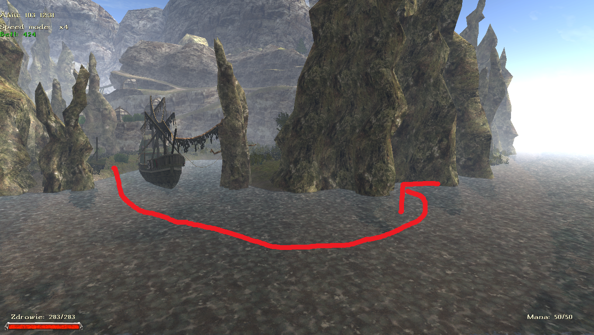

# Rozdział II

## Statek Wojenny Albatros

### Najważniejsze informacje

**Wskazówki:**

- Nie warto wydawać [Handlarza bagiennym zielem](#handel-bagiennym-zielem), jako że nauczy Cię on wcześnie kradzieży kieszonkowej, która jest niezbędna na kolejnych wyspach

### Zadania główne i powiązane

#### Bosman

Po tym jak trafiliśmy na statek gadamy z Gernotem, który wysyła nas do Haralda. Ten odpowiada nam, że musimy wykonać misje dla niego, Halvora, Wolfganga, Hawka oraz uzyskać zaufanie załogi (wykonując kolejne misje). Po ukończeniu wszystkiego udajemy się do Gernota i zostajemy bosmanem.

#### Broń z magicznej rudy

Zadanie jest dostępne u Hawka po nauczeniu się podstaw kowalstwa. By nauczył cię kuć broń z magicznej rudy potrzebuje dostać 5 bryłek magicznej rudy. Będziemy w stanie to zadanie wykonać na [Tamorze](#tamora).

#### Służba na statku

Harald każe nam pozamiatać statek. W tym celu prosimy o pomoc Dandolo, który zgodzi się gdy wykonamy dla niego zadanie.

#### Szacunek

Po wykonaniu misji dla Haralda potrzebujemy zdobyć uznanie załogi. W tym celu wykonujemy inne misje na statku.

#### Skradziony prowiant

Misję zleca nam Wolfgang. By rozwikłać tajemnicę udajmy się do Svena, który informuje nas, że paladyn Beowulf idzie do ładowni po 22:00. Rozmawiamy z nim dwukrotnie:  
w ładowni oraz jak z niej wyjdzie. Mówi nam, że po 01:00 słychać tam dziwne dźwięki. Udajemy się tam o tej godzinie i zabijamy szczury. Całość raportujemy Wolfgangowi.

#### Podły awanturnik

Misje otrzymujemy po spytaniu się o Knuta u Wolfganga. Więcej na jego temat mogliśmy się już dowiedzieć od Ernsta i Dandolo. Gdy zdobędziemy wszystkie te informacje udajemy się do Knuta i wyzywamy go na pojedynek. Wygrywamy pojedynek w ładowni po północy i rozmawiamy z przegranym. Po tym wracamy do Wolfganga kończąc misję.

#### Handel bagiennym zielem

Zadanie dostajemy jeśli zapytamy o Svena u Wolfganga. Idziemy do Svena, następnie znajdujemy dowody (notatkę) w ładowni po prawej stronie za skrzyniami. Teraz wracamy do Svena

Mamy opcje by go wydać lub oszczędzić. Lepiej jest go oszczędzić, ponieważ zyskujemy jego szacunek oraz może nauczyć nas kradzieży kieszonkowej. Wydając go zyskujemy tylko 50 sztuk złota więcej.

#### Zaklęcie światła dla Ernsta

Zadanie zleca nam Ernst. Udajemy się do Konrada następnie Wulfiasa, u którego płacimy 50 sztuk złota za przebaczenie oraz przy okazji dowiadujemy się, że potrzebna nam woda święcona w celu wymiany (powinieneś ją mieć z Athanos). Udajemy się do Konrada po zwój i oddajemy go Ernstowi.

#### Pomoc dla kucharza

Po skończeniu zamiatania Harald wysyła nas byśmy pomogli Albinowi. Potrzebuje on nowej patelni. W tym celu udamy się do Wolfganga i po podróży między Wolfgangiem a Albinem idziemy do Haralda by poprosić o pomoc. Kończy się na kupnie patelni. Oddajemy ją Albinowi.

#### Ryby dla Albina

Po oddaniu patelni Albin chce abyśmy dostarczyli mu dwa tuziny ryb. Prawdopodobnie możesz je od razu oddać. Gdy ich nie posiadamy, to kilka otrzymujemy od Wolfganga, a resztę zdobywamy na wyspie.

#### Bitwa z orkami

Hawk chce abyśmy dostarczyli mu 12 orkowych broni. Te zadanie wykonasz dopiero na wyspie [Khorus](#khorus).

#### Kto więcej wypije

Halvar chce byśmy pokonali go w piciu. Po porażce udajemy się do Dandolo następnie Ernsta i Wolfganga. W ładowni po lewej stronie odnajdujemy rum Halvara. Teraz należy się uzbroić w co najmniej 6 butelek rumu i wyzwać Wolfganga na kolejny pijacki pojedynek, który wygrywamy.

#### Zagubiony sekstans

Po misji z piciem, Halvarowi potrzebny jest sekstans. Znajduje się on ma szczycie masztu, na który wchodzimy po drabinie. Po pokazaniu go Halvarowi przekazujemy sekstans Gernotowi nie wydając go. Tym samym mamy kolejny głos na Bosmana.

### Zadania poboczne

#### Dolny pokład Albatrosa

Po odblokowaniu nowego pomieszczenia na statku dostajemy wpis w dzienniku na temat dolnego pokładu. Zadanie kończy się otwierając skrzynię na dolnym pokładzie.

#### Rośliny dla Wulfiasa

Dostajemy je, jeżeli chcemy uczyć się alchemii. Mag ognia potrzebuje 20 roślin leczniczych i 15 ognistych pokrzyw. Prawdopodobnie je posiadasz. Jeśli nie, to możesz zebrać na pobliskiej wyspie.

#### Żołd

Od Wolfganga dowiadujemy się, że Harald wie sporo o paladynach. Idąc do niego i poruszając tę kwestię dowiadujemy się, że każdy otrzymuje swoje wynagrodzenie. Po wykonaniu większości wcześniejszych misji, dostaniemy u Gernota opcje odebrania należnego złota.

## Wyspa Jonesa

### Najważniejsze informacje

- Aby odpłynąć z tej wyspy musimy zrobić możliwie wiele zadań na Bosmana oraz ukończyć zadanie "Szczątki statku"

### Zadania główne i powiązane

#### Szczątki statku

Dandolo prosi nas byśmy zbadali wrak statku na wyspie nieopodal. Zadanie kończy się przekazując mu 100 sztuk złota jednak warto przeszukać całą wyspę w celu odnalezienia pięciu dzienników i mapy skarbu.

#### Złoto piratów

Po zbadaniu wysepki i odnalezieniu 5 dzienników w skrzyni na szczycie znajdujemy mapę skarbów. Opowiadamy o tym Dandolo, a następnie Halvarowi po czym dowiadujemy się na temat Mendozy. Po drodze w Khorinis dowiadujemy się więcej robiąc zadania: [Admirał](sekcje/zadania/rozdzial_iii?id=admirał) oraz [Skarb w bagnie](sekcje/zadania/rozdzial_iii?id=skarb-w-bagnie). Następnie w Varancie, po spotkaniu Rotbarta, otrzymujemy klucz do skrzyni znajdującej się na statku, gdzie znajdujemy kolejną mapę skarbów oraz list od Mendozy. Skarb znajduję się przy brzegu jakbyś pływał za plecami Ernsta od miejsca lądowania. Trafiamy na piratów. Pajk ma przy sobie list, z którego dowiadujemy się na temat jednego ze skarbów Mendozy. Po zdobyciu wracamy do Pajka przy czym możemy mu powiedzieć prawdę lub skłamać. Prawda prowadzi do walki. Jeśli uda ci się dostać mapę na wyspę Mendozy od pirata Klausa (najważniejsze) w Ugarze, to możesz tam popłynąć statkiem  by następnie dowiedzieć się od Sama po zrobieniu dla niego zadań, że Mendoza obecnie przebywa w Królestwie Smoka. Na tym zadanie się kończy, ponieważ nie odwiedzimy tego miejsca.

## Kondera

### Najważniejsze informacje

**Wskazówki:**

- Na tej wyspie nauczysz się ważnego przepisu (dostaniesz wpis w dzienniku po misji [Ważne zadanie Griseldy](#ważne-zadanie-griseldy)) i odkryjesz nową roślinę, z której będziesz robił zupki +1 siły
- Istotną misją jest również [Pierścień szybkości](#pierścień-szybkości), jako że nieprędko wrócisz na tę wyspę, jeśli nie zacząłeś tej misji tutaj
- Świerszczowa pokrzywa pojawia się dopiero po otrzymaniu misji od Griseldy
- Przed odpłynięciem można pobić zarówno Oskara jak i Griselde, aby odzyskać pokrzywę i zupę

### Zadania główne i powiązane

#### Wyspa Kondera

Gernot zleca nam zebranie informacji na wyspie na temat orkowej floty. Gadasz przede wszystkim z Oldersonem i Sandrokiem. Po załatwieniu spraw na wyspie wracasz na statek zdać raport.

#### Zaginiona kapliczka Innosa

Oskar opowiada nam, że zniknęła kapliczka Innosa. Następnie udajemy się do Sandroka, który nas informuje o tym, że gdy postawimy posążek Innosa na piedestale w kamiennym kręgu, to kapliczka się pojawi i o tym, że widział jak Gyges się tam kręcił. Idziemy więc do niego.Po wykonaniu misji dowiadujemy się, że posążek, został zjedzony przez ścierwojady jednak nic takiego nie znajdujemy więc idziemy jeszcze raz do Gygesa, który mówi nam, że jedyną możliwością jest to, że posążek zleciał w dół przez dziurę niedaleko ścierwojadów. Skaczemy na sam dół i zaraz przy brzegu leży posążek, który odnosimy na piedestał. Wracamy po wszystkim do Oskara.

#### Dostęp do twierdzy Sandroka

Misja aktywuje się po dojściu do mostu, który obecnie jest podniesiony do góry, a przejście jest nieczynne. Oskar opowie ci o alternatywnej drodze. Misja kończy się po rozmowie z Sandrokiem.

#### Sandrok się nudzi

W celu wykonania tej misji potrzebujemy znaleźć 3 tabliczki (lokalizacje poniżej):

Zielona znajduje się obok krwiopijców jak idziemy w stronę kamiennego kręgu.  
Czerwoną tabliczkę chroni pełzacz wojownik w podziemnej jaskini.  
Do niebieskiej tabliczki należy popłynąć na skałę otoczoną mgłą, która znajduje się niedaleko twierdzy Sandroka. Po zebraniu tabliczek odkładamy je w piwnicy Sandroka, dzięki czemu odblokowujemy przejście do biblioteki. Po przeszukaniu jej wracamy do Sandroka kończąc misję.

#### Zatopiony statek

Po zrobieniu misji z kapliczką Innosa, Olderson opowiada o orkowej flocie i o tym, że zatonął jeden z ich okrętów. Odnajdujemy go nurkując po czym możemy zdać raport Gernotowi (upewnij się, że zrobiłeś wszystko).

#### Flota Orków

Zadanie polega na zebraniu informacji o flocie. Robiąc misje w solucji w końcu je skończymy. Kończy się dopiero po wyspie Khorus, gdy uzyskamy tam ostatnie informacje.

#### Zaginiony kij pasterski

Po znalezieniu kapliczki Gyges mówi, że zgubił swój kij pasterski. Po zgodzeniu się na wykonanie misj, wskazuje nam miejsce, w którym spadł jego kij. Znajdujemy go i wracamy z nim by wykonać misje.

### Zadania poboczne

#### Ważne zadanie Griseldy

Griselda chce byś się dowiedział co Oskar chce na obiad oraz następnie zebrał potrzebne składniki. Świerszczową pokrzywę znajdziemy nieopodal Gygesa, pod drzewem. Następnie wracając do Griseldy najlepiej wybrać opcje, że jesteś Gyges'em otrzymując tym sposobem 2 zupy ziołowe do siły. Oddając jedną z nich Oskarowi otrzymujesz dodatkowe 200 doświadczenia.

#### Szary wilk

Gyges zleca nam zabicie szarego wilka, który znajduje się nieopodal.

#### Gobliny-piraci

Szukając przejścia do Sandroka prawdopodobnie dostałeś wpis na temat goblinów-piratów. Gobliny wyruszyły w podróż tratwami. Pierwsze znajdziesz na Tamorze, następne na Khorus, ostatnie na Khorinis tym samym kończąc misję.

#### Pierścień szybkości

W jaskini z goblinami-piratami natrafiłeś na notatkę nijakiego Berengara. Opowiada on o swoim pierścieniu szybkości, więc postanawiasz iść jego śladem.  
Druga notatka znajduje się na Tamorze w jednej ze skrzyń w wieży strażniczej zamku.  
Trzeci list znajduje się w skrzyni na Adarmos w budynku Rosha.  
Czwarta w hotelu Hanny na piętrze, w rogu pokoju. Tam dowiadujemy się o miejscu pobytu Salandrila, którego okradamy.  
Piąta w skrzyni u Salandrila,a szósta w osadzie rybackiej.  
a ostatnia mówi ci o lokalizacji pierścienia, a właściwie przepisu na stworzenie go. Znajduje się w skrzyni na bagnie gdzie znajduje się też wrak pirackiego statku.

#### Wola Korofskiego

W piwnicy Sandroka możemy przeczytać na temat ukrytego skarbu Korofskiego.

Zdobędziemy go dopiero na początku 4 rozdziału na rafie (Rozdział IV), na której znajdziemy Dandolo. Jeśli ominiemy grobowiec i wypłyniemy z raf, zadanie zakończy się niepowodzeniem.

#### Adelinda i Brosius

Po wykonaniu zadania [Sandrok się nudzi](#sandrok-się-nudzi) dostaniemy dostęp do biblioteki pod twierdzą, w której jest książka potrzebną do wykonania tej misji dla Adelindy.

#### Szczury w porcie

Sandrok prosi nas o wybicie szczurów w porcie. Schodzimy na dół, rozprawimy się ze szkodnikami i wracamy po nagrodę.

#### Prowiant dla Sandroka

Po wykonaniu wszystkiego na wyspie można iść pożegnać się z Sandrokiem. Poprosi cię o dostarczenie mu racji żywnościowych wraz z beczką wina (Najlepiej dać mu wino z Varantu). Zadanie możemy wykonać dopiero w 4 rozdziale, gdy już odblokowujemy możliwość powrotu na wyspę.

## Tamora

### Najważniejsze informacje

**Wskazówki:**

- Wymagane minimum 45 zręczności, aby pchnąć dalej wątek (kradzież kieszonkowa)
- Dobrze jest ją jednak wbić tutaj na 60 i odebrać szpadę od Gernota przy zadaniu Stammler (można wspomóc się kapliczką)
- Po wejściu na dziedziniec zamku, zajrzyj do wieży po lewo, a znajdziesz tam dobrą broń wymagającą zręczności
- Pogadaj na starcie z Ambroziusem znajdującym się na plaży, na lewo od miejsca lądowania, po to by przyspieszyć jedną misję
- Nie atakuj najemników orków znajdujących się w obozie za mostem, aż do ukończenia zadania [Negocjacje z Jaco](#negocjacje-z-jaco)
- Potrzebna nauka wyrywania serc oraz pozyskiwania skór. Uczą [myśliwi](#łuk-hansa)
- Przydatna akrobatyka
- Nie wchodź do kopalni srebra dopóki nie dostaniesz misji!
- Znajdziesz tu kapliczkę Innosa przy której warto będzie spędzić trochę czasu ze śpiworem
- Jeden z handlarzy na rynku sprzedaje śpiwór, który bardzo Ci się przyda przy nabijaniu statystyk przy kapliczkach

### Zadania główne i powiązane

#### Zamieszki na Tamorze

Gernot wysyła nas z misją, by się dowiedzieć od gubernatora na temat orków oraz by przysiągł ponownie wierność królowi. By dostać się do Bruno, musimy udać się do Stefana, który zazwyczaj przesiaduje w karczmie. Musimy dla niego wykonać zadanie [Droga do gubernatora](#droga-do-gubernatora). Jak już jesteśmy na zamku, to Bruno nie chce z nami rozmawiać i kieruje nas do doradcy Funko. Wykonując zadanie [Podejrzany doradca](#podejrzany-doradca), Bruno informuje nas, że ulegnie znowu przed królem wtedy, gdy wyczyścimy kopalnie oraz dostarczymy mu kopaczy na Tamorę. Dodatkowo musimy wykonać zadanie [Stammler](#stammler)

#### Droga do gubernatora

Przy bramie dowiadujemy się, że nie uzyskamy dostępu do Bruno bez zyskania poparcia mieszkańców. W tym celu udajemy się do Stefana, który mówi nam dokładnie to samo, dodatkowo każe nam zapłacić 500 sztuk złota, co też robimy. Następnie bierzemy misje od Finko (po czym w trakcie wykonujemy [zadanie dla Hansa](#łuk-hansa) i [Marka](#skóry-dzików-dla-marka)) oraz Karczmarza. Po wykonaniu wszystkiego wracamy do Stefana, który zezwala nam na wejście do zamku i Bruno.

#### Przekupstwo strażnika

Stefan chce byśmy mu zapłacili 500 sztuk złota za zezwolenie na wejście do zamku. Płacimy Stefanowi, a on udziela nam swojej rekomendacji. Jeśli nie zrobimy tego zadania/odmówimy zapłaty, to będziemy musieli wejść do zamku przemianą w chrząszcza/bugiem.

#### Wieża strażnicza Tamory

Stefan chce byśmy sprawdzili co z jego człowiekiem w wieży strażniczej. Idziemy tam, zabijamy najemników orków, czytamy list z ciała strażnika i wracamy do Stefana po nagrodę.

#### Strzały dla Finko

Finko, handlarz na targowisku, prosi nas o dostarczenie dwóch pakietów strzał od myśliwego Markusa i Hansa. W tym celu wychodzimy z miasta i skręcamy w prawo w stronę lasu. Robimy po jednym zadaniu dla Hansa i Markusa, a gdy już otrzymaliśmy pakiety, to wracamy do Finko (nie warto oddawać swoich strzał, gdyż zaufanie myśliwych i tak jest nam potrzebne).

#### Łuk Hansa

Hans zgubił swój łuk. Prosi nas o jego odnalezienie. Łuk odnajdziemy w pobliżu wyschniętego koryta rzeki. Zabijamy pobliskie wilki i oddajemy łuk.

Lokalizacja łuku:

<iframe width="560" height="315" src="https://www.youtube.com/embed/c7xQCXgAl5Y" title="YouTube video player" frameborder="0" allow="accelerometer; autoplay; clipboard-write; encrypted-media; gyroscope; picture-in-picture; web-share" referrerpolicy="strict-origin-when-cross-origin" allowfullscreen></iframe>

#### Skóry dzików dla Marka

Mark chce, abyśmy dostarczyli mu 6 skór dzika. Jeżeli nie posiadamy umiejętności skórowania, to uczymy się tego u myśliwych. Dziki znajdują się na lewo od wyjścia Tamory. Zabijamy je i dostarczamy skóry.

#### Serafis dla karczmarza

Karczmarz prosi nas o dostarczenie 10 serafisów. Powinniśmy już je dawno posiadać. Oddajemy kończąc misję.

#### Jagody jałowca

Po oddaniu serafisów dostajemy kolejne zadanie. Prosi nas o przyniesienie 20 jagód jałowca. Znajdują się one na lewo, za dzikami, jak wychodzimy od miasta. Uwaga na cieniostwora i drzewca. Wracamy do karczmarza po zebraniu wystarczającej ilości.

#### Miód

Berta prosi nas abyśmy dostarczyli jej 4 plastry miodu. Pomagając myśliwym mogliśmy już je zebrać. Jeśli nie to zbieramy w tamtych okolicach i oddajemy.

#### Podejrzany doradca

Gadając z mieszkańcami dowiadujemy się, że Funko, doradca Bruno, coś ukrywa. By rozwikłać zagadkę udajemy się do Janusa, który opowiada nam o Funko po zadaniach [Sekret sługi](#sekret-sługi) oraz misji [Złodziej](#złodziej). Dostajemy wtedy trzy wpisy: [Zjawa](#zjawa), [Zjawa w sali tronowej](#zjawa-w-sali-tronowej) oraz [Poltergeist](#poltergeist). Po zrobieniu tego, zdajemy raport Janusowi i dostajemy wpis „Więzień", który również wykonujemy. Dowiadujemy się, że Fulko jest w zmowie z najemnikami orków. Idziemy do Janusa by się skonsultować. Zdobywamy list z jego pokoju i pokazujemy go słudze. Ostatnia rzecz jaka nam pozostała to konfrontacja z Fulko i zabicie go. Po robocie możemy pogadać z Bruno.

#### Sekret sługi

Polega na przeczytaniu pamiętnika Janusa po rozmowie z nim. Znajduje się on w jego pokoju.

#### Złodziej

Klaus prosi nas o wykonanie dla niego misji w odnalezieniu złodzieja, który ukradł amulet maga wody Telema i byś udał się do niego po więcej informacji. Po rozmowie z magiem idziemy do karczmarza, a następnie strażnika przy bramie miasta. On wysyła nas do Adama. Dowiadujemy się, że u podnóża gór jest jaskinia, w której mógł się ukryć złodziej. Idziemy więc w prawo od bramy i znajdujemy Igora. Odprowadzamy go do miasta i wracamy do Telema.

#### Zjawa w sali tronowej

Śpimy do północy i po krótkim filmiku zdajemy raport Janusowi.  
Możliwe że filmik się zbuguje/nie pojawi, wtedy trzeba wczytać i spróbować przespać się poza zamkiem.

#### Poltergeist

W poszukiwaniu dowodów Janus daje nam klucz na poddasze. Idziemy tam, zabijamy tam dwóch Asasynów i wracamy. Jeden znajduje się na najwyższej wieży, a do drugiego przechodzimy po dachu.

#### Zjawa

Zadanie kończy się w momencie zrobienia dwóch powyższych i zdaniu relacji Janusowi.

#### Więzień

Pierwszą informację dostajemy już na samym starcie od karczmarza jednak dopiero po uzyskaniu zaufania Janusa, ten, opowiada nam kto posiada klucz do więzienia. Jest to Stefan. Potrzebujemy 45 zręczności by ukraść klucz do jego pokoju, a następnie kolejny, do więzienia, z jego skrzyni. Dowiadujemy się ciekawych rzeczy na temat Fulko i po rozprawieniu się z doradcą i rozmowie z Bruno wracamy do więźnia.

#### Negocjacje z Jaco

Bruno prosi nas o to, abyśmy przekonali najemników orków, żeby opuścili Tamorę. W tym celu mamy porozmawiać z Jaco, który znajduje się niedaleko kryjówki Igora. Nie udało się nic wskórać (dobrze jest zabić jego i orka zaraz po rozmowie, aby potem nie męczyć się z nim w jego obozie) więc wracamy do Bruno.

#### Najemnicy orków

Początkowy wpis dostajemy już od Stefana. Całość zadania wykonujemy dopiero po zadaniu [Negocjacje z Jaco](#negocjacje-z-jaco). Polega to na zabiciu wszystkich najemników na wyspie. Ich obozy znajdują się w następujących miejscach:

1\. Przed wejściem do miasta, którzy pojawiają się po wzięciu zadania [Negocjacje z Jaco](#negocjacje-z-jaco)  
2\. Przy ognisku niedaleko jeziorka naprzeciw bramy Tamory  
3\. Nad jaskinią Igora (tam gdzie było spotkanie z Jaco)  
4\. W lesie, niedaleko myśliwych.  
5\. Przed i w [kopalni rudy](#kopalnia-rudy).  
6\. W [wieży strażniczej](#wieża-strażnicza-tamory)  
7\. W domku myśliwych nad plażą. Od miejsca lądowania daleko w lewo.

Wracamy wtedy do Bruno zdać relację.

#### Kopalnie Tamory

Po rozprawieniu się z Fulko, Bruno wysyła nas byśmy sprawdzili czy kopalnie funkcjonują. Zbieramy potrzebne surowce oraz czyścimy kopalnie zaznaczone na mapie, którą otrzymaliśmy od Bruno. Wracamy zdać raport.

#### Kopalnia soli

Zbieramy dowody i czyścimy kopalnię dla Bruno. Lokacja jest na otrzymanej mapie i drogowskazach.

#### Kopalnia rudy

Zbieramy dowody i czyścimy kopalnię dla Bruno. Lokacja jest na otrzymanej mapie i drogowskazach.

#### Kopalnia srebra

Zbieramy dowody i czyścimy kopalnię dla Bruno. Lokacja jest na otrzymanej mapie i drogowskazach. Do środka wchodzimy przez wielki otwór na górze, za pomocą przemiany w krwiopijcę, leżącej nieopodal w beczce.

#### Kopacze potrzebni na Tamorze

Po wyzwoleniu kopalni, Bruno chce by znowu zaczęto prowadzić wydobycie. W tym celu potrzebujemy zorganizować mu kopaczy.(Patrz: Kopacze potrzebni na Tamorze)  
Kopaczy potrzebnych do ukończenia zadania znajdziemy dopiero na Khorinis w pobliżu obserwatorium / osady rybackiej. Robimy dla nich zadania [Kilofy](sekcje/zadania/rozdzial_iii?id=kilofy) i [Osada rybacka](sekcje/zadania/rozdzial_iii?id=osada-rybacka) Zadanie kończy się po przypłynięciu z nimi na Tamorę i rozprowadzeniu ich po kopalniach.

#### Stammler

W trakcie tego dostaniemy też zadanie [Miecz poległego paladyna](sekcje/zadania/rozdzial_vi?id=miecz-poległego-paladyna) - dopiero 6 rozdział

Pierwszą wzmiankę o Stammlerze dostajemy już od karczmarza. Ciąg dalszy misji możemy jednak zrobić po rozmowie z Bruno. On z kolei wysyła cię do Janusa, ten odsyła do Telema, a mag każe dojść do biblioteki. Biblioteka znajduje się na murze, po prawo od wejścia do budynku z Bruno. Gadamy z Adamem, Bruno i znów Adamem by dostać klucz. Czytamy opowieść. Udajemy się następnie do domu w górach (zadanie [Opuszczona chatka](#opuszczona-chatka)) i dowiadujemy się gdzie został schowany kamień ogniskujący. Znajduje się on w kopalni soli, w której wcześniej byliśmy. Należy kopać w pierwszej „kupce" jaką natrafiliśmy w jednym z rogów (możliwe, że nie zadziała za pierwszym razem, więc radzę zapisać i wczytać). Miejsce zakopanego kamienia poniżej:

Udajemy się na cmentarz do grobowca i gadamy z duchem Stammlera. Ten opowiada nam o klątwie rzuconej na niego. By ją złamać potrzebujemy pokonać Abraxasa. Do przyzwania potrzebujemy trzech serc golemów. Kamienny znajduje się nad cmentarzem przy wodospadzie. Srebrny i Solny w znanych nam wcześniej kopalniach (potrzebne rodzaje golemów będą także przy kaplicy Innosa, a tam się kierujemy). Następnie gadamy z Gernotem i wybieramy od niego broń (polecam pod zręczność jeśli wbijesz jej 60), a następnie idziemy pogadać z Telemem, który wysyła nas na bagna znajdujące się niedaleko zamku. Kapliczkę odnajdziemy w tym miejscu:

<iframe width="560" height="315" src="https://www.youtube.com/embed/AQueMHSRKJw" title="YouTube video player" frameborder="0" allow="accelerometer; autoplay; clipboard-write; encrypted-media; gyroscope; picture-in-picture; web-share" referrerpolicy="strict-origin-when-cross-origin" allowfullscreen></iframe>

Konsekrujemy tam broń i przyzywamy Abraxasa przy kamiennym kręgu (tym niedaleko domku myśliwskiego). Pokonujemy go, a następnie gadamy kolejno ze Stammlerem, Bruno i Karczmarzem kończąc zadanie.

### Zadania poboczne

#### Kroniki Tamory

Zadanie polega na zebraniu wszystkich kronik i ich przeczytaniu.  
Część I znajduje się w bibliotece, do której dostęp uzyskamy później  
Część II znajduje się w jednym z domów na rynku  
Część III możemy znaleźć w pokoju Stefana  
Część IV znajduje się w lesie w opuszczonym domu (Ambroziusa)  
Część V jest w świątyni Innosa nad bagnem.  
Kolejność czytania książek nie ma znaczenia.

#### Gra w kości z Mitchem

Po rozmowie z Mitchem dowiadujemy się, że wieczorami w karczmie gra w kości. Pokonujemy go i zgarniamy złoto.

#### Ołtarz Adanosa

Po oddaniu [amuletu](#amulet-erika) dostajemy kolejną misją od maga. Polega na sprawdzeniu co jest nie tak, przy ołtarzu Adanosa. Kierujemy się drogowskazami trafiając w końcu na miejsce, zabijamy szkielety-gobliny i wracamy zdać raport.

#### Gryf

Zadanie daje nam pasterz Edgar. Znajduje się on niedaleko ołtarzu Adanosa. Prosi nas o zabicie gryfa (wygląda jak harpia), który znajduje się niedaleko w górach. Lokalizacja gryfa poniżej:

Zabijamy go i wracamy po nagrodę.

#### Zamknięta piwnica

Wpis dostajesz, jeśli staniesz przed wejściem do piwnicy. Gra informuje, że nie jest to miejsce, do którego obecnie powinieneś wchodzić. Wejdziemy tam dopiero w 4 rozdziale.

#### Królewskie szaty

Izabela prosi nas, abyśmy dostarczyli jej królewską suknie. Dostaniemy ją dopiero w Vengardzie w ramach robienia misji [Nowicjusz za kratami](sekcje/zadania/rozdzial_vi?id=nowicjusz-za-kratami).

#### Martwy na bagnie

Na bagnach w ciele martwego strażnika znajduje się notatka. Po przeczytaniu jej idziesz do Rubena. Dostajesz od niego wtedy misje [Cenna księga](#cenna-księga), którą wykonasz dopiero w 6 rozdziale.

Lokalizacja notatki:

<iframe width="560" height="315" src="https://www.youtube.com/embed/5d4Xpxhfrh8" title="YouTube video player" frameborder="0" allow="accelerometer; autoplay; clipboard-write; encrypted-media; gyroscope; picture-in-picture; web-share" referrerpolicy="strict-origin-when-cross-origin" allowfullscreen></iframe>

#### Cenna księga

Ruben opowiada ci o księdze, którą poszukiwał jego martwy brat. W szóstym rozdziale po dotarciu na Tamorę i wejściu do piwnicy dostrzegasz martwe ciało Rubena. Czytasz książkę, którą znajdziesz w jego ciele

#### Zatopiona wieża

Zadanie dostajemy czytając ukrytą notatkę schowaną, w zamku, w pomieszczeniu z kominkiem i schodami prowadzącymi do Telema. Klikamy w pomieszczeniu w przycisk pod witrażem, a kominek się przesunie. Idziesz szukać wieży zatopionej w morzu, której szczyt będzie wystawać lekko nad powierzchnią. Nurkujemy po skarb i otwieramy kończąc zadanie.

Lokalizacja wieży:

<iframe width="560" height="315" src="https://www.youtube.com/embed/EYX64Oap8VA" title="YouTube video player" frameborder="0" allow="accelerometer; autoplay; clipboard-write; encrypted-media; gyroscope; picture-in-picture; web-share" referrerpolicy="strict-origin-when-cross-origin" allowfullscreen></iframe>

#### Opuszczona chatka

Niedaleko miejsca z gryfem możemy udać się dalej na szczyt. Mogłeś trafić tam też jeśli zacząłeś szukać [Kroniki Tamory](#kroniki-tamory). Zobaczymy tam dom, który dokładnie przeszukujemy i czytamy książkę, dostając tym samym wpis do dziennika. Dowiadujemy się, że chatka należy do Ambroziusa. Idziemy więc do niego kończąc całość.

#### Zakopany skarb

Jak już pogadałeś z Ambroziusem, wiedząc, że [dom pustelnika](#opuszczona-chatka) należy do niego, to dowiadujemy się na temat skarbu. Szukanie skarbu zaczyna się po drugiej stronie skały, którą opływamy. Jak się tam dostaniesz, to czytasz wszystkie dokumenty i odnajdziesz skarb. Wracasz do zleceniodawcy i dzielisz się z nim łupem lub nie.

#### Kradzież kieszonkowa

Zadanie to otrzymamy tylko i wyłącznie, jeśli dojdziemy do misji w zamku, a nadal nie potrafimy kradzieży kieszonkowej. Gra nas wtedy odsyła do Svena, który zgadza się nauczyć nas otwierania i kradzieży.

## Adarmos

### Najważniejsze informacje

**Wskazówki:**

- Na tej wyspie pod koniec wątku sprzedasz magowi Kajo syriański olej, a będzie to jedyna okazja w grze.
- Na tej wyspie pojawi się możliwość nauki magii, ale szkoda sobie tym zaprzątać głowę na początku.
- Po ostatniej rozmowie z Roshem można wybić korsarzy.

### Zadania główne i powiązane

#### Wyspa Adarmos

Gernot zleca nam misje by się dowiedzieć, w którym kierunku popłynęła orkowa flota. Zadanie kończy się po rozmowie z Roshem na wyspie.

#### Piraci na Adarmos

Zadanie również dostajemy od Gernota i kończy po rozmowie z Roshem.

#### Kowal Wiko

Po pierwszej rozmowie ze Starostą Wioski idziemy pogadać z mieszkańcami wioski. Po tym jak się od nich nic nie dowiemy, dostajemy zadanie od starosty, który powie nam gdzie znajduje się Rosh tylko jeśli je wykonamy. Kowal chce od nas 3 bryłki magicznej rudy, którą mogliśmy znaleźć wcześniej na Tamorze lub tutaj można odnaleźć na wyspie. Oddajemy Wiko i wracamy do starosty.

#### Droga do Rosha

Po sprawie z kowalem dowiadujemy się gdzie możemy znaleźć Rosha. Przed budynkiem gadamy z najemnikiem o imieniu Kosta, który przepuści cię, jeśli się dowiesz czegoś o piratach. Do tej misji daje ci specjalny ubiór, a następnie idziesz wykonywać zadania dla piratów i czarnego maga Cyona po drugiej stronie wyspy. Po wykonaniu zadań wracamy do Kosta i zostaniemy wpuszczeni do budynku.

#### Gra w kości z Dalem

Chodzi o grę w kości z najemnikiem Dale w karczmie. Ogrywamy go ze złota i kończymy zadanie.

#### Obibok

Bantor opowiada nam, że Pablo miga się od pracy i prosi nas o odnalezienie go  
i przekonanie do powrotu do pracy. Chowa się między skrzyniami przy budynku gdzie stacjonuje Rosh. Po przekonaniu go wracamy do Bantora po nagrodę.

#### Szpieg korsarzy

Mount opowiada nam o szpiegu Alvaresie, który znajduje się między wioską a obozem piratów w jaskini. Idziemy do niego (bijemy) po informacje i wracamy do Mount’a.

#### Informacja o Roshu

Po rozmowie z Alvaresem dowiadujemy się coś na temat Rosha. Z tymi informacjami idziemy do bosmana piratów, a następnie do samego kapitana Bjorna.

#### Świeże mięso dla obozu

Po zadaniu [Szpieg korsarzy](#szpieg-korsarzy)

Zadanie zleca nam pirat myśliwy, strażnik przed wejściem do obozu. Potrzebną ilość mięsa prawdopodobnie już posiadamy. Oddajemy to Mount'owi. Jeśli nie mamy to polujemy lub kupujemy od Baromira.

#### Amulet Erika

Po dwukrotnej rozmowie z Erikiem dowiadujemy się, że zgubił swój amulet i chcemy mu w tym pomóc. By go odszukać udajemy się do pasterza Carvallho, który stacjonuje przed wioską. On opowiada nam, że amulet ma najemnik Everaldo, który chce za niego 200 sztuk złota lub 2 lekkie topory orkowe. Parę orków znajdziemy na wyspie. Zabijamy i oddajemy topory oszczędzając złoto (dla Hawka topory zdobędziemy i tak na następnej wyspie). Wracamy z amuletem do Erika po nagrodę.

#### Zioła Bjorna

Bjorn chce zioła od Emilio (znajduje się nad obozem piratów). Idziemy do niego i płacimy za czym wracamy z zielskiem do Bjorna. Nie wolno nam sprzedać ziół w wiosce, tak jak sugeruje to dziennik.

#### Znaleziona notatka

Nad Emilio, na wzgórzu, przy drzewie znajdujemy notatkę, która umożliwia wykonanie nam poniższej misji [Nieszczęście Emilio](#nieszczęście-emilio), odblokowując opcję dialogową „Pomogę ci".

#### Nieszczęście Emilio

Emilio prosi nas o zdobycie odtrutki na swój problem. Idziemy z tym do Melvina z przyjacielskimi pozdrowieniami od Emilio i zdobywamy lub oddajemy mu już potrzebne składniki potrzebne do przygotowania odtrutki. Wracamy z gotowym antidotum do Emilio.

#### Skarb wioski

Bosman piratów usłyszał na temat skarbu wioski. Idziemy do starosty, czekamy dzień i wracamy ze złotem.

#### Czarny Mag Cyon

Po zdobyciu zaufania piratów i uzyskania informacji o Roshu, Bjorn wysyła nas do maga Cyona by przekazać mu te informacje wraz z akwamarynem. Gadamy ze strażnikiem i teleportujemy się do czarnego maga. Przekazujemy mu wszystko.  Następnie idziemy do maga ognia Kajo i informujemy go, że jesteśmy tak naprawdę wojownikiem Innosa i chcemy mu pomóc. Wracamy do Cyona i wypowiadamy zaklęcie otrzymane przez Kajo. Czarny mag ucieka. Nie pozostaje nic innego jak wrócić do kapitana, a następnie już do Kosty (jeśli zrobiliśmy wszystko co chcieliśmy).

#### Syn marnotrawny

Gdy opuszczamy wioskę możemy zagadać o tym do starosty, który opowiada nam o swoim synu. Spotkamy go dopiero w 3 rozdziale na Khorinis, na początku mrocznego lasu przy farmie Akila. W 4 rozdziale możemy poinformować o tym starostę.

#### Statek Handlowy

#### Statek handlowy

Harald prosi nas byśmy dowiedzieli się informacji na temat orkowej floty od ludzi na pobliskim statku. Robimy tam potrzebne misje, by koniec końców dowiedzieć się od kapitana statku na temat floty orków. Z tymi informacjami wracamy do Haralda.

#### Gorączka na pokładzie

Jeden z marynarzy opowiada nam, że nie zostaniesz dopuszczony do kapitana jeśli nie wyleczysz Hansa. W tym celu idziemy do Wulfiasa by przygotował nam specjalny eliksir. O składniki możemy spytać Wolfganga, a tran znajdziemy na statku handlowym. Po przygotowaniu eliksiru i przy ponownej rozmowie z Hansem, mamy możliwość oddania specjalnej mikstury lub grogu.

#### Rum dla Bjorna

By dostać klucz do kajuty kapitańskiej potrzebujemy oddać 5 butelek rumu Bjornowi. Jeśli nie posiadamy to Wolfgang powinien sprzedawać.

#### Dostęp do ładowni

Cała misja polega na rozmowie z Ahabem, marynarzami i Haraldem, by w końcu zdobyć pierścień od kapitana a następnie powiedzieć mu, że oddasz go po uzyskaniu dostępu do ładowni. Tam znajdujemy orkowy sztandar po czym kapitan wszystko ładnie nam potem opowiada.

## Khorus

### Najważniejsze informacje

**Wskazówki:**

- Tutaj zdobędziesz wystarczającą ilość broni dla Hawka by zostać w końcu bosmanem i uzyskać lepszy pancerz.  
  \-Na lewo od latarni zeskocz na polane poniżej. Znajdziesz na niej bardzo dobry miecz.  
  \-Wioskę odbij jako ostatnia rzecz na wyspie- Warto eksplorować wyspę z Dandolo, jako że radzi on sobie z większością przeciwników (tylko nie porywajcie się na orków i drzewce)
- Jeżeli zginie ci myśliwy Enzo znajdujący się poza obozem, to nie przejmuj się. Nie jest do niczego potrzebny.
- Jest też duża szansa, że nie wykonasz misji ze skórami wargów dla myśliwych, ponieważ mieszkańcy zabiją je za ciebie i ciał nie będzie.

- [Gobliny-piraci](#gobliny-piraci)

### Zadania główne i powiązane

#### Poszukiwanie żywności

Gernot wysyła nas razem z Dandolo i Ernstem, byście kupili prowiant na statek. Zadanie kończy się dopiero po misji [Wyzwolenie Khorusu](#wyzwolenie-khorusu) i otrzymaniu prowiantu od handlarza (Martisa) w wiosce. Oddajemy prowiant Gernotowi i możesz wyruszać w dalszą podróż.

#### Wyzwolenie Khorusu

Po tym jak znalazłeś Vikasa, Roland obiecuje mu, że wyzwoli Khorus spod władzy orków. Po zabiciu WSZYSTKICH orków na wyspie i jej wyzwoleniu możemy na końcu udać się do Vikasa go poinformować o sukcesie misji.

#### Orkowie na Khorusie

Zadanie rozpoczyna się po zobaczeniu orków zwiadowców. Do ukończenia jej potrzebujemy dowiedzieć się od mieszkańców o orkach w wiosce oraz w trakcie wykonywania zadań: [Latarnia morska na Khorusie](#latarnia-morska-na-khorusie) i [Patrole orków](#patrole-orków). Meldujemy o tym Gernotowi.

#### Latarnia morska na Khorusie

Zleceniodawcą jest Tadeus. Zabijamy wszystkich orków w latarni i wracamy po nagrodę.

#### Patrole orków

Tom każe pozbyć się patroli orków. Jeden z nich jest na plaży, a drugi krąży blisko mostu do miasta.

#### Vikas

Alternatywą jest pójście od razu do Vikasa.

Zadanie otrzymujemy po rozmowie z Haraldem (mieszkańcem) na wyspie. Znajdujemy Vikasa w jaskini na prawo, na plaży, od miejsca przypłynięcia. Wracamy poinformować.

#### Święta księga

Petra prosi nas o dostarczenie jej księgi. Znajduje się ona w kaplicy za mostem w drodze do wioski. Oddajemy jej i kończymy zadanie.

#### Lek dla Waliny

Walina prosi nas o lek na gorączkę. W tym celu potrzebujemy udać się do Valendraji, która nie pomoże nam, jeśli nie pomożemy jej w pewnym zadaniu ([Kobieta przy Kamiennym Kręgu](#kobieta-przy-kamiennym-kręgu)). Po wykonaniu zadania, potrzebujemy zebrać dla niej grzyby, które rosną na wyspie w jaskiniach. Po zebraniu oddajemy składniki, czekamy jeden dzień i wracamy do Waliny z lekarstwem.

#### Kobieta przy Kamiennym Kręgu

Valendraja prosi nas byśmy pozbyli się zagrożenia wokół kręgu. Chodzi o stwory przy kamiennym kręgu. Po zabiciu wracamy i informujemy, że teren czysty.

#### Skóry wargów

Henry prosi nas o dostarczenie 12 skór wargów. Zabijamy wargi na wyspie i oddajemy skóry.

#### Mięso dla Logi

Myśliwy prosi nas o dostarczenie mu mięsa. Powinniśmy to już dawno mieć więc oddajemy. Jak nie to idziemy polować.

#### Środek uspokajający dla Kolwina

Kolwin daje nam klucz do swojej skrzyni. Kierujemy się do jaskini niedaleko dziury, otwieramy skrzynię i wracamy z winem.

Lokalizacja jaskini:

#### Ferell

Od Martisa dowiadujemy się, że zaginął jego syn. W pobliżu leży kilof, więc jeśli żadnego nie posiadasz, to weź go. Misje możesz wykonać dopiero po wyzwoleniu wioski, więc czyścisz tam wszystko. Szukasz w niej czegoś co posłuży ci jako drabina. Znajdziesz ją w tym miejscu:

Następnie przejście do kopalni otwierasz niszcząc kamienie kilofem. Dajesz drabinę i schodzisz na dół. Na dole kopalni znajdujesz Ferella. Odprowadzasz go na górę, uważając przy tym na pełzacze, które ponownie się pojawią. Idziesz poinformować Martisa o odnalezieniu syna.

#### Punkt obserwacyjny

Po opuszczeniu wyspy Khorus Gernot każe obserwować morze. W tym celu udajemy się na maszt.

#### Statek orków

#### Niewolnik

Po wygranej walce z orkami trafiasz na Martina, znanego nam członka straży miejskiej Khorinis. Nie opuści on jednak tego miejsca, jeśli nie znajdziemy mu jego cennego miecza. Znajduje się na dole pokładu w skrzyni. Oddajemy miecz i przyprowadzamy Martina na Albatrosa.

#### List w języku orków

W skrzyni na dolnym pokładzie znalazłeś również list w języku orków. Gdy próbujesz go przeczytać okazuje się, że nie znasz ich mowy więc idziesz z tym do Gernota, który wysyła cię do Wulfiasa. Po jednym dniu wracasz do niego, by dowiedzieć się jakie informacje zawierał i przekazujesz je Gernotowi i Baldwinowi.

#### Ruda dla króla

Martin na statku informuje nas, gdzie udał się Lord Hagen. Dodatkowe informacje uzyskujemy od Lorda Baldwina. Potrzebne jest dla tej misji 10 zamkniętych skrzyń z magiczną rudą. Znajdziesz je wszystkie na Khorinis w opuszczonej kopalni. Dostęp tam uzyskasz robiąc misje w Khorinis opisane już w solucji w rozdziale 3.

#### Czarni Magowie w Khorinis

Martin opowiada ci, że żyje tylko z powodu darowania życia z rozkazu czarnego maga. Twoim zadaniem jest uzyskać informacje, co robią czarni magowi w Khorinis. Główny dowód potrzebny do ukończenia misji zdobywamy okradając [Donshaka](sekcje/zadania/rozdzial_iii?id=donshak) w górnym mieście lub zabijając go przy wyzwoleniu miasta. Czytamy list i wracamy z tym do Gernota.
