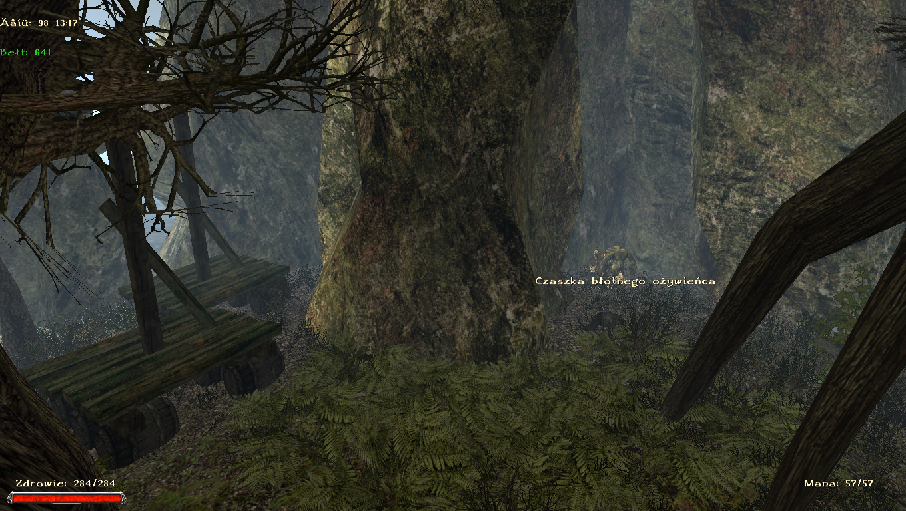

# Rozdział III

## Khorinis

### Najważniejsze informacje

> **KRYTYCZNE:** Nie odbijaj Khorinis! Lepiej zrobić to w czwartym rozdziale, wtedy będziesz miał pewność że nic sobie nie zablokowałeś, bo zrobiłeś wszystkie najważniejsze dla fabuły misje. Nie odbijaj samemu obozu przed farmą Onara, bo zbugujesz sobie grę. Zrobisz to w zadaniu [Obóz orków](#obóz-orków) wraz z Khaledem i Andre.

**Wskazówki:**

- Nie atakuj orków w mieście, dopóki nie skończysz związanych z nimi zadań
- Nie atakuj najemników orków w gospodzie Orlana, dopóki nie skończysz zadań w mieście
- Przed wypłynięciem z Khorinis należy nauczyć się mistrzowskiego złotnictwa i ostrzenia
- Warto jak najszybciej udać się na farmę Onara (zaraz po uwolnieniu ludzi z kanałów). Jak ją znaleźć od początku rozdziału:

<iframe width="560" height="315" src="https://www.youtube.com/embed/RGW6EFfDX8Y" title="YouTube video player" frameborder="0" allow="accelerometer; autoplay; clipboard-write; encrypted-media; gyroscope; picture-in-picture; web-share" referrerpolicy="strict-origin-when-cross-origin" allowfullscreen></iframe>

- Wulfgar uczy bardzo pożytecznych umiejętności miecza, a Dragomir kuszy i łuku
- Niepozorny malarz przy farmie Bengara jest bardzo istotną postacią dla wątku głównego
- Elena sprzeda nam pancerz łowcy smoków, który jest użyteczny przez cały rozdział
- Nad wykopaliskami magów wody i wzdłuż wybrzeża są nowe tereny, na które zdecydowanie warto zajrzeć
- W jaskini z lawą na nowych terenach jest skrzynia zawierająca ornament, który odblokuje Ci most do skrzyni z Embarla Filgastro (+15 siły)
- Na tej wyspie kończysz wątek pierścienia prędkości, który pozwala Ci na nieskończony sprint
- [Propozycja sojuszu](#propozycja-sojuszu) **Uwaga!** Po tej misji nie będziemy w stanie udać się do miasta i orkowie będą już wrogo nastawieni
- Warto wykonać szybko [Runy Tarroka](#runy-tarroka), by się szybko poruszać po mapie
- Klucz na północne tereny Khorinis posiada bandyta [Gregor](#banda-gregora) nad farmą Akila
- Wątek gildii złodziei odblokujemy robiąc zadanie [Złoto Jory](#złoto-jory)
- Dużą część zadań min. z gildii złodziei i Jarkendaru itp. odblokujesz dopiero po questach [Dostęp do Aszdodu](sekcje/zadania/rozdzial_v?id=dostęp-do-aszdodu) i [Wyzwolenie Khorinis](#wyzwolenie-khorinis)
- [Goblini-piraci](#admirał)

**Ważne misje na Khorinis:**

Te misje są niezbędne do opuszczenia wyspy. Najlepiej po prostu zrobić wszystkie zadania w tym dziale solucji

- [Kopacze potrzebni na Tamorze](#kopacze-potrzebni-na-tamorze)
- [Czarni Magowie w Khorinis](#czarni-magowie-koło-wieży-xardasa)
- [Pojmany Paladyn](#pojmany-paladyn)
- [Ruda dla króla](sekcje/zadania/rozdzial_vi?id=ruda-dla-króla)
- [Najemnicy orków w Khorinis](#najemnicy-orków-w-khorinis)
- [Obóz orków](#obóz-orków)
- [Obserwatorium](#obserwatorium)

### Zadania główne i powiązane

#### Gdzie jest Lord Hagen?

Po pierwszej rozmowie z Gernotem na Khorinis, powie Ci, że jednym z Twoich głównych zadań będzie znalezienie Lorda Hagena. Ten wątek ciągnie się przez całe Khorinis, aż do momentu w którym spotykamy Lorda Andre w starej wieży Dextera niedaleko farmy Onara. Andre mówi nam, że Lord Hagen przebywa w Górniczej Dolinie.

#### Ewakuacja

Na wybrzeżu, gdzie stacjonował Skip, znajdziemy parę osób którym udało się uciec z Khorinis. Rozmawiamy z Baltramem, ale on podejrzewa nas o to, że jesteśmy szpiclem najemników orków. Musimy przynieść mu dowód. Idziemy więc do Gernota, a ten wydaje nam pisemne oświadczenie z pieczątką króla, wracamy z tym do Baltrama, ten od teraz darzy nas zaufaniem. Poinformuje Cię, że jest więcej ocalałych i ukrywają się w Kanałach, poprosi Cię również, abyś porozmawiał z Farimem który jest obok. Farim opowiada nam, że latarnia morska nad plażą została przejęta przez orków. Idziemy do latarni i wybijamy orków, wracamy do Farima i potem Baltrama. Powinniśmy już mieć klucz do kanałów, udajemy się tam i spotykamy resztę ocalałych. Rozmawiamy teraz z Alrikiem, mówimy mu, że oczyściliśmy latarnie morską i możemy pomóc wszystkim w ucieczce, jednakże jest jeden problem. Żeby dostać się z kanałów na plaże, a następnie do latarni, trzeba przepłynąć mały kawałek, a Gritta boi się wody. Rozmawiamy z Grittą, potem z Alrikiem. Dochodzimy do porozumienia, wszyscy poza Grittą udadzą się do latarni morskiej, a my będziemy musieli przebiec przez środek Khorinis razem z Grittą i doprowadzić ją do latarni morskiej. Teraz mamy dwa wyjścia, po których zadanie się kończy

1. Zabijamy strażników bramy Khorinis i o 3 w nocy biegniemy z Grittą przez rynek, aż do latarni.
2. Jak wszyscy będą już w latarni, to zabijamy Gritte w kanałach i mówimy że nie udało jej się dotrzeć

#### Latarnia morska w Khorinis

Farim opowiada nam, że latarnia morska nad plażą została przejęta przez orków. Idziemy do latarni i wybijamy orków, wracamy do Farima.

#### Orkowie na farmach

Lord Andre mówi nam, aby przed odbiciem miasta Khorinis rozprawić się z mniejszymi oddziałami orków, którzy zajęli farmy. Wybijamy wszystkich orków na farmach Akila, Lobarta, Sekoba oraz Bengara, następnie informujemy o tym każdego z farmerów, i wracamy do Lorda Andre.

#### Lobarta problem z orkami

Lobarta możemy znaleźć w jaskini, na końcu doliny obok południowej bramy w której polujemy z Bartokiem w Gothicu 2. Wybijamy orków z jego farmy, i mówimy mu, że jego farma jest wolna.

#### Orkowie u Sekoba

Sekoba możemy znaleźć w jaskini, w której wykopujemy pierwszy skarb z Gregiem w Gothicu 2. Wybijamy orków z jego farmy, i mówimy mu, że jego farma jest wolna.

#### Orkowie u Bengara

Bengara możemy znaleźć na farmie Onara. Wybijamy orków z jego farmy, i mówimy mu, że jego farma jest wolna.

#### Orkowie u Akila

Akila możemy znaleźć w jaskini nieopodal jego farmy, w której zdobywaliśmy śmierdzącą rybę z wątku gildii złodziei w Gothicu 2. Wybijamy orków z jego farmy, i mówimy mu, że jego farma jest wolna.

#### Poprosić Gernota o pomoc
Po wykonaniu [Orkowie na farmach](#orkowie-na-farmach) możemy poprosić Gernota o dodatkowe wsparcie, na które się zgodzi. Do naszego zespołu dołączają Harald, Ernst i Hawk.

#### Zwoje dla Lorda Andre

Po zadaniu [Orkowie na farmach](#orkowie-na-farmach) musimy zdobyć magiczne zwoje od Pyrokara. W tym celu, aby uzyskać klucz do klasztoru musimy wykonać zadanie [Niebezpieczna jaskinia](#niebezpieczna-jaskinia). Gdy już pogadamy w klasztorze z Pyrokarem, to otrzymamy listę składników, którą potrzebujemy zdobyć. Gdy już wszystko zdobędziemy i dostarczymy, czekamy jeden dzień, a pod otrzymaniu zwojów idziemy je oddać Lordowi Andre.

#### Zaginiony nowicjusz

Pyrokar wysłał nowicjusza Babo, w celu zdobycia materiałów, które koniec końców sami musimy dostarczyć dla zadania [Zwoje dla Lorda Andre](#zwoje-dla-lorda-andre). Mimo tego prosi nas byśmy odszukali i przyprowadzili zaginionego nowicjusza. Znajdziemy go niedaleko tawerny Orlana, w miejscu gdzie przebywa Dragomir. Nie wróci jednak do klasztoru, dopóki nie wykonamy zadań [Oblężenie klasztoru](#oblężenie-klasztoru) oraz [Zagubiona księga](#zagubiona-księga).

#### Zagubiona księga

Babo boi się odzyskać księgę, którą utracił. Opisuje nam dokładnie miejsce gdzie ją stracił, więc robimy to za niego. Znajdziemy ją całkiem niedaleko cmentarza, przy spalonych chatach.

#### Niebezpieczna jaskinia

W celu uzyskania klucza do klasztoru podczas zadania [Zwoje dla Lorda Andre](#zwoje-dla-lorda-andre) udajemy się do Darona, który znajduje się przy słonecznym kręgu. Ten prosi nas, przed oddaniem klucza, abyśmy zbadali jaskinie, w której odbywała się próba ognia. Spotykamy tam orka Tarroka. Teraz mamy kilka opcji. Możesz okłamać Darona o obecności Tarroka, a ork wyjdzie z jaskini. Możesz powiadomić Darona o obecności orka, jednak ten wyda ci polecenia zabicia go. W tym przypadku możesz iść i dostać broń orka jako dowód lub faktycznie go zabić (zdecydowanie odradzam, ponieważ tracisz misję [Runy Tarroka](#runy-tarroka), [Poszukiwany Ork](#poszukiwany-ork) oraz możliwość zdobycia w 6 rozdziale Ulu-Mulu dla zadania "Negocjacje z Ur-Shakiem", co kończy się zabijaniem wszystkiego w Górniczej Dolinie). Po wszystkim dostaniemy klucz do drzwi klasztoru.

#### Runy Tarroka

Zadanie możemy wykonać po misji [Niebezpieczna jaskinia](#niebezpieczna-jaskinia). Po oszczędzeniu Tarroka, spotkamy go w pobliżu, przy jeziorze. Opowiada nam o runach, które posiadał, dzięki którym będziemy mogli szybciej się przemieszczać. Pierwsza runa znajduje się w jaskini próby ognia (tak, wracasz się). Potem spotykamy się z Tarrokiem obok tawerny Orlana, a sama runa jest w okolicach cmentarza. Kolejna runa jest w pobliżu. Chodzi o wysepkę, przy jeziorze, gdzie kopaliśmy jeden ze skarbów Grega. Następny punkt spotkań jest, gdy udamy się w kierunku wykopalisk magów wody, w pobliżu rzeki. Runa będzie w jaskini cieniostworów, pod mostem. Ostatnie miejsce spotkań z Tarrokiem będzie przed miastem, a dokładniej przed wschodnią bramą. Runa znajduje się w kufrze Granta, w koszarach. Po zdobyciu runy wracasz do Tarroka kończąc misję.

#### Dezerterzy

Po zdobyciu [zwojów](#zwoje-dla-lorda-andre), Lord Andre opowiada nam o grupie dezerterów, której musimy się pozbyć przed wyzwoleniem farmy Onara. Znajdziemy ich za jaskinią Sagitty/farmą Sekoba.

#### Orkowie na przełęczy

Po zadaniu [Zwoje dla Lorda Andre](#zwoje-dla-lorda-andre) Przed odbiciem farmy Onara, Lord Andre pragnie się dowiedzieć czy istnieje zagrożenie od orków z Górniczej Doliny na przełęczy. Idziemy więc tam ciągle prosto głównym przejściem (nie do kopalni), aż dostaniemy wpis w dzienniku. Po wpisie, możemy wrócić do Lorda Andre.

#### Broń z miasta

Po wykonaniu zadania [Orkowie na przełęczy](#orkowie-na-przełęczy), Lord Andre prosi nas o zdobycie paczek z bronią  
i prochu z wież w mieście. Dostaniemy się tam w ramach zadania [Sprawozdanie o sytuacji](#sprawozdanie-o-sytuacji). Proch znajduje się w nowych wieżach w górnym mieście. Otrzymujemy od niego klucze do nich, zdobywamy potrzebne rzeczy i wracamy.

#### Malarz

Przy farmie Bengara obok wodospadu spotykamy malarza Giaccomo. Prosi nas, żebyśmy przynieśli mu trochę papieru. Następnym zadaniem jest sprzedanie trzech jego obrazów. Ostatnie zadanie, to znalezienie przyjaznego Orka, aby Giaccomo mógł go namalować. Po wykonaniu tych trzech zleceń, zadanie kończy się.

#### Papier do malowania

Malarz Giaccomo prosi nas, abyśmy przynieśli mu kilka pustych kartek papieru. Możemy je kupić u różnorakich handlarzy, ale na tym etapie gry powinniśmy je po prostu mieć w ekwipunku.

#### Zbyt obrazów

Po zrobieniu zadania [Orkowie na przełęczy](#orkowie-na-przełęczy)  
Giaccomo prosi nas, abyśmy dokończyli dla niego trzy zamówienia. Pierwszy obraz zanosimy do Lariusa i sędziego, którzy znajdują się w starej wieży Dextera niedaleko farmy Onara. Kolejny sprzedajemy jednemu z bandycie (Gonzalesowi) przy jeziorze między martwą harpią a domem Erola, idąc w stronę farmy Onara. Ostatni obraz trafia do czarnego maga Kordiana. Jednak, by dostać się do miasta musisz spotkać się z pośrednikiem, Grantem, w jaskini niedaleko miasta (tam gdzie teleport magów wody do Martwej Harpii).

#### Najemnicy orków w Khorinis

Baltram mówi nam, że najemnicy orków pomogli w przejęciu Khorinis. Z tą informacją udajemy się do Gernota, który mówi nam, żebyśmy dowiedzieli się o nich jak najwięcej. Konieczne będzie zinfiltrowanie miasta i podszycie się pod jednego z nich. Zrobić to możemy przy wątku z malarzem Giaccomo ([Zbyt obrazów](#zbyt-obrazów)), znajduje się on obok farmy Bengara, przy wodospadzie. Wykonujemy wszystkie zadania dla najemników orków na Khorinis, przy okazji wyciągając z nich wszystkie przydatne informacje ([Sprawozdanie o sytuacji](#sprawozdanie-o-sytuacji), [Lojalność najemników orków](#lojalność-najemników-orków), [Arena](#arena), [Donshak](#donshak)). Po zakończeniu zadań w mieście, wracamy z informacjami do Gernota.

#### Sprawozdanie o sytuacji

Po wykonaniu zadania [Zbyt obrazów](#zbyt-obrazów), Grant chce byśmy do niego wrócili, gdyż ma dla nas pewne zadanie. Chce od nas otrzymać raport od jednego z najemników orków (Scott) w tawernie Orlana. Rozmawiając z nim dowiadujemy się, że wysłał szpiega w teren, by dowiedział się o sytuacji dotyczącej bandytów. Idąc w stronę wykopalisk magów wody trafiamy w końcu na martwe ciało szpiega. Czytamy notatkę, którą miał przy sobie, wracamy do Scotta, a na samym końcu do Granta.

#### Lojalność najemników orków

Po zadaniu [Sprawozdanie o sytuacji](#sprawozdanie-o-sytuacji), Grant prosi nas, byśmy dowiedzieli się co sądzą o nim jego ludzie. By dowiedziedzieć się czegoś więcej, należy udać się do karczmarzy. Najpierw najlepiej iść prosto do karczmy Coragona (Kass), by się czegoś dowiedzieć, a następnie do karczmy Kardifa (Butch). Od Butcha jednak niczego istotnego nie byliśmy w stanie wyciągnąć. Wracamy więc do Granta, by poprosić go o pomoc. Radzi nam wrócić do Kassa, ponieważ zna się z Butchem od bardzo dawna. Dowiadujemy się, że Evans planuje zastąpić Granta oraz jak wyciągnąć więcej informacji od Butcha. Możemy zrobić to poprzez grę w kości. Pokonując go, oferujemy mu połowę zdobytej nagrody, co też przyjmuję. Potwierdzają się wcześniejsze przypuszczenia, że Evans planuje zastąpić Granta. Jak ma to zamiar zrobić możemy się dowiedzieć jednak od jego ludzi. Hamlet, jeden z ludzi Evansa, przebywa w koszarach. chroniąc więzienia. Ork strzegący przejścia nie ma zamiaru nas jednak przepuścić więc idziemy do Granta po zgodę. Po rozmowie z Hamletem dowiadujemy się, że Evans jest już bliski swojego planu, a najemnik orków Mark, lada chwila powinien dostarczyć pewien list jednemu z dowódców orków. Wracasz do Granta, a ten każe ci szybko odzyskać list. Przy pomocy kradzieży kieszonkowej zdobywamy list od Marka, czytamy go i wracamy do Granta. Chce, abyśmy sami dostarczyli jednak ten list i powiedzieli orkom, że jest od niego (odblokowując tym samym dostęp do górnego miasta). Wracamy następnie do Granta kończąc zadanie. Po naradzie z nim dochodzicie do wniosku, że najlepszym sposobem na osłabienie pozycji Evansa będzie pokonanie go na Arenie podczas misji [Arena](#arena). Po naszym zwycięstwie wracamy do Granta zdać raport kończąc zadanie.

#### Dostęp do więzienia

Wpis dostajemy po romowie z orkiem, który pilnuje wejścia do więzienia w koszarach. Zadanie kończy się w trakcie misji [Lojalność najemników orków](#lojalność-najemników-orków)

#### Pojmany paladyn

Kiedy już uzyskaliśmy [dostęp do więzienia](#dostęp-do-więzienia), to możemy spotkać tam paladyna Cedrika. Gadać z nim możesz w godzinach 24:00 - 06:00. Możesz się od niego dowiedzieć na temat [rudy dla króla](sekcje/zadania/rozdzial_vi?id=ruda-dla-króla). Paladyn będzie gotowy do ucieczki tylko gdy uzyskamy informacje w trakcie zadań [Najemnicy orków w Khorinis](#najemnicy-orków-w-khorinis) oraz [Czarni magowie w Khorinis](#czarni-magowie-koło-wieży-xardasa).

#### Homer

W karczmie Coragona spotkać można Homera, który opowiada nam swoją historię. W celu wykonania zadania wystarczy pogadać z Khaledem na farmie Onara i wrócić do Homera powiedzieć mu, że znaleźliśmy dla niego nowe miejsce.

#### Pismo dla Karosha

Zadanie dostaniemy w trakcie wykonywania misji [Lojalność najemników orków](#lojalność-najemników-orków). Przy pomocy kradzieży kieszonkowej zdobywamy list od Marka, czytamy go i wracamy do Granta. Chce, abyśmy sami dostarczyli jednak ten list i powiedzieli orkom, że jest od niego (odblokowując tym samym dostęp do górnego miasta). Wracamy następnie do Granta kończąc zadanie.

#### Arena

Pod koniec misji [Lojalność najemników orków](#lojalność-najemników-orków), Grant chce, żebyśmy pokonali Evansa na arenie. By do walk doszło musimy być jednak odpowiednio przygotowani (120 siły/zręczności oraz 50% władania 1H/2H. Po spełnieniu wymagań idziemy do portu pogadać z orkiem Trompekiem o walce na arenie. Walczysz według następującej kolejności: Butch→Hamlet→Evans. Po naszych wygranych zdobywamy nagrodę - dobry miecz jednoręczny.

#### Donshak

Po zadaniu Arena, Grant wysyła nas do Donshaka, żeby zobaczył nowego czempiona areny. Tam wykonujemy dla niego pewne zadania. Po wykonaniu wszystkich poleceń ([Grimok](#grimok), [Wiadomość dla orków](#wiadomość-dla-orków), [Mikstury dla armii orków](#mikstury-dla-armii-orków)), wracamy do Granta.

#### Grimok

Donshak każe ci iść do Grimoka i dowiedzieć się dlaczego są opóźnienia w dostawie broni. Grimoka jest kowalem, którego znajdziemy w miejscu gdzie stacjonował zazwyczaj Harad. Powie, że nie ma wystarczającej ilości magicznej rudy. Wracając z tymi informacjami do Donshaka, dostaniesz polecenie, by pomóc kowalowi. W celu wykonania tego zadania możemy oddać mu 30 bryłek magicznej rudy, którą prawdopodobnie już posiadamy lub jedną skrzynie magicznej rudy, którą możemy znaleźć w trakcie wykonywania zadania “Pustelnik w górach”. Po całości, wracamy do Donshaka.

#### Wiadomość dla orków

Po zadaniu [Grimok](#grimok), Donshak wysyła cię byś dostarczył list dowódcy orków Mardokowi, który znajduje się w obozie przed farmą Onara. Zamiast oddawać go natychmiast, to można wcześniej udać się z listem do Gernota, następnie do Wulfiasa, by nam go przetłumaczył po jednym dniu. Gdy już finalnie przekażemy list orku Mardokowi, zadanie się zakończy.

#### Mikstury dla armii orków

Po misji [Wiadomość dla orków](#wiadomość-dla-orków), Mardok mówi, że potrzebuje mikstury lecznicze. Idziemy więc powiedzieć o tym Donshakowi. Ten wysyła nas do alchemika Enzo, którego znajdziemy, gdzie wcześniej mieszkał Salandril. Do przygotowania mikstur potrzebuje jeszcze rośliny. Dostarczamy mu je, czekamy jeden dzień, wracamy do Mardoka, a na końcu do Donshaka.

#### Propozycja sojuszu

Po zadaniach dla [Donshaka](#donshak), Grant wysyła nas do najemników na farmę Onara byśmy pogadali z przywódcą najemników (Khaledem) i złożyli mu propozycję sojuszu. Możesz Khaledowi zaproponować przyjęcie lub odrzucenie sojuszu. Propozycja przyjęcia skutkuje tym, że wracamy do Granta prosić go o dowód jego zamiarów dla Khaleda. Po tym najemnicy się godzą. Gdy już wracamy do Granta, to spotykamy jego martwe ciało, a nad nim Evansa. Po tym się na nas rzucają. Jeżeli postanowimy odradzić Khaledowi sojusz, to po tych przekazaniu informacji Grantowi,  będzie chciał nas wyprowadzić z miasta. Gdy już dotarliśmy z nim na miejsca, to każe nam oddać zbroje. Tutaj mamy wybór oddać mu dobrowolnie po czym się rozstajecie i nie będziesz miał możliwości wejścia do miasta lub mówisz, że nie oddasz mu i doprowadzasz do walki. Zabicie go w tym miejscu skutkuje zdobyciem [klucza do kopalni prowadzącej do Górniczej Doliny](sekcje/zadania/rozdzial_vi?id=ruda-dla-króla). Nie ważne jak zdecydujemy się poprowadzić zadanie, to kończy się to tym, że orkowie będą już wrogo nastawieni.

#### Obóz orków

Zadanie dostępne dopiero po przy zadaniu [Propozycja sojuszu](#propozycja-sojuszu)  
Po rozmowie z Khaledem na farmie Onara dowiadujesz się więcej o oblężeniu orków. Obawia się, że atak może nastąpić w każdej chwili. Rozmawiasz o tym z Lordem Andre i proponujesz mu sojusz z najemnikami, by przeciwstawić się zagrożeniu. Wracasz więc do Khaleda, a następnie znów do Lorda Andre, gdzie tym razem otrzymujesz zapewnienia. Przy kolejnej rozmowie z Khaledem, chce wiedzieć, co sądzą jego ludzie oraz czy można nam ufać. Wykonujemy więc zadanie [Zaufanie najemników](#zaufanie-najemników), a po wykonaniu zadania, wracamy do Lorda Andre, że sojusz został przez najemników zaakceptowany. Jednak zamiast Lorda Andre, zastajesz Wulfgara, który opowiada ci o jego zniknięciu. Po odnalezieniu Andre, mówisz mu w końcu o sojuszu i spotykasz się ze wszystkimi na farmie Onara. Musisz pogadać tam z Khaledem i Lordem Andre, by rozpocząć atak. Po zwycięstwie nad orkami meldujesz o tym obu przywódcom. Jeżeli nie zaliczyło ci zadania, to potrzebujesz jeszcze zabić orków za Cavalornem (tych w jaskini).

#### Zaufanie najemników

By zdobyć zaufanie najemników dla Khaleda, w celu zawarcia sojuszu, potrzeba wykonać zadania [Dar chce palić](#dar-chce-palić), [Lekarstwo dla Roda](#lekarstwo-dla-roda), [Polowanie na wilki”](#polowanie-na-wilki), [Pierścień wodnego kręgu](#pierścień-wodnego-kręgu), [Oddział orków](#oddział-orków)

#### Dar chce palić

Żeby dar nas poparł musimy dać mu trochę skrętów bagiennego ziela.

#### Lekarstwo dla Roda

Dla Roda potrzebujemy zdobyć od Sagitty lekarstwo po jego poparcie.

#### Polowanie na wilki

Torlof chce, żebyśmy pozbyli się wilków znajdujących się niedaleko Groma w dolinie trolli.

#### Pierścień wodnego kręgu

Cord prosi nas o pomoc w odzyskaniu jego pierścienia wodnego kręgu. Znajdziemy go w krypcie, w której kiedyś był nieumarły paladyn Inubis. Z pierścieniem wracamy do Corda i zadanie się kończy.

#### Oddział orków

Cavalorn prosi nas o pomoc w pozbyciu się oddziału orków stacjonującego nieopodal. Robimy to  
i zdajemy relacje Cavalornowi

#### Napad na Lorda Andre

Po zdobyciu [zaufania najemników](#zaufanie-najemników), idziemy powiedzieć to Lordowi Andre. Dowiadujemy się jednak od Wulfgara, że gdzieś zniknął. Znaleźć go możemy w kopalni znajdującej się za obozem. Musimy pokonać kościanych wojowników i uwolnić paladyna.

#### Wysłańcy ciemności

Dostajemy to zadanie po rozwiązaniu [Napadna Lorda Andre](#napad-na-lorda-andre). Zadanie kończy się samoistnie na Varancie podczas kontynuacji wątku głównego.

#### Wiadomość dla Lorda Baldwina

Po wyzwoleniu farmy Onara, Lord Andre przekazuje nam pismo do przekazania Lordowi Baldwinowi. Wykonać to możemy jednak dopiero po zadaniu [Ważne misje na Khorinis](#ważne-misje-na-khorinis), gdy przekażemy wszystkie informacje Gernotowi, odblokowując tym samym wejście na statek.

#### Wyzwolenie Khorinis

Lord Andre mówi nam, że sytuacja jest tragiczna, oraz, że orkowie zajęli całe miasto oraz praktycznie całą wyspę. Ten wątek toczy się przez cały rozdział, musimy powoli wyzwolić Khorinis spod władzy Orków. Wykonujemy kolejne zadania dla Lorda Andre, wyzwalamy farmy, zdobywamy dla niego magiczne zwoje, wykonujemy również zadania dla najemników orków podczas infiltracji Khorinis, oraz rozbijamy obóz orków obok farmy Onara. Pod koniec wyzwolenia farmy Onara, dowiadujemy się, że żołnierze są zbyt zmęczeni, aby pomóc nam odbić miasto, więc musimy zająć się wszystkimi orkami w mieście bez pomocy. Wybijamy wszystkich najemników orków, adeptów, mrocznych magów oraz orków w Khorinis, po czym powinniśmy dostać informację, że Khorinis zostało wyzwolone. Teraz możemy przystąpić do sporej ilości zadań zawartych w dziale [Khorinis](#khorinis) w 4R”  
Wracamy do Lorda Andre z dobrymi wieściami, a ten mówi nam, że wykonaliśmy świetną robotę i teraz wszyscy mieszkańcy miasta mogą wrócić do swoich domów.

#### Kopacze potrzebni na Tamorze

Kopaczy znajdziemy w obozie nad wykopaliskami nad nowych terenach. Robimy dla nich zadania [Kilofy](#kilofy) i [Osada rybacka](#osada-rybacka) Zadanie kończy się po przypłynięciu z nimi na Tamorę i rozprowadzeniu ich po kopalniach.

#### Kilofy

Zadanie dostajemy w obozie kopaczy od Slima. W celu zatrudnienia jego grupy jako [kopacze](#kopacze-potrzebni-na-tamorze), potrzebują dostać 9 kilofów. Jeżeli ich nie posiadamy, to znajdziemy je przy kamiennym kręgu nieopodal. Są jednak chronione przez ogry.

#### Osada rybacka

Po zdobyciu kilofów dla Slima, zleca on nam udanie się do osady rybackiej. Jeśli jeszcze tam nie byliśmy, to udajemy się do niej, pozbywamy się orków i idziemy pogadać z rybakiem, znajdujący się w wieży nieopodal. Z informacjami od niego wracamy do Slima, a następnie odprowadzamy kopaczy przez jaskinie lawy.

#### Obserwatorium

Na nowym terenie możemy trafić do obserwatorium, w którym spotykamy Sejana. Opowiada nam o zagrożeniu, jednak sam do końca nie jest pewny, co dokładnie się wydarzy. W tym celu musisz zdobyć dla niego [Dzienniki Xardasa](#dzienniki-xardasa). Po zdobyciu ich, Sejan przekazuje ci więcej informacji na temat Xardasa i pyta się czy patrzyłeś już przez teleskop. To, czy to zrobiliśmy, jednak nie ma większego znaczenia. Przychodzimy do niego następnego dnia, po tym, jak Sejan nastawił teleskop. Opowiada ci, że odkrył wyrwę w niebie jednak nie ma czasu na ciągłe obserwacje, dlatego musisz go zastąpić. Zobaczyłeś demony, przedostające się do świata, a o tym odkryciu informujesz natychmiast Sejana. Wysyła cię do grobowca paladynów, jednak przybywasz tam za późno, o czym musisz powiedzieć Sejanowi kończąc zadanie.

#### Dzienniki Xardasa

W bibliotece na Athanos znajdziesz księgę, która okazuje się być pamiętnikiem Xardasa. Pokazując ją Sejanowi, on prosi Cię o znalezienie reszty. Zadanie można dokończyć dopiero na Khorinis, gdzie spotykamy Sejana w obserwatorium. Musimy przynieść mu pozostałe tomy, które znajdują się w:

- Tomy II i III w bibliotece klasztornej, w piwnicy
- Tom IV w wieży Xardasa
- Tom V w skrzyni w piwnicy Obserwatorium
- Tom VI znajduje się w skrzyni, w jaskini niedaleko kamiennego kręgu ogrów

Lokalizacja tomów V i VI:

<iframe width="560" height="315" src="https://www.youtube.com/embed/Zw1dMh3chms" title="YouTube video player" frameborder="0" allow="accelerometer; autoplay; clipboard-write; encrypted-media; gyroscope; picture-in-picture; web-share" referrerpolicy="strict-origin-when-cross-origin" allowfullscreen></iframe>

#### Księgi Xardasa z zaklęciami przywołania

W [obserwatorium](#obserwatorium) znajdziemy kolejne 5 ksiąg przywoływania, które czytamy, zabijamy moby, a następnie oddajemy je Sejanowi.

#### Grobowiec paladynów

Zadanie dostaniemy w trakcie wykonywania [Obserwatorium](#obserwatorium). Sejan wysyła nas byśmy poszli do grobowca paladynów po kamień duszy. Dojdziemy tam kierując się od obserwatorium ścieżką w dół i skręcając w prawo do zamkniętych wrót. Na końcu grobowca, otwierając skrzynkę, możemy zauważyć, że jest pusta. Nagle pojawia się czarny mag Cyon, z którym mieliśmy już kontakt na Adarmos. Po pokonaniu go wracamy do Sejana.

### Zadania poboczne

#### Proroctwo

Abuyin co rozdział (zaczynajac od szóstego) może nam powróżyć. Po ostatniej przepowiedni kończy się zadanie.

#### Niebezpieczne warany

Po rozmowie z Gernotem na plaży, nagle pojawiają się jaszczury. Zabijamy wszystkie i rozmawiamy o tym z Gernotem.

#### Spragniony piwa

W kanałach spotkamy Booze’a, który mówi nam, że chętnie by się napił. Dajemy mu piwo, zadanie się kończy.

#### Rodzice

Baltram mówi nam, że nasi rodzice zdołali uciec z Khorinis. Dowiadujemy się też, że większość obywateli udała się na północ Khorinis i założyli obóz na płaskowyżu obok legowiska Czarnego Trolla. Część z nich również ostała się na farmie Onara. Naszą matkę możemy spotkać jednak w obozie obok legowiska Czarnego Trolla, a ojca w ruinach wykopalisk magów wody, obok portalu do Jarkendaru. Aby ukończyć zadanie, musimy przyprowadzić Bospera do obozu, oraz wykonać prośbę naszej mamy.

#### Maminsynek

Po rozmowie z matką, dowiadujemy się, że odkąd Bosper poszedł na polowanie, to zaczął naprzykrzać się jej Moe. Rozmawiamy z nim, bijemy i wracamy do matki.

#### Ocalenie Bospera

Gdy od mamy dowiedziałeś się, że ojciec wyruszył na polowanie, to postanawiasz go odszukać. Znaleźć go możesz w ruinach wykopalisk magów wody, obok portalu do Jarkendaru. By go wydostać należy wychodząc z nim wyczyścić nieumarłych (można to zrobić bez niego). Po drodze do obozu uchodźców natrafiamy jeszcze na bandytów, jednak koniec końców udaje ci się go odprowadzić do twojej matki.

#### Nieprzyjemne typki

Zadanie zleca Orlan, którego możemy spotkać w “jaskini Grega” niedaleko jeziorka przy Martwej Harpii. Prosi nas o pozbycie się zagrożenia z gospody. Po zabiciu najemników wracamy z informacją, że może wrócić do gospody.

#### Banda Gregora

Zadanie dostajemy od Dragomira. Opowiada nam o tym, że bandyci, którzy grasują na północ Khorinis, czynią ten rejon niebezpieczny, a w szczególności problematyczny jest ich przywódca - Gregor. Więcej na jego temat możemy dowiedzieć się od Pablo w obozie Lorda Andre. Samego bandytę znajdziemy na płaskowyżu nad farmą Akila. Po zabiciu, wracamy do Dragomira.

#### Oblężenie klasztoru

Pyrokar prosi nas byśmy pozbyli się zagrożenia ze strony orków i czarnych magów znajdujących się przed klasztorem. Po wyeliminowaniu zagrożenia, wracamy po nagrodę.

#### Pradawna magia

Wpis dostajemy po rozmowie z Utharem, który opowiada nam na temat pradawnej magii. Poprosić naukę możemy Pyrokara po wybraniu opcji, by wspomógł nas w walce z kościanymi wojownikami. Możemy to zrobić przed lub po oczyszczeniu piwnicy klasztornej pod koniec 5 rozdziału.

#### Modlitwa za paladynów

Marduk sugeruje nam, abyśmy pomodlili się przy kapliczce Innosa za paladynów. Robimy to.

#### Towarzysz broni

Po rozmowie w klasztorze z paladynem Sergio możemy mu zaproponować by wspomógł nas w walce. Można to wykonać dopiero na początku 4 rozdziału, gdy już zostajemy paladynem.

#### Czarni magowie koło wieży Xardasa

Ork pułkownik Zardok (alternatywnie Bartok, gdzie spotkaliśmy w nocy kruka Cavalorna), z miasta przy południowej bramie, chce byśmy pomogli czarnym magom w pobliżu wieży Xardasa. Idziemy tam. Po drodze możemy spotkać Bartoka, od którego będziemy w stanie dowiedzieć się trochę informacji. Idąc dalej zagada do nas jeden z adeptów magów - Achilles. Wyśle nas do przywódcy magów, z którym gadamy. Oferuje nam nagrodę 500 sztuk złota, jeśli wykonamy dla niego zadanie, na co się zgadzamy (podwyższenie ceny skutkuje walką po oddaniu książki). Dostajemy zadanie “Księga w wieży Xardasa”. Po dostarczeniu książki otrzymamy należną nagrodę (Uwaga! Książka będzie i tak potrzebna do zadania [Dzienniki Xardasa](#dzienniki-xardasa), więc i tak będziemy zmuszeni do walki by ją odzyskać, jednak można to zrobić potem).

#### Księga w wieży Xardasa

Czarny mag Roaz, który znajduje się przed wieżą Xardasa chce zdobyć znajdującą się tam księgę. Przedzieramy się przez chmarę demonów, zabieramy książkę i oddajemy ją czarnemu magowi.

#### Strażnicy latarni morskiej

Po wykonaniu dla Zardoka [Czarni magowie koło wieży Xardasa](#czarni-magowie-koło-wieży-xardasa), każe nam odprowadzić do latarni Jacka orków: Boleka (koło miejsca gdzie przemawiał Herold), Taboka (dom Eddy w porcie), Nempeka (magazyn portowy), Grampeka (na końcu molo przy statku). Gdy już porozmawiasz z orkami przy wschodniej bramie, to możesz zdecydować się zabić ich samemu idąc w stronę latarni lub razem z uchodźcami. Meldujesz wszystko Zardokowi.

#### Poszukiwania Xardasa w Varancie

W trakcie wykonywania [Grobowiec paladynów](#grobowiec-paladynów), Cyon powiedział, że kamień duszy jest w drodze do Varantu. Po rozmowie z Sejanem mamy za zadanie poszukać śladów Xardasa w Varancie. Dokładna lokalizacja będzie w [zachodnim Varancie](sekcje/zadania/rozdzial_iv?id=zachodni-varant), do której przejście będzie w pobliżu przełęczy do Ishtar. Potrzebujemy w wieży Xardasa znaleźć klucz do ukrytej skrzyni. Klucz do skrzyni znajduje się w piwnicy, a na piętrze mamy przełącznik do odkrycia kufra.

#### Banita

Zadanie dostajemy od Fellana przy legowisku czarnego trolla. Został niesłusznie oskarżony i wrobiony przez Gerbrandta. By mu pomóc udajemy się do Lorda Andre jednak bez dowodów nic nie wskóramy. Musimy więc pogadać z poszkodowanym - Lehmarem. Opowiada ci, że zaginął mu jeszcze złoty talerz, który nie został odnaleziony przy Fellanie. Mając punkt zaczepienia idziemy do Gerbrandta. Mimo to, nic ciekawego nie uzyskujemy więc trzeba przepytać jego żonę. Pytając się jej o złoty talerz, a następnie składając ofertę odkupienia, możemy wrócić do Gerbrandta z dowodem. Następnie pokazujemy dowód Lordowi Andre. Mówi, że dowody są niewystarczające, by coś zrobić przeciwko Gerbrantowi, jednak Fellan uzyskuje uniewinnienie, o czym jemu mówimy, a talerz oddajemy Lehmarowi.

#### Dać nauczkę Gerbrandtowi

Po ułaskawieniu Fellana opowiada nam, że przydałoby się, by ktoś pobił Gerbrandta. Gdy się zgodzimy idziemy do niego, odciągamy z dala od obozu i bijemy. Po pobiciu wracamy do Fellana.

#### Złoto Jory

Po ucieczce uchodźców z kanałów, możemy spotkać Jorę przy latarnii morskiej. Opowiada nam o tym, że został obrabowany przez Rengaru. Samego Rengaru znajdziemy w obozie na północy. Po rozmowie i po tym, jak go dogonimy, przeprowadzamy z nim rozmowę. Możemy zdradzić Jorę i rozpocząć wątek [Gildii Złodziei](sekcje/zadania/rozdzial_v?id=gildia-złodziei) (warto) lub odzyskać dla niego złoto.

#### Odtrutka

W obozie uchodźców na północy Khorinis możemy spotkać Ignaza, który opowiada nam o swoim zaplanowanym eksperymencie. Do tego potrzebuje świerszczowej pokrzywy, słoneczny aloes oraz żądło krwiopijcy z wyciągniętą z niej wydzieliną. Pierwsze dwa składniki będziemy w stanie zdobyć na Khorinis. Pozyskiwanie wydzieliny będziemy mogli się nauczyć jednak dopiero w 5 rozdziale, w Ugarze, od jednego z czarnych magów, gdy już [zostaniemy jednym z nich](sekcje/zadania/rozdzial_v?id=ugar). Wracamy ze składnikami do Ignaza (musi być już miasto wyzwolone) i musimy przetestować na rozpruwaczu miksturę. Doświadczamy, że trujące eksplozje nie są nam już w stanie zagrozić. Powiadamy o tym Ignaza

#### Narzędzia zawsze się przydają

Zadanie dostajemy na farmie Onara, w kuchni Thekli, od Carstena. Opowiada, że w mieście, przy rusztowaniu ratusza, zgubił swoje narzędzia. Chodzi o kielnię, tarnik oraz strugarkę. Kielnie możemy znaleźć na miejscu rusztowania. W miejscu gdzie zazwyczaj stacjonował Thorben możemy znaleźć orka Brambaka. Dowiadujemy, że strugarkę ma jeszcze przy sobie. Możemy ją zdobyć przy pomocy kradzieży kieszonkowej. Tarnik jednak zdobywamy dopiero na nowych terenach w wiosce rybackiej. Mając wszystko możemy zakończyć misję. Jeżeli chcemy zdobyć złoto można oddawać również inne narzędzia Carstenowi np. za kilof dostaniemy 300 sztuk złota.

#### Pustelnik w górach

Gunnar na farmie Onara opowiada nam o szaleńcu, który poszedł osiedlić się gdzieś w góry w pobliżu. Jest to Gilbert. Spotkać go możemy idąc w stronę Sagitty, a następnie dostając się, po prawej stronie, do gór. Droga do Gilberta:

<iframe width="560" height="315" src="https://www.youtube.com/embed/GtM-7Sx6CFM" title="YouTube video player" frameborder="0" allow="accelerometer; autoplay; clipboard-write; encrypted-media; gyroscope; picture-in-picture; web-share" referrerpolicy="strict-origin-when-cross-origin" allowfullscreen></iframe>

#### Problem z goblinami

Gilbert prosi nas o pozbycie się dużej grupy goblinów, które go od jakiegoś czasu dręczą. W zamian opowie ci więcej o kopalni rudy (może się przydać do zadania [Grimok](#grimok)). Idziesz więc je zabić idąc wzdłuż wąwozu.

#### Potwór w kopalni

Po rozwiązaniu [problemu z goblinami](#problem-z-goblinami), Gilbert prosi nas byśmy sprawdzili kopalnie, ponieważ słyszy tam niepokojące dźwięki. Idziemy rozwiązać ten problem zabijając potwora i wracamy do Gilberta. W nagrodę możemy wykopać tyle rudy ile możemy oraz zabrać ze sobą [skrzynie z rudą](#ruda-gilberta) dla [Grimoka](#grimok).

#### Ruda Gilberta

By zdobyć rudę Gilberta, o której mówi nam po zadaniu [Potwór w kopalni](#potwór-w-kopalni), należy przed kopalnią udać się na wzgórze. Ruda znajduje się przy czarnym trollu. Podnosimy i powiadamiamy Gilberta, że ją zdobyliśmy.

#### Jedzenie dla Groma

Groma znajdziemy niedaleko farmy Onara i wieży Dextera. Za naukę prosi nas abyśmy dostarczyli mu jedzenia. Oddając je kończymy zadanie.

#### Poszukiwany Ork

To zadanie może zostać zakończone, gdy nie wydaliśmy Tarroka przy rozmowie z Daronem. Giaccomo mówi nam, że chciałby namalować orka. Do zakończenia tego zadania potrzebujemy Tarroka, który siedzi w ukrytej jaskini Magów Ognia niedaleko legowiska czarnego trolla. Podczas zadania [Zwoje dla Lorda Andre](#zwoje-dla-lorda-andre) musimy udać się do Darona, aby zdobyć klucz do klasztoru. Ale Daron prosi nas, żebyśmy najpierw sprawdzili jaskinie magów ognia, ponieważ słyszał stamtąd jakieś dziwne dźwięki. Oczywiście chodzi tutaj o Tarroka, ostrzegamy go, że jego pozycja jest zagrożona, oraz najlepiej byłoby, aby udał się gdzieś indziej. Z tymi informacjami wracamy do Darona i nie wydajemy Tarroka mówiąc, że w jaskini były tylko pełzacze. Idziemy ponownie do Tarroka, będzie teraz stał niedaleko jeziora w okolicy legowiska czarnego trolla, wykonujemy z nim zadanie [Runy Tarroka](#runy-tarroka). Po zebraniu ostatniej runy, w końcu możemy poprosić Tarroka, aby udał się z nami do Giaccomo. Wracamy z Tarrokiem do Giaccomo, i mówimy mu, że znaleźliśmy orka. Zadanie zakończone.

#### Skłócić rycerzy

Rangar, w starym obozowisku Dextera, opowiada nam krótko swoją historię. Gdy postanowiliśmy mu pomóc, to idziemy pogadać z paladynami Jestanem oraz Salfordem. Nic istotnego nie udało się jednak uzyskać, mimo wszystko wracamy do Rangara. Postanawiasz więc doprowadzić do kłótni rycerzy. Pytasz się Rangara, czy ma może jakiś pomysł. Mówi ci o kuszy Salforda. W celu wykonania misji, trzeba kradzieżą kieszonkową ukraść klucz do kufra Jestena, podrzucić kuszę Salforda z kufra obok, a następnie powiedzieć o kuszy Salfordowi. O całości idziesz powiedzieć potem Rangarowi.

#### Poszukiwania Gekarda

Wulfgar prosi nas, abyśmy znaleźli strażnika miejskiego Gekarda. Znajdujemy go w chacie Erola, po czym on daje nam kilka małych zadań. Po wykonaniu wszystkich, Gekard udaje się do latarni Dextera, a my wracamy do Wulfagara.

#### Kusza Gekarda

Gekard mówi nam, że podczas walki ze zmutowanymi topielcami zgubił kuszę. Kuszę możemy znaleźć niedaleko przejścia do przełęczy górniczej doliny, gdzie znajdują się zmutowane topielce.

#### Specjalna mikstura lecznicza

Gekard został poważnie ranny podczas walki ze zmutowanymi topielcami. Prosi nas o przyniesienie mu silnego eliksiru leczniczego. Idziemy z tym do Constantino, musimy przynieść mu trochę ziół. Gdy oddamy mu zioła, mówi nam, że eliksir będzie gotowy na kolejny dzień. Odbieramy więc eliksir i oddajemy go Gekardowi.

#### Dziwne topielce

Gekard mówi nam, że niedawno polował na topielce niedaleko wejścia do przełęczy górniczej doliny, jednakże trafił na wyjątkowo potężne okazy, i musiał uciekać, przy okazji gubiąc swoją kuszę. Podejrzewa, że to sprawka czarnych magów. Idziemy więc przed wejście do przełęczy górniczej doliny, obok jeziora powinniśmy znaleźć grupę topielców. Przy okazji podnosimy też kuszę Gekarda. Wybijamy topielce i mówimy o tym Gekardowi.

#### Złe towarzystwo

Po wyzwoleniu farmy Akila, pytamy go czemu jest taki przygnębiony. On mówi nam, że jego pracownicy Egill i Enhim po ataku orków przyłączyli się do bandytów. Prosi Cię, abyś ich odnalazł i sprowadził z powrotem. Egilla i Enhima możemy znaleźć w małym oddziale bandytów, którzy stacjonują przy moście prowadzącym do wykopalisk magów wody. Przejście blokują zamknięte drzwi, otworzyć je możemy po zakończeniu zadania "Zwoje dla lorda Andre", ale nic nie stoi na przeszkodzie, abyśmy weszli tam przez góry. Wybijamy mały oddział bandytów oraz powalamy (nie zabijamy!) Egilla i Enhima. Po wszystkim rozmawiamy z nimi, po czym wracają na farmę Akila. My również wracamy do Akila i mówimy mu o wszystkim.

#### Till w tarapatach

Po spotkaniu Garrika niedaleko farmy Akila, dowiedzieliśmy się, że poszukuje Tilla, który zaginął. By zasięgnąć po więcej informacji, idziemy do Rosi na farmie Onara, jednak niewiele więcej się dowiadujemy i musimy szukać na własną rękę. Tilla znajdziemy w bimbrowni Vino, w mrocznym lesie. Teraz musimy go całą drogę przeprowadzić, by dostarczyć go do matki.

#### Czerwona latarnia

Bromor, który razem ze swoimi dziewczynami siedzi w przyczółku obok schodów do farmy Bengara, prosi nas, abyśmy udali się do miasta i sprawdzili, co się dzieje w Czerwonej Latarni. Możemy się tam dostać przy wykonywaniu zadań dla najemników orków. Gdy wejdziemy do czerwonej latarni, dostajemy wpis do dziennika, cały burdel wygląda na zdemolowany. Wracamy z tą informacją do Bromora. Mówi nam również, że brakuje mu jego oszczędności oraz jego szkatułki. Te rzeczy możemy zdobyć od najemnika orków o imieniu Hulk, który znajduje się w dolinie pod wieżą Xardasa (siedzi w tym samym miejscu, co Lester).

#### Nauczka dla Hereka

W obozie kopaczy spotykamy Hereka, który widocznie ma do nas jakiś problem, więc obijamy mu mordę, a zadanie się kończy.

#### Zaginiony mag wody

Wchodząc do podziemi wykopalisk na kamiennej półce znajdziemy pierwszą notatkę, mówiącą o zaginionym magu wody Teofilu. Kolejność czytania notatek nie ma żadnego znaczenia, można równie dobrze odrazu znaleźć Teofila.Druga notatka znajduje się w wiosce rybackiej.  
Trzecia notatka jest w namiocie niedaleko wykopalisk  
Czwarta notatka jest w jaskini w której mieszka Kilian  
Ostatnia, piąta notatka, jest w budynku na wykopaliskach w Jarkendarze.  
Samego Teofila znajdziemy na dnie jaskini ogrów, łączącej Jarkendar z Khorinis. Po znalezieniu jego zwłok wracamy do Kiliana, a zadanie się kończy

#### Kamienie teleportacyjne

Na stole alchemicznym przy portalu od strony Khorinis znajdziemy notatkę Myxira informującą nas o istnieniu piedestałów teleportacyjnych. Znajdziemy je:  
Wykopaliska Khorinis: Za kamiennymi drzwiami, klucz w notatce MyxiraGospoda Orlana: Po kradzieży klucza od Orlana (130 zręczności)Khorinis: Jaskinia z podstawki obok wschodniej bramyGrobowiec Paladynów: W głównej sali należy się dokładnie rozejrzeć po ścianach  
Góry nad grobowcem: Teleportuje nas do niego teleport z grobowca

#### Nieznana dolina

W opuszczonej chacie nad wioską rybacką znajdziemy notatkę pustelnika, który mówi że przeniósł się do Jarkendaru. W Jarkendarze po rozmowie z Amenofisem zadanie się kończy.

#### Admirał

W wiosce goblinów spotykamy pirata Spencera, który przewodzi goblinami i ogrami. Pomagamy mu w zadaniu [Rytuał](#rytuał) i [Skarb w bagnie](#skarb-w-bagnie), po czym okazuje się on złym duchem, przed którym ostrzegał nas Kilian.

#### Rytuał

Samozwańczy admirał Spencer, którego znajdziemy w osadzie goblinów, prosi nas o pomoc w zorganizowaniu rytuału przywołania ducha kapitana. Robimy dla niego poniższe zadania, po czym przywołujemy Kuternogę, na czym zadanie się kończy.

#### Czaszka

Spencer zleca nam zdobycie czaszki ożywieńca. Lokalizacja czaszki poniżej:

Znajdziemy ją na ziemi na bagnach, niedaleko łódek piratów. Po podniesieniu czaszki wracamy do Spencera.

#### Serce ognistego golema

Spencer zleca nam zdobycie serca ognistego golema. Znajdziemy je w jaskini pełnej lawy, łączącej teren obserwatorium i wioskę rybacką. Warto ją przy okazji wyczyścić, bo znajdziemy tam cenny eliksir, tabliczki oraz ułatwimy sobie przeprawę z kopaczami.

#### Magiczny kostur

Spencer zleca nam znalezienie magicznego kostura. Znajdziemy go w bibliotece w Jarkendarze, a po zdobyciu go wracamy do Spencera.

#### Piracki wrak na bagnie

Spencer zleca nam znalezienie personalnej rzeczy kapitana. Idziemy na statek widmo, zabijamy nieumarłych i wchodzimy do kajuty kapitana, gdzie znajdujemy jego miecz. Z mieczem wracamy do Spencera i zadanie się kończy.

#### Skarb w bagnie

Po ukończeniu zadania “Rytuał” idziemy ze Spencerem do jaskini, w której wykopujemy skarb, po czym zabijamy nieumarłych, a zadanie się kończy.
