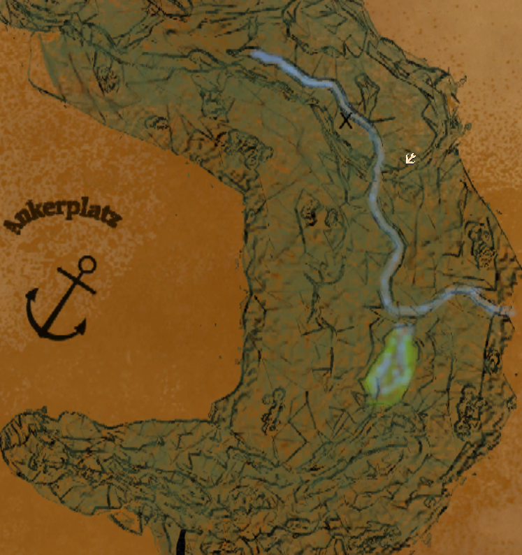
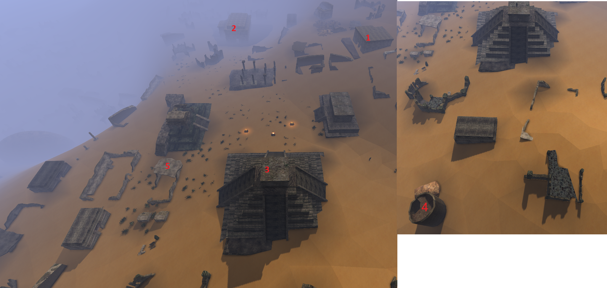

## Najważniejsze informacje {#najwazniejsze-informacje}

:::warning Uwaga

Otrzymałeś właśnie dostęp do swobodnego powrotu na poprzednie wyspy. Nie atakuj orków i asasynów, dopóki nie skończysz z nimi zadań. Po wykonaniu zadań dla Saida i zaakceptowaniu jego oferty, asasyni i orkowie stają się agresywni.

:::

:::tip Wskazówka

- Warto zaglądnąć na poprzednie wyspy
- Jeśli jeszcze go nie zrobiłeś, bardzo pomocny będzie tutaj [pierścień szybkości](/solucja/rozdzial-ii/#pierscien-szybkosci)
- Do pewnej części Varantu otrzymasz dostęp dopiero w 5 rozdziale, więc nie próbuj tam przechodzić górami
- Warto wykonać zadanie [Oszukany](/solucja/rozdzial-iv/#oszukany)
- Po zebraniu i przeczytaniu "kamiennej tablicy z świątyni" z ruin Tadmoru, Asasyni staną się wrogo nastawieni.

:::

## Statek Wojenny Albatros {#statek-wojenny-albatros}

### Najważniejsze informacje {#statek-wojenny-albatros-najwazniejsze-informacje}

- Tutaj możemy znaleźć dobrą biżuterię na hp oraz hp i manę

### Zadania główne i powiązane {#zadania-glowne-i-powiazane}

#### Vengard {#vengard}

Teleportujemy się do sali tronowej króla za pomocą runy otrzymanej od Baldwina. Należy porozmawiać z Królem, a następnie z zarządzcą. Ponownie rozmawiamy z Królem i teleportujemy się z powrotem na statek.

#### Zlecenie zarządcy {#zlecenie-zarzadcy}

Zarządca potrzebuje 10 skrzyń z rudą, 30 bochenków chleba, 300 bełtów, 20 eliksirów leczniczych (konkretnie „Eliksir leczniczy”, `ItPo_Health_03`) i 20 zwojów kuli ognia. Jest to dodatkowa dostawa, po przekazaniu skrzyń przewiezionych dla króla.

#### Sztorm {#sztorm}

Zadanie informacyjne, które kończy się po ukończeniu zadań [Dziura](/solucja/rozdzial-iv/#dziura) i [Człowiek za burtą](/solucja/rozdzial-iv/#czlowiek-za-burta)

#### Dziura {#dziura}

Gernot mówi nam o dziurze powstałej w wyniku sztormu. Należy udać się do Hawka, który jest w ładowni. Wysyła on nas po Svena, Albina, Konrada, Beowulfa i Bertrama.

Kiedy zawołasz ich wszystkich, należy porozmawiać z Hawkiem, który następnie odsyła Cię do Gernota.

#### Szczury na Albatrosie {#szczury-na-albatrosie}

Gernot zleca nam zabicie wszystkich szczurów na pokładzie Albatrosa. Większość z nich znajduje się na środku statku, ale kilka sztuk schowało się w pobliżu masztu.

Po wszystkim wracamy do Gernota i odbieramy nagrodę.

#### Człowiek za burtą {#czlowiek-za-burta}

Gernot mówi nam o tym, że Dandolo wypadł za burtę podczas sztormu. Zleca on nam przeszukanie pobliskich raf.

Interesują nas tylko 2 duże rafy. Na jednej z nich jest krypta ze skarbem z misji [Wola](/solucja/rozdzial-ii/#wola-korofskiego) [Korofskiego](/solucja/rozdzial-ii/#wola-korofskiego), a także Dandolo siedzący we wgłębieniu w skałach.

Należy go odprowadzić na statek, wystarczy, że porozmawiamy z nim na podeście przy drabinie. Po wszystkim wracamy do Gernota

#### Rozbitkowie {#rozbitkowie}

Na plaży na rafie z Dandolo, znajdujemy wiadomość w butelce. Dowiadujemy się z niej o rozbitku, który potrzebuje pomocy, ale znajdziemy go dopiero w 6 rozdziale na [wyspie Mendozy](/solucja/rozdzial-vi/#wyspa-pirata-mendozy).

Zadanie można również wykonać rozmawiając z Samem po raz pierwszy właśnie na tej wyspie. Zabieramy go na statek, płyniemy na Myrtanę i tam z nim rozmawiamy, co kończy nasze zadanie.

#### Zagubieni orkowie {#zagubieni-orkowie}

Po odprowadzeniu Dandolo na statek opowiada on nam o orkowym statku, który rozbił się na pobliskiej dużej rafie. Płyniemy na rafę, pozbywamy się przeciwników i zgarniamy wszystkie łupy jak i wykopujemy rudy.

Po zabiciu orków powinniśmy otrzymać wpis, a wtedy możemy udać się do Dandolo i zakończyć misję.

## Wyspa krabów {#wyspa-krabow}

### Zadania główne i powiązane {#wyspa-krabow-zadania-glowne-i-powiazane}

#### Zniszczenia po burzy {#zniszczenia-po-burzy}

Quest informacyjny zlecany przez Halvara. Po sztormie lądujemy na Krabowej Wyspie, gdzie musimy naprawić nasz statek.

#### Wsparcie załogi {#wsparcie-zalogi}

W rozmowie z Halvarem na wyspie możemy zgodzić się pomóc przy naprawie Albatrosa lub odmówić. Po akceptacji zadania musimy wykonać trzy subquesty: [drewno na statek](/solucja/rozdzial-iv/#drewno-na-statek), [naprawa kadłuba statku](/solucja/rozdzial-iv/#naprawa-kadluba-statku) oraz [kolorowe ryby](/solucja/rozdzial-iv/#kolorowe-ryby).

#### Drewno na statek {#drewno-na-statek}

Udajemy się do Dandolo, który stoi po lewej stronie na końcu pomostu. Po rozmowie z nim ścinamy drzewo obok i ponownie zagadujemy. Dandolo prowadzi nas na kolejną wycinkę. Ścinamy drzewo, wycinamy pnie i znowu z nim rozmawiamy. Po czterech ściętych drzewach idziemy do łuparki, a następnie do strugnicy. Gdy drewno będzie gotowe, wracamy do Halvara.

:::tip Wskazówka

Podczas wycinki może pęknąć trzonek topora. Aby go naprawić, potrzebujemy solidnej gałęzi i ostrza. Gałąź znajdziemy w obozie drwali. Po zebraniu wracamy na statek i naprawiamy topór przy stole warsztatowym, po czym kontynuujemy pracę.

Podczas wycinki może stępić się nasz topór, więc ostrzymy go na osełce i wracamy do zadania.

:::

#### Zabezpieczenie tartaku {#zabezpieczenie-tartaku}

Przy czwartym ściętym drzewie Dandolo wspomina o potworach i paladynach, którzy mieli ich pilnować. Musimy ich odnaleźć i porozmawiać w tej sprawie. Dwóch znajduje się na plaży, jeden po lewej stronie obozu drwali, drugi po prawej. Trzeci jest w lesie za obozem, a czwarty w pobliżu namiotu. U Volkera i Erika trzeba pokonać potwory. Po obchodzie wracamy do Dandolo.

#### Naprawa kadłuba statku {#naprawa-kadluba-statku}

Do naprawy kadłuba potrzebujemy 3 długich, 4 średnich i 4 krótkich desek. Idziemy do piły i przygotowujemy potrzebne materiały. Po pokazaniu desek Halvarowi przybijamy je do kadłuba od zewnątrz i od wewnątrz. Następnie uszczelniamy nieszczelne miejsca smołą. Niezbędne narzędzia otrzymamy od Wolfganga. Po zakończeniu napraw wracamy do Halvara.

#### Kolorowe ryby {#kolorowe-ryby}

Po zakończeniu prac przy kadłubie przejmujemy obowiązki Svena i idziemy na ryby. Po złowieniu 12 kolorowych ryb zanosimy je do Albina.

:::tip Wskazówka

Podczas łowienia może pęknąć żyłka. Wtedy udajemy się do Wolfganga, który sprzedaje nową. Po naprawie sprzętu wracamy na łowisko. Gdy złowimy 12 kolorowych ryb, ponownie zanosimy je do Albina, a następnie wracamy do Halvara.

:::

#### Kokosy {#kokosy}

Po podejściu do palmy otrzymujemy zadanie zebrania kokosów. Przydatny będzie autoloot lub free aiming. Po zebraniu kokosa quest zostaje zaliczony.

#### Jakby zapadł się pod ziemię {#jakby-zapadl-sie-pod-ziemie}

Halvar informuje nas, że zaginął Ernst. Przy beczkach nad rzeką, niedaleko łowiska, znajdujemy ślady stóp. Podążając ich tropem, docieramy do drzewa z plamą krwi, a kawałek dalej leży martwy dzik i łuk Ernsta. Wracamy z informacjami do Halvara, po czym ponownie udajemy się na miejsce. Od dzika przechodzimy przez bagna i przy skale znajdujemy kolejny ślad. Kierujemy się kamienną ścieżką w górę i po krótkiej wędrówce odnajdujemy szablę Ernsta. Idziemy dalej prosto, a gdy pojawi się nowy wpis w dzienniku, cofamy się do krzaków, które mijaliśmy wcześniej. Stojąc przodem do ściany, po lewej stronie znajdujemy klucz i przełącznik. Aktywujemy go, by wejść do jaskini, gdzie więziony jest Ernst. W drugiej komorze atakuje nas porywacz – nie zabijamy go, tylko obezwładniamy. Po krótkiej rozmowie zamykamy pustelnika w klatce i wracamy do Halvara, by zgłosić wykonanie zadania.

#### Beczki z wodą pitną {#beczki-z-woda-pitna}

Po zgodzeniu się na pomoc Ernstowi wracamy nad rzekę i przenosimy beczki na plażę. Po trzech kursach informujemy Halvara o wykonaniu zadania i kończymy misję.

#### Szalony pustelnik {#szalony-pustelnik}

Pustelnik prosi, abyśmy przynieśli mu grzyby z jaskini zaznaczonej na jego mapie. Po ich zebraniu, ze względu na nieprzyjemny zapach, pokazujemy je Wulfiasowi, który odkrywa, że są silnie trujące. Informujemy o tym pustelnika i czekamy trzy dni, aż przejdzie detoks. Następnie, po przeczytaniu jego dzienniczka, przekazujemy mu jego prawdziwe imię. Potem udajemy się do Baldwina, prosząc o ułaskawienie porywacza – ten się zgadza. Następnego dnia wracamy do Dusty’ego, kończąc zadanie.

#### Tajemnicza wyspa {#tajemnicza-wyspa}

Po ukończeniu zadania [Szalony pustelnik](/solucja/rozdzial-iv/#szalony-pustelnik) i rozmowie z Dustym o wyspie dowiadujemy się o nieumarłych krążących nocami nad rzeką i w górach. Po pokonaniu ich, przy jednym z magów znajdujemy klucz do skrzyni. Skrzynia znajduje się w jaskini, do której można dostać się od strony morza. Po jej otwarciu czeka nas walka z królem aligatorów.

[Otwórz album na Imgur](https://imgur.com/a/APY2Rgo)

#### Przy ognisku {#przy-ognisku}

Halvar zaprasza nas na ognisko, które odbędzie się przy namiocie o 20:00. Podczas spotkania rozmawiamy z towarzyszami i w międzyczasie zbieramy gałęzie, aby podtrzymać ogień.

#### Niebezpieczne bagno {#niebezpieczne-bagno}

Zadanie informacyjne, które kończy się po wypłynięciu z wyspy.

#### Bagienna febra {#bagienna-ferba}

Na bagnach dopada nas gorączka, więc udajemy się do Halvara, który odsyła nas do Wulfiasa. Niestety, mag pokładowy nie ma odpowiedniego lekarstwa. Uleczyć nas może dopiero Merkurius w Varancie lub mikstura kupiona od Bachala.

:::warning Uwaga

Po złapaniu ferby najlepiej wczytać grę, ponieważ choroba ustawia manę na poziomie 20 punktów, niezależnie od naszej maksymalnej wartości.

:::

## Tamora {#tamora}

### Zadania główne i powiązane {#tamora-zadania-glowne-i-powiazane}

#### Atak orków {#atak-orkow}

Po dopłynięciu na Tamorę okazuje się, że miasto zostało przejęte przez orków. Teleportujemy się do zamku i rozmawiamy z Bruno, który każe nam wyeliminować orków w mieście, jak i na jego obrzeżach. Po załatwieniu sprawy zdajemy Bruno sprawozdanie i kończymy zadanie.

#### Wojownicze trolle {#wojownicze-trolle}

Bruno opowiada nam o czterech bojowych trollach atakujących Tamorę. Powinniśmy je znaleźć podczas robienia zadań "Atak orków" i "Okręty wojenne orków"

Po wszystkim udajemy się do Bruno i tu misja się kończy.

#### Okręty wojenne orków {#okrety-wojenne-orkow}

Bruno opowiada nam o orkowych okrętach, które zakotwiczyły na plaży w Tamorze. Płynąc lewo wpław od miejsca naszej łódki, która płyniemy na statek, natrafimy na plaże, na której są orkowie.

Po zabiciu wszystkich orków na statkach wracamy do Bruno i zadanie się kończy

## Adarmos {#adarmos}

### Zadania główne i powiązane {#adarmos-zadania-glowne-i-powiazane}

#### Potężne Golemy {#potezne-golemy}

Po powrocie na Adarmos Starszy Wioski opowiada nam o golemach z magicznej rudy, które są nieśmiertelne i terroryzują mieszkańców wioski. Udajemy się do Kajo, który znajduje się w starym obozie piratów. Zleca on nam zadanie [List do Pyrokara](/solucja/rozdzial-iv/#list-do-pyrokara), a następnie [List do Telema](/solucja/rozdzial-iv/#list-do-telema)

Następnie wracamy na Adarmos pokonać golemy. Zdajemy relacje Kajo i udajemy się do Starszego Wioski.

#### List do Pyrokara {#list-do-pyrokara}

Kajo daje nam list, z którym udajemy się do Pyrokara, który nam odmawia, więc wracamy do Kajo

#### List do Telema {#list-do-telema}

Kajo daje nam list, z którym udajemy się do Telema na Tamorze. Ten opowiada nam o jaskini pod zamkiem, do której klucz ma Bruno. Nie zgadza się on wydać nam klucza, więc go kradniemy i idziemy do podziemi. Otwieramy tajne przejście w piwnicy i zabieramy Święty Topór spod kapliczki Adanosa

## Khorus {#khorus}

### Zadania główne i powiązane {#khorus-zadania-glowne-i-powiazane}

#### Gdzie się podział Kolwin? {#gdzie-sie-podzial-kolwin}

Po powrocie na Khorus udajemy się do Haralda, który opowiada nam o zaginięciu Kolwina. Pytamy mieszkańców wioski, po czym udajemy się do obozu myśliwych, gdzie dowiadujemy się, że myśliwy Refti go widział.Od niego dowiadujemy się, że widział go w okolicy namiotu Valandraji i latarni Tadeusa. Wypytujemy tę dwójkę, po czym Tadeus mówi nam, że Kolwin udał się do kopalni węgla i gadamy z Kolwinem.\
Na koniec udajemy się do Haralda i powiadamiamy go o naszym sukcesie.

## Khorinis {#khorinis}

### Zadania główne i powiązane {#khorinis-zadania-glowne-i-powiazane}

#### Gildia Złodziei {#gildia-zlodziei}

Po oszczędzeniu Rengaru podczas misji [Złoto Jory](/solucja/rozdzial-iii/#zloto-jory), możemy dołączyć (lub odrzucić ofertę) do gildii złodziei. Jeżeli zdecydujemy się dołączyć w rozdziale 3 możemy wykonać tylko [Plan Rengaru](/solucja/rozdzial-iii/#plan-rengaru). Więcej zadań odblokujemy dopiero w rozdziale 4 od Nagura. Dodatkowym wymogiem jest wyzwolenie miasta. Dodatkowe zadania w 4 rozdziale to: [Skarbiec miasta Khorinis](/solucja/rozdzial-iv/#skarbiec-miasta-khorinis) [Piwnica koszar](/solucja/rozdzial-iv/#piwnica-koszar) [Włamanie do Lutero](/solucja/rozdzial-iv/#wlamanie-do-lutero) (po tym zadaniu mamy alternatywną ścieżkę zadań - [Pomiędzy złodziejami](/solucja/rozdzial-iv/#pomiedzy-zlodziejami) - po czym zadanie z gildią złodziei może się wcześniej zakończyć), po której ogarniają nas wyrzuty sumienia i możemy wydać gildię Lordowi Andre. Ten jednak nie ma czasu, więc udajemy się z tym do Wambo i twoim zadaniem będzie znaleźć tożsamość [przywódcy](/solucja/rozdzial-iv/#gildia-zlodziei) oraz [pasera](/solucja/rozdzial-v/#paser). Będziecie się spotykać po godzinie 20:00, w jaskini z teleportem obok cmentarza Martwej Harpii. [Specjalna ryba](/solucja/rozdzial-iv/#specjalna-ryba), [Kryjówka przemytników](/solucja/rozdzial-iv/#jaskinia-przemytnikow), [Kontrabanda](/solucja/rozdzial-iv/#kontrabanda), [Grzyby dla Krugera](/solucja/rozdzial-iv/#grzyby-dla-gospodarza), [Tania ryżówka](/solucja/rozdzial-iv/#tania-ryzowka), [Kusząca propozycja](/solucja/rozdzial-iv/#kuszaca-propozycja), [Krwawe puchary](/solucja/rozdzial-iv/#krwawe-puchary), [Bart sprawia kłopoty](/solucja/rozdzial-iv/#bart-sprawia-problemy), [Test odwagi](/solucja/rozdzial-iv/#test-odwagi), [Topór bandyty”](/solucja/rozdzial-iv/#topor-bandyty). Po wykonaniu zadań dla przemytników dostaniemy od Nagura zadanie [Okradnięcie Lorda Andre](/solucja/rozdzial-v/#okradniecie-lorda-andre). Kolejne zadania dostaniemy dopiero w 5 rozdziale, a dokładniej po odblokowaniu dostępu do [Aszdod](/solucja/rozdzial-v/#aszdodvarant). Nagur powie nam, że [szef przemytników oczekuje](/solucja/rozdzial-iv/#gildia-zlodziei) na nas w ich kryjówce. Spotykamy tam Booze’a, któremu wcześniej wręczyliśmy piwo w kanalizacji. Twoim zadaniem obecnie jest zabicie wszystkich. Z ciała szefa przemytników zabieramy klucz do kufra oraz drzwi do jego pokoju. Dom znajduje się w przejściu do części gdzie mieszka Lutero i Salandril. Na piętrze znajduje się szafka, a na jej boku przycisk, który otwiera przejście na poddasze. Znajduje się tam skrzynia zawierająca notatkę mówiąca o tym, że Gerbrandt jest paserem. Mówimy o tym Wambo, który wysyła nas do Lorda Andre. Pozwala on nam na aresztowanie Gerbrandta, po czym wracamy do Andre i odbieramy nagrodę. Przy okazji w domu mogliśmy rozpocząć, po przeczytaniu notatki, zadanie [Zamknięty pokó](/solucja/rozdzial-v/#zamkniety-pokoj)j”

#### Pomiędzy złodziejami {#pomiedzy-zlodziejami}

Zadanie pojawia się, gdy decydujemy się nie wydać Nagura i złodziei Lordowi Andre. Wybieramy wtedy współpracę z gildią: wykonujemy zlecenia złodziei i przemytników, a po dotarciu do Booze'a nie atakujemy go.

:::warning Uwaga

W tej ścieżce nie zgłaszamy kolejnych zleceń Wambowi. Donoszenie straży należy do wariantu infiltracji opisanego w zadaniu [Gildia złodziei](/solucja/rozdzial-iv/#gildia-zlodziei). Współpraca z gildią prowadzi natomiast do zleceń od Nagura i Booze'a.

:::

Booze daje nam klucz do sekretnego pokoju w kanałach i poleca przesłuchać Rączkę. W pierwszym pomieszczeniu pociągamy za żelazny pierścień, a w kolejnym szukamy drugiego pierścienia na kolumnie; warto mieć pochodnię. Otwieramy przejście do więźnia, rozmawiamy z nim o ukrytej rudzie, a po pobiciu zabieramy jego mapę.

Możemy zabić Rączkę albo, po odmowie zabicia go w rozmowie z Booze'em, pozostawić go w zamknięciu. Wracamy z mapą do Booze'a. Uwolnienie Rączki powoduje wrogość Booze'a i kończy współpracę z gildią. Jeśli zachowamy jej zaufanie, na koniec pytamy Booze'a o dalsze zlecenia: udziela nam porad dotyczących zarobku i zamyka zadanie.

#### Włamanie do Lutero {#wlamanie-do-lutero}

Nagur zleca nam przyniesienie mu cennej szkatułki Lutero. Należy go okraść i wziąć szkatułkę ze skrzyni w jego domu. O północy spotykamy Nagura w kanałach i oddajemy mu szkatułkę. Po kilku dniach można odebrać nagrodę i zakończyć zadanie.

#### Piwnica koszar {#piwnica-koszar}

W trakcie nauki o włamywaniu, Mike mówi nam o mysiej albo szczurzej norze, przez którą można się dostać do piwnicy koszar. Dziura znajduje się za krzakami przy schodach prowadzących do koszar od strony morza. W piwnicy znajdziemy kuferek, który wymaga specjalnego wytrychu, 250 zręczności i 5 poziomu otwierania. Po wytworzeniu wytrychu i opróżnieniu skrzyni, quest zostaje zaliczony.

#### Skarbiec miasta Khorinis {#skarbiec-miasta-khorinis}

Po nauczeniu się otwierania zamków na 5. poziomie otrzymamy zadanie polegające na okradzeniu skarbca Khorinis. Udajemy się do skarbca, którego strzeże Gekard. Sprawdzamy zamek, okradamy strażnika z klucza do skrzyni i rzucamy na niego zaklęcie strachu. Następnie opróżniamy skrzynię i czekamy jeden dzień. Następnego dnia zaklęcie snu zaczyna działać na strażnika. Przed włamaniem wykonujemy wytrych do skarbca na stole warsztatowym. Idziemy do skarbca, usypiamy Gekarda i okradamy Khorinis. Potem czekamy kolejny dzień i rozmawiamy z Wambo, który niczego nie podejrzewa. Zadanie ukończone.

Dalszy etap, [Specjalna ryba](/solucja/rozdzial-iv/#specjalna-ryba), jest dostępny u Nagura od IV rozdziału po spełnieniu warunków poprzednich rozmów.

#### Włamanie do Herolda {#wlamanie-do-herolda}

Nagur zleca nam okradnięcie domu Herolda. Sam Herold przemawia na placu wisielców, a jego dom znajduje się nad domem Constantino.

Znajdujemy tam mapę skarbów, która prowadzi do X'a na polanie nad słonecznym kręgiem.

#### Zakopane skarby {#zakopane-skarby}

Zadanie aktywuje się automatycznie po przeczytaniu mapy z domu Herolda, a kończy się po wykopaniu go.

#### Specjalna ryba {#specjalna-ryba}

Nagur opowiada nam o specjalnych rybach, w których złodzieje przenoszą informacje.Idziemy się przespać, następnie gadamy z Nagurem, po czym idziemy do Halvora, który daje nam ryby.

1. WSPÓŁPRACA ZE STRAŻĄ Otwieramy ryby i idziemy z rybami do Wambo, aby dowiedzieć się, jak je zszyć. Następnie idziemy do Nagura, który mówi nam o Wainie.

2. DROGA ZŁODZIEI Idziemy z rybami do Nagura, który mówi nam, że wiadomość jest od Waine'a, szefa przemytników.

#### Jaskinia przemytników {#jaskinia-przemytnikow}

Zadania są powiązane z [Gildia złodziei](/solucja/rozdzial-iv/#gildia-zlodziei)

Po zadaniu [Specjalne ryby](/solucja/rozdzial-iv/#specjalna-ryba) Nagur daje nam mapę i klucz do jaskini przemytników, która znajduje się na nowych terenach w górach naprzeciw kapliczki Innosa przy farmie Lobarta. Musimy ubrać zbroje, która nie jest pancerzem żołnierza, ani pancerzem bandytów.

Po wejściu do jaskini rozmawiamy z Waine'em, który zleca nam pomóc innym przemytnikom.

a) Robimy zadania wymienione poniżej

b) Mówimy Waine'owi, że zrobiliśmy wszystko, a ten każe nam zapłacić i przymyka oko na nasze lenistwo.

Otrzymujemy zadanie [Krwawe Puchary](/solucja/rozdzial-iv/#krwawe-puchary), a kiedy je zrobimy, Waine odsyła nas do Nagura, gdzie zadanie się kończy.

#### Kusząca propozycja {#kuszaca-propozycja}

Baloro oferuje nam potężna broń, pod warunkiem że przyniesiemy mu jedzenie. Możemy odmówić lub przynieść mu jedzenie. Niezależnie od naszej decyzji, okazuje się, że nas oszukał i broni nie dostaniemy. Możemy wyzwać go na pojedynek i odzyskać jedzenie, aczkolwiek nie wolno go zabijać.

#### Topór bandyty {#topor-bandyty}

Eddi potrzebuje pomocy aby wykuć lekki topór na kowadle. Po dostarczeniu potrzebnych materiałów, otrzymujemy od niego przepis, by wykonać topór. Po wykuciu należy naostrzyć go na osełce i oddać.

#### Bart sprawia problemy {#bart-sprawia-problemy}

Jeśli Bart zagada nas odpowiednią ilość razy rozpocznie się walka. Po pokonaniu go i rozmowie, zadanie się kończy.

#### Test odwagi {#test-odwagi}

Przemytnik Josh opowiada nam o groźnym piekielnym ogarze, który przebywa w lesie przed jaskinią. Musimy go zabić i przynieść jego pazur Joshowi. Zadanie się kończy, a my otrzymujemy kolejną misję

#### Kontrabanda {#kontrabanda}

Przemytnik Josh wysyła nas do jaskini w kotlinie obok Wieży Xardasa, abyśmy przynieśli mu dwie skrzynie z kontrabandą. Rozprawiamy się z poszukiwaczami i jaszczuroczłekami, po czym oddajemy mu skrzynie.

#### Grzyby dla gospodarza {#grzyby-dla-gospodarza}

Przemytnik Kruger zleca nam zebranie 10 leśnych smardzów i 12 surojadek, na jego specjalną zupę. Oba rodzaje grzybów można znaleźć w lesie przed jaskinią.\
Przynosimy Krugerowi składniki i zadanie się kończy.

#### Tania ryżówka {#tania-ryzowka}

Przemytnik Brady zleca nam sprzedanie Kardifowi 10 butelek taniego bimbru. Kardiff nie chce kupić alkoholu po wysokiej cenie.

a) Kradniemy Krugerowi przepis na zupę, czytamy go, a następnie oddajemy Kardifowi. Ten jest zadowolony i kupuje alkohol.

b) Sprzedajemy alkohol po niższej cenie i odbieramy marne pieniądze.

Niezależnie od wyboru wracamy do Brady’ego, a tutaj zadanie się kończy.

#### Handel z bandytami {#handel-z-bandytami}

Rivers chce żebyśmy przeprowadzili negocjacje handlowe z bandytą Udo, którego możemy spotkać w lesie świerkowym. W tym celu dostajemy specjalny strój, w którym musimy iść. Uwaga, aby nie przekroczyć ceny\
Po wszystkim wracamy do Riversa.

#### Krwawe Puchary {#krwawe-puchary}

Po zdobyciu zaufania przemytników Waine Zleca nam przyniesienie 6 krwawych pucharów umiejscowionych w górnym mieście Khorinis.

Znajdują się one kolejno w Domu Sędziego, Domu Lariusa, Domu Fernando, Domu Valentino, Domu Boltara (Handlarz ubraniami obok Salandrila) oraz u Lehmara. Puchary odnosimy Waine'owi i możemy odebrać nagrodę.

#### Gra w kości w Khorinis {#gra-w-kosci-w-khorinis}

W gospodzie Coragona pojawiają się zawodowi gracze kości, których należy pokonać w grze w kości, aby móc stoczyć pojedynek z ich szefem Hughem. Po ich pokonaniu Hugh daje nagrodę i zadanie się kończy.

#### Niedobitki armii orków {#niedobitki-armii-orkow}

Po odbiciu Khorinis Andre mówi nam o orkowych uciekinierach, którzy schowali się w niektórych częściach Khorinis. Należy się ich pozbyć, aby nie zagrażali mieszkańcom. Po zlikwidowaniu wszystkich grup orków udajemy się do Andre.

Pierwsza grupa znajduje się w dolince na prawo od wschodniej bramy miasta.\
Druga grupa jest rozproszona po mrocznym lesie, między farmą Akila, a latarnią morską.\
Trzecia grupa znajduje się przy ognisku, gdzie w podstawce siedzi Lester\
Czwarta grupa jest przy przejściu na Przełęcz.\
Piąta grupa jest niedaleko mostu prowadzącego na północ Khorinis, tam gdzie piramidy.

#### Wybaczenie dla Corneliusa {#wybaczenie-dla-corneliusa}

Andre zleca nam udanie się z listem do Corneliusa. Znajduje się on tam, gdzie bandyci Cavalorna w podstawce.\
Odprowadzamy go do miasta, w międzyczasie pozbywając się poszukiwaczy. Odprowadzamy go naprzeciw straganu Ruperta i idziemy porozmawiać z Andre.

#### Powrót poszukiwaczy {#powrot-poszukiwaczy}

Pyrokar mówi nam o Poszukiwaczach, którzy powrócili do Khorinis. Zadanie kończy się, po ukończeniu zadań [Niebiańska tarcza](/solucja/rozdzial-v/#niebianska-tarcza) i [Szpon Beliara](/solucja/rozdzial-v/#szpon-beliara).

#### Sługi Beliara {#slugi-beliara}

Pyrokar mówi nam o Kościanych Wojownikach, którzy ulokowali się w podziemnej bibliotece klasztoru. Rozmawiamy z Talomonem, a następnie pozbywamy się nieumarłych z piwnicy.\
Po skończonej robocie wracamy do Pyrokara i odbieramy nagrodę.

#### Ogniste pokrzywy dla Neorasa {#siedem-roslin}

W starszych opisach: „Siedem roślin”.

Neoras prosi nas o przyniesienie 7 ognistych pokrzyw, które już zapewne mamy. Oddajemy mu je i odbieramy nagrodę.

## Wybrzeże Varantu {#wybrzeze-varantu}

### Zadania poboczne {#wybrzeze-varantu-zadania-poboczne}

#### Szakale {#szakale}

Jake, strażnik korsarzy w ruinach świątyni na wybrzeżu Varantu, prosi o pozbycie się szakali z okolicy. Możemy zgodzić się na zapłatę 50 sztuk złota albo najpierw odmówić, aby uzyskać ofertę 100 sztuk złota. Wynagrodzenie odbieramy po wykonaniu zadania.

Zabijamy szakale w pobliżu ruin i wracamy do Jake'a z raportem. Rozmowa i odbiór ustalonej zapłaty kończą zadanie.

## Pustynia Varantu {#pustynia-varantu}

### Najważniejsze informacje {#pustynia-varantu-najwazniejsze-informacje}

- Dostęp za przełęcz do [Bezimiennego](/solucja/rozdzial-iv/#bezimienny-bohater) oraz [Zachodniego Varantu](/solucja/rozdzial-iv/#zachodni-varant) zdobędziemy okradając Tartarona, a następnie otwierając jego skrzynię na dole. Następnie należy na przełęczy do Ishtar wejść do wieży obok wrót i [domu Zoraba](/solucja/rozdzial-iv/#dom-zoraba) i otworzyć przejście. Za nim spotkamy znajome twarze i przejście na dalszą część pustyni.

### Zadania główne i powiązane {#pustynia-varantu-zadania-glowne-i-powiazane}

#### Nieznośne gorąco {#nieznosne-goraco}

Po wejściu na pustynię dostajemy wpis, który sugeruje nam zdobyć pancerz chroniący przed gorącem. Jeden z takich pancerzy sprzedaje Abbas w Ugarze.

Pancerz koczowników sprzeda nam Said w jego obozie. Po zdobyciu pancerza asasyna i koczownika quest się kończy.

#### Świątynia Aszdodu {#swiatynia-aszdodu}

Baldwin zleca nam dostanie się do świątyni Aszdodu. To główne zadanie wywiadowcze Varantu. [Wejście do doliny](/solucja/rozdzial-iv/#dostep-do-aszdod) i [dostęp do samej świątyni](/solucja/rozdzial-v/#dostep-do-swiatyni) stanowią kolejne etapy. Wątek prowadzi do ustalenia zagrożenia ze strony Baal Handshara i raportu Baldwinowi przed odpłynięciem z Varantu.

#### Dostęp do Aszdod {#dostep-do-aszdod}

Strażnik drzwi do doliny Aszdodu nie chce nas przepuścić bez przepustki, więc musimy ukończyć zadanie [Audiencja u Tartarona](/solucja/rozdzial-iv/#audiencja-u-tartarona) i otrzymać od niego pozwolenie.

#### Orkowie w Varancie {#orkowie-w-varancie}

Zadanie informacyjne; Nie należy atakować orków, dopóki oni nie zaczną atakować Ciebie lub nie skończysz wszystkich związanych z nimi wątków.

#### Przyjaciel koczowników {#przyjaciel-koczownikow}

Zadanie informacyjne; Powinniśmy głównie trzymać stronę koczowników, ale nie powinniśmy bezpodstawnie atakować miast asasynów lub działać całkowicie przeciwko nim.

Jeśli chcesz, aby Said pomógł Ci odbić Aszdod, musisz zrobić zadanie "Głos odwagi" i wypowiedzieć wojnę asasynom

#### Droga asasyna {#droga-asasyna}

Zadanie informacyjne; Powinieneś trzymać również stronę asasynów, ale nie powinieneś odbijać osad asasynów i zostawić mocno stronnicze misje na sam koniec.

Asasyni i orkowie i tak zaczną Cię atakować po wejściu do grobowca Baal Handshara lub po wzięciu artefaktu z świątyni.

#### Wymiana klucza za rum {#wymiana-klucza-za-rum}

Korsarz Dylan, który znajduje się w obozie Pajka, wysyła nas na statek Pajka, do pirata Rileya po specjalny rum. Wracamy z rumem do Dylana, który daje

nam klucz do skrzyni, która znajduje się na małej wysepce niedaleko statku.

#### Straszne ruiny {#straszne-ruiny}

Prampek, ork którego spotykamy po wejściu na pustynię, oferuje nam towarzystwo w eksploracji pobliskich ruin. Najlepiej wyczyścić je samemu, a przed nieumarłym trollem po niego wrócić, zabić go z nim i porozmawiać. Wtedy quest się kończy, a Prampek odchodzi.

#### Prampek chce iść do obozu {#prampek-chce-isc-do-obozu}

Zadanie polegające na odprowadzeniu Prampeka do obozu orków przy kanionie. Wystarczy iść cały czas na wprost od wejścia na pustynię i zagadać z orkiem dowódcą w namiocie.

#### Obcy wojownicy {#obcy-wojownicy}

Zadanie rozpoczyna pierwsza rozmowa z małomównym Hakkonem, który siedzi przy palmach na skraju pustyni. Poznajemy go już w IV rozdziale. Dopiero po uzyskaniu [dostępu do świątyni Aszdodu](/solucja/rozdzial-v/#dostep-do-swiatyni) wracamy do niego i dowiadujemy się o losie jego towarzysza. Zgoda na pomoc Larsowi zamyka „Obcych wojowników” i rozpoczyna osobne zadanie [Wojownik z Nordmaru](/solucja/rozdzial-v/#wojownik-z-nordmaru), opisane w V rozdziale.

#### Zew przodków {#zew-przodkow}

Hakoon i Lars poszukują informacji o swoim przodku Akaschy. Jego tabliczka znajduje się w grobowcu świątyni Tadmoru, do której dostaniemy się w ramach zadania [Boski artefakt](/solucja/rozdzial-iv/#boski-artefakt)

#### Broń Larsa {#bron-larsa}

Lars prosi nas o przyniesienie mu jego łuku i topora. Topór posiada rozbójnik Achmed, którego przed chwilą zabiliśmy, a łuk jest u rozbójnika Hussina, który przebywa między Ugarem a wieżą wojowników Beliara.

#### Tajemnicza jaskinia {#tajemnicza-jaskinia}

Po wejściu do jaskini niedaleko mostu, nad oazą ze źródłem wody, otrzymujemy wpis w dzienniku, a gra nas wycofuje. Podczas robienia zadania [Nemrosh](/solucja/rozdzial-v/#nemrosh) odnajdziemy kamień ogniskujący, którym będziemy mogli uruchomić tamtejszy teleport i kontynuować zadanie "Boski artefakt"

#### Notatka Krzywobrodego {#notatka-krzywobrodego}

Po spotkaniu Pajka w świątyni niedaleko miejsca, gdzie siedzi Ernst, możemy pomóc mu w poszukiwaniach lub go zabić. Niezależnie od wyboru, dzięki mapie znajdujemy skarb, a zadanie się kończy.

#### Skarb w ruinach klasztoru {#skarb-w-ruinach-klasztoru}

W ruinach klasztoru nieopodal wejścia do Aszdodu, po prawej stronie głównego budynku znajduje się skrzynia z kluczem. Na najwyższym piętrze w centralnej części jest kolejna skrzynia, a następna w środku. Ostatnia jest w piwnicy i zawiera ornament do otwarcia trumny ze skarbem.

#### Poszukiwanie skarbu w świątyni z wahadłem {#poszukiwania-skarbow-w-swiatyni-wahadel}

Na końcu kanionu lwów znajduje się teleport, który prowadzi nas przed drzwi świątyni wahadeł. Dostaniemy się tam dopiero w ramach zadania [Niebiańska Tarcza](/solucja/rozdzial-v/#niebianska-tarcza) Po przejściu kilku pomieszczeń znajdziemy wrak statku, a w nim trumnę, w której znajduje się skarb.

#### Poszukiwanie skarbu w ruinach domu {#poszukiwanie-skarbu-w-ruinach}

W skrzyni na małej wysepce (Zadanie [Wymiana klucza za rum](/solucja/rozdzial-iv/#wymiana-klucza-za-rum)) znajdujemy mapę, która prowadzi nas do skarbu w ruinach. Znajdujemy go, a zadanie się kończy.

#### Poszukiwanie skarbu na plaży {#poszukiwanie-skarbu-w-przybrzeznej-jaskini}

W starszych opisach: „Poszukiwanie skarbu w przybrzeżnej jaskini”.

Po zakupie mapy u Amada dowiadujemy się o skarbie, który jest na dnie kanionu w jaskini łączącej Patarę z pustynia. Wykopujemy skarb i zadanie się kończy.

#### Kopalnia przeklętych {#kopalnia-przekletych}

Po zakupie mapy u Amada dowiadujemy się o skarbie, który jest w przeklętej kopalni. Znajduje się on za mostem, po prawej stronie.

Zabijamy szkielety, wykopujemy skarb i na tym misja się kończy

#### Poszukiwanie skarbu nad jaskinią {#poszukiwania-skarbu-w-jaskini-wodnej}

W starszych opisach: „Poszukiwania skarbu w jaskini wodnej”.

Po przeczytaniu notatki z martwego człowieka przy wyjściu z jaskini łączącej Patarę z pustynią, dowiadujemy się o skarbie zakopanym w jaskini wodnej.

Jest to jaskinia nad źródłem, które jest po lewej stronie od wejścia na pustynię. Kiedy będziemy mogli tam wejść(Zadanie [Tajemnicza jaskinia](/solucja/rozdzial-iv/#tajemnicza-jaskinia))

#### Łup Saladyna {#skarb-saladyna}

W starszych opisach: „Skarb Saladyna”.

1. W jaskini z lampartami pod obozem orków banitów, znajdujących się między Amarną, a Ugarem znajdziemy notatkę, która prowadzi nas do opuszczonego domu, w którym znajdujemy notatkę, w której dowiadujemy się gdzie jest skarb. Idziemy we wskazane miejsce, zabijamy asasyna, a misja się kończy

2. W opuszczonym domu na pustyni znajdujemy notatkę, po przeczytaniu której pojawia się agresywny asasyn. Czytamy dokumenty i idziemy do wcześniej wspomnianej jaskini z lampartami, a tam zadanie się kończy.

## Patara {#patara}

### Zadania główne i powiązane {#patara-zadania-glowne-i-powiazane}

#### Przejście na pustynię {#przejscie-na-pustynie}

Od strażnika przejścia na pustynię dowiadujemy się, że potrzebujemy zgody od Abdula. Zgodzi się on nas przepuścić, jeśli zrobimy zadania dla mieszkańców wioski. Po otworzeniu krat, zadanie się kończy

#### Żona rybaka {#zona-rybaka}

Rybak Luka opowiada nam o swojej żonie prześladowanej przez piratów. Samą Sulejke znajdziemy w dużej jaskini, która znajduje się przy wybrzeżu. Po tym jak odprowadzimy ją do wioski, zadanie się kończy.

#### Bezczelni korsarze {#bezczelni-korsarze}

Po odprowadzeniu Sulejki Luka prosi nas o rozprawienie się z piratami. Idziemy do Vincenta i wyzywamy go na pojedynek. Po pokonaniu gadamy z nimi jego koleżką, po czym wracamy do Luki

#### Cenne perły {#cenne-perly}

Po rozprawieniu się z piratami Luka wspomina nam o tym, że Rudobrody poszukuje pereł. Znajdziemy go na statku lub w domu Abdula. Wysyła on nas po 12 pereł, które są porozrzucane w przybrzeżnej jaskini. Zbieramy perły, odnosimy Rudobrodemu i na tym quest się kończy.

#### Potwór {#potwor}

Abdul opowiada nam o potworze, który zalągł się w przybrzeżnej jaskini. W jednej z odnóg jaskini znajduje się imienny smoczy zębacz, którego zabijamy i wracamy zdać relacje Abdulowi

#### Bagienne ziele dla Gor Assura {#bagienne-ziele-dla-gor-assura}

Gor Assur znajdujący się w domu Abdula prosi nas o przyniesienie mu 12 sztuk bagiennego ziela. Jeśli jeszcze go nie zebraliśmy, znajdziemy je pod drzewami na plaży. Odnosimy ziele i na tym zadanie się kończy.

#### Żarłoczne krokodyle {#zarloczne-krokodyle}

Po dostarczeniu Gor Assurowi ziela, ten zleca nam zajęcie się grupą żarłocznych krokodyli, które znajdują się na brzegu. Zabijamy krokodyle i wracamy do Gor Assura po rekomendacje.

#### Biedacy {#biedacy}

Aram zleca nam kradzież jedzenia z domu Abdula i rozprowadzenie go pośród rybaków. Po wszystkim wracamy do Arama i odbieramy nagrodę

#### Mięso żółwia {#mieso-zolwia}

Asmund prosi nas o dostarczenie mu 30 mięs żółwia. Pojawiły się one na potrzeby misji w przybrzeżnej jaskini, jak i na samym wybrzeżu. Po zebraniu odpowiedniej ilości mięsa wracamy i tym samym kończymy zadanie.

#### Mięso dla Drompeka {#mieso-dla-drompeka}

Po otrzymaniu pozwolenia na wejście na pustynię Abdul prosi nas o pomoc dla Drompeka. Udajemy się do orka, przynosimy mu 10 surowego mięsa i na tym quest się kończy.

#### Starosta wioski {#starosta-wioski}

Po otrzymaniu pozwolenia na wejście na pustynię Abdul prosi nas o szpiegowanie Arama. O 2030 wychodzi on ze swojego domu i zmierza do przybrzeżnej jaskini, a konkretnie do zamkniętych drzwi, za którymi znajduje się kapliczka Adanosa. Możemy go wydać(co spowoduje walkę) lub zachować to w tajemnicy. Niezależnie od wyboru wracamy do Abdula i odbieramy nagrodę.

#### Caine {#caine}

Po otrzymaniu pozwolenia na wejście na pustynię Gor Assur prosi o odnalezienie jego mentora, guru Caine'a. Znajduje się on w Aszdodzie, do którego dostaniemy się dopiero w trakcie wątku głównego. Quest kończy się po zabiciu Caine'a w bibliotece.

## Obóz orków Nemrosha {#oboz-orkow-nemrosha}

### Zadania główne i powiązane {#oboz-orkow-nemrosha-zadania-glowne-i-powiazane}

#### Artefakty {#artefakty}

Nemrosh zleca nam przeszukanie ruin Tadmoru w poszukiwaniu kolorowych kamiennych tabliczek. 

1. Czerwona - zasypane ruiny z przełącznikiem znajdującym się wewnątrz.
2. Fioletowa - ruiny z ognistym golemem; przełącznik umieszczony na zewnątrz.
3. Niebieska - na szczycie piramidy, przełącznik znajduje się na zewnątrz.
4. Zielona - w przysypanej wieży, w której znajduje się mumia.
5. Żółta - na dachu niewielkich ruin obok piramidy.

Po zebraniu tabliczek udajemy się do Gemnoka, który odsyła nas do Nemrosha, gdzie zadanie się kończy.

#### Mięso dla obozu {#mieso-dla-obozu}

Yussuf prosi nas o przyniesienie 30 mięsa, które już zapewne mamy, więc oddajemy i kończymy zadanie.

#### Pełzacze z ruin {#pelzacze-z-ruin}

Gemnok prosi nas o pozbycie się pełzaczy z ruin. Po zabiciu wszystkich otrzymujemy wpis i wracamy po nagrodę do Gemnoka.

## Ugar {#ugar}

### Zadania główne i powiązane {#ugar-zadania-glowne-i-powiazane}

#### Audiencja u Tartarona {#audiencja-u-tartarona}

Zadanie rozpoczynamy rozmową z Hektorem przed siedzibą Tartarona. Aby uzyskać audiencję, pracujemy na swoją reputację w Ugarze, wykonując zadania takie jak [Łowcy głów w Ugarze](/solucja/rozdzial-iv/#lowcy-glow-w-ugarze), [Mąka dla Ugaru](/solucja/rozdzial-iv/#maka-dla-ugaru), [Zbiór pomidorów](/solucja/rozdzial-iv/#zbior-pomidorow), [Nadzorca](/solucja/rozdzial-iv/#nadzorca), [Nielegalny handel](/solucja/rozdzial-iv/#nielegalny-handel) i [Łowcy lwów](/solucja/rozdzial-iv/#lowcy-lwow). Następnie pytamy Torresa, czy nasza reputacja jest już wystarczająca, i rozmawiamy z Tamarą przed spotkaniem z Tartaronem.

#### Zwiadowca w Varancie {#zwiadowca-w-varancie}

W Ugarze, na placu szubienicy, rozmawiamy z Dandolo przebranym za przodownika karawany. Chce spotkać się dyskretnie w ruinach niedaleko handlarza suknem. Umawiamy się tam o 3:00 w nocy; uważamy na bandytów grasujących po mieście.

Podczas spotkań Dandolo udziela wskazówek o Ugarze, jego mieszkańcach i ważnych budynkach; możemy otrzymać od niego mapę miasta. Po zakończeniu misji w Varancie informujemy go, że może wrócić na statek. Przed [atakiem na Ugar](/solucja/rozdzial-v/#wyzwolenie-ugaru) trzeba przekazać mu tę wiadomość.

#### Zbiegli niewolnicy {#zbiegli-niewolnicy}

Gasparino każe nam odszukać zbiegłych niewolników. Lokalizacje niewolników:

Morris Na lewo od wyjścia z Ugaru, leży wśród stada brzytwiaków\
Wilbert Niedaleko łowców lwów przy palmach\
Spike Przy skałach niedaleko świątyni na końcu oazy\
Clark W kamiennym domku, którego pilnują dwie pantery

Są dwa rozwiązania tego zadania.

1. Rozliczamy u Gasparina los wszystkich czterech zbiegów. Morris nie żyje — zgłaszamy znalezienie jego ciała. Pozostałych trzech można odprowadzić, jeśli żyją; dostępne są także odpowiedzi o ich śmierci lub ucieczce. Po rozliczeniu zbiegów odbieramy nagrodę.

2. [Ratunek dla niewolników](/solucja/rozdzial-iv/#ratunek-dla-niewolnikow)

#### Ratunek dla niewolników {#ratunek-dla-niewolnikow}

Po przeczytaniu notatki w ciele Morrisa i rozmowie z Pietem, który jest w kopalni Gasparino, mamy możliwość objąć stronę koczowników. Jeśli się zgodzimy, [Zbiegli niewolnicy](/solucja/rozdzial-iv/#zbiegli-niewolnicy) psuje się, a my musimy udać się do Tamary i zdobyć zaufanie koczowników. Po zdobyciu zaufania, wracamy do Piet'a i odprowadzamy wszystkich niewolników do małej oazy za wieżą strażniczą wojowników Beliara. Na miejscu rozmawiazmy z Haram'em.

#### Ogary łowców niewolników {#ogary-lowcow-niewolnikow}

Gasparino każe nam uważać na ogary łowców niewolników, które musimy najzwyczajniej w świecie zabić. Po zabiciu 8 ogarów otrzymujemy wpis w dzienniku, a quest kończy się samoistnie.

#### Łowcy głów w Ugarze {#lowcy-glow-w-ugarze}

Torres zleca nam pozbycie się Berdochy, szefa pustynnych wojowników. Wychodzimy z bramy miasta od strony plantacji i idziemy do kamiennego łuku. Znajdziemy tam grupę rozbójników, a w jednym z nich klucz. Następnie idziemy wzdłuż tej skały, aż trafimy na wnękę, która prowadzi do wejścia do katakumb. Tam napotkany Berdoche i jego gang, którego się pozbywamy. Po wszystkim wracamy do Torresa i odbieramy nagrodę

#### Zbiór pomidorów {#zbior-pomidorow}

Bachal potrzebuje kogoś, kto pozbiera dla niego pomidory z jego plantacji. Otrzymujemy klucz i zabijamy ogary oraz chrząszcze na plantacji.

Zbieramy pomidory z krzaków po czym wracamy do Bachala zdać mu relację. Odsyła nas żebyśmy napełnili butelki wodą i podlali grządki. Trzeba pochodzić po plantacji, aż nie dostaniemy wpisu w dzienniku. Nawet jeśli mamy wystarczającą ilość pomidorów, warto podlać grządki jeszcze raz i poczekać tydzień. Dostaniemy wtedy dodatkowe 270-300 pomidorów. Idziemy teraz do Pedro, którego zatrudniamy jako zbieracza pomidorów. Odbieramy od niego pomidory, idziemy do Bachala i kończymy questa. (Pomidorki odzyskamy w handlu, warto je kupić dla siły)

#### Nadzorca {#nadzorca}

Bachal nie otrzymał wieści od swojego nadzorcy już od dłuższego czasu. Udajemy się na teren w pobliżu plantacji, gdzie okazuje się, że nadzorcę zabiły potwory. Bierzemy i czytamy notatkę z jego ciała, po czym wracamy do Bachala. Ten zleca nam znalezienie nowego nadzorcy, którym jest Pedro. Uzgadniamy z nim warunki pracy, po czym wracamy do  Bachala i kończymy misje

#### Mąka dla Ugaru {#maka-dla-ugaru}

Torres chce abyśmy przynieśli mu 30 worków mąki. Musimy udać się do młyna Sancheza, który znajduje się obok Amarny. Sanchez nie wyda nam mąki, dopóki nie otrzymamy pozwolenia od Hassana, więc udajemy się do Amarny, gdzie strażnik nie chce nas wpuścić. Wracamy do Torresa po hasło, a następnie z powrotem idziemy do Amarny. Da on nam pozwolenie, jeśli zrobimy zadanie [Łowcy głów w Ugarze](/solucja/rozdzial-iv/#lowcy-glow-w-ugarze) i [Niebezpieczna karawana](/solucja/rozdzial-iv/#niebezpieczna-karawana). Stamtąd idziemy do Sancheza, a on udziela nam pozwolenia na zabranie mąki, z którą wracamy do Torresa.

#### Nielegalny handel {#nielegalny-handel}

Torres jest zaniepokojony handlem bronią w Ugarze. Wysyła nas do Branco, który się wszystkiego wypiera, więc idziemy zapytać o to Czampoka. Czampok odsyła nas z powrotem do Branco, któremu kradniemy klucz i otwieramy jego skrzynie w noclegowni Bachala. Po przeczytaniu notatki wracamy do Branco i udajemy się z nim do kryjówki Humphreya. Robimy teraz zadania [Niebezpieczne Cieniostwory](/solucja/rozdzial-iv/#niebezpieczne-cieniostwory) i [Łowca skarbów](/solucja/rozdzial-iv/#lowca-skarbow), a po oddaniu złota Branco mówi nam, abyśmy śledzili osobę wychodzącą o 3 w nocy z miasta. Śledzimy Gero aż do końca jego trasy, otrzymujemy klucz do jaskini, zabijamy rabusiów i czytamy notatkę. Z notatką udajemy się do Torresa.

#### Łowca skarbów {#lowca-skarbow}

W ramach misji "Nielegalny handel" udajemy się z Branco do jaskini Humphreya. Po pokonaniu cieniostworów, musimy przespać się do 8 i wyruszamy z nimi do świątyni. Stamtąd wracamy do kamiennych filarów które minęliśmy i klikamy jeden z przycisków na nim, a następnie wskakujemy do "studzienki" i zmierzamy w głąb świątyni. W większości pomieszczeń otwiera je przycisk obok krat, poza ostatnim, jako że wtedy zginiemy. Wchodzimy do głównego pomieszczenia, zabijamy nieumarłych i wpuszczamy Humphreya. Następnie wracamy do podziemi i otwieramy kluczem wszystkie kraty i zbieramy sakiewki. Następnie wracamy do Humphreya zabijamy go i jego wspólnika i wracamy do Branco. Należy oddać mu co najmniej 500 sztuk złota, co kończy questa.

#### Niebezpieczne cieniostwory {#niebezpieczne-cieniostwory}

Humphrey prosi nas o zabicie cieniostworów sprzed jaskini. Zabijamy je i wracamy do niego po nagrodę.

#### Łowcy lwów {#lowcy-lwow}

Od Bena dowiadujemy się, że Iskra czeka na powrót Tabora, łowcy lwów. Oferujemy Iskrze pomoc, po czym idziemy do obozu Tabora, który znajduje się na końcu Oazy.

Wykonujemy dla niego zadania, rozmawiamy jeszcze raz i wracamy do Iskry po nagrodę.

#### Prowiant dla łowców lwów {#prowiant-dla-lowcow-lwow}

Tabor prosi o przyniesienie prowiantu z Ugaru. Potrzebuje 3 beczek wody(od zarządcy magazynów), 5 worków mąki, 12 pieczonych kozich mięs, 5 całych kozich serów i 5 wiaderek koziego mleka. Wszystko możemy kupić u handlarza w Ugarze.

#### Skóry dla łowców lwów {#skory-dla-lowcow-lwow}

Tabor prosi o przyniesienie 12 lwich skór i 6 skór pantery. Znajdziesz je w oazie i nieopodal obozu łowców. Odnosimy mu skóry i odbieramy sporą nagrodę.

#### Aslan {#aslan}

Po przyniesieniu skór dla Tabora, możemy mu pomóc w poszukiwaniach lwa Aslana, który znajduje się w ruinach naprzeciw obozu łowców lwów. Prowadzimy tam Tabora, który zabija lwa, skórujemy go i oddajemy skórę Taborowi.

#### Zaufanie {#zaufanie}

Zadanie rozpoczyna się po rozmowie z Tamarą o ucieczce niewolników, a kończy się na zdobyciu zaufania Saida (Patrz [Koczownicy](/solucja/rozdzial-iv/#koczownicy)). Jest to zadanie wymagane, aby pchnąć zadanie [Potężne zaklęcie](/solucja/rozdzial-iv/#potezne-zaklecie)

#### Potężne zaklęcie {#potezne-zaklecie}

Tamara mówi nam, że Tartaron potrafi czytać w myślach. Pytamy Hektora o sekret Tartarona, ale ten nie chce nic powiedzieć, więc idziemy do Kasima. Kasim opowiada nam, że Hektor lubi palić ziele, więc idziemy do Sindbada i robimy dla niego zadanie [Bardzo mocny skręt](/solucja/rozdzial-iv/#bardzo-mocny-skret). Po tym idziemy zaoferować Hektorowi ziele i udajemy się z nim za noclegownie Iskry, gdzie dowiadujemy się o sekrecie Tartarona. Wracamy do Tamary, która odsyła nas do Merkuriusa, który odsyła nas do Wulfiasa na Albatrosie. Musimy teraz znaleźć kamień,który znajduje się w ruinach, gdzie znajdował się lew Aslan(Między obozem łowców lwów, a wieżą wojowników Beliara). Z kamieniem wracamy do Wulfiasa, otrzymujemy amulet i zakładamy go do rozmowy z Tartaronem, co kończy nasze zadanie.

#### Bardzo mocny skręt {#bardzo-mocny-skret}

Sindbad każe nam przynieść bagienne ziele i grobowy mech. Możemy go znaleźć w gnieździe gryfów nad obozem Saida. Z roślinami wracamy do Sindbada, który robi nam skręty.

#### Skelron {#skelron}

Tartaron wysyła nas do kryjówki Skelrona. Używamy runy teleportacyjnej, otwieramy drzwi, rozmawiamy z nieumarłym lordem i go zabijamy. Po wszystkim wracamy do Tartarona.

#### Księga Czarnego Maga {#ksiega-czarnego-maga}

Po otrzymaniu pozwolenia na wejście do Aszdodu, musimy się udać do Alvareza, który mieszka obok głównego budynku w mieście Aszdodu. Daje on nam księgę, którą czytamy i odnosimy Tartaronowi

### Zadania poboczne {#zadania-poboczne}

#### Miejsce do spania w Ugarze {#miejsce-do-spania-w-ugarze}

W Ugarze szukamy noclegu, więc rozmawiamy z Rosko, który odsyła nas do Bachala. Niestety, potrzebujemy zgodę od Tartarona na spanie w noclegowni Bachala. Tartaron zezwoli na pobyt w noclegowni po wykonaniu [Księga Czarnego Maga](/solucja/rozdzial-iv/#ksiega-czarnego-maga).

#### Opuszczony Dom {#opuszczony-dom}

Karczmarz opowiada nam o opuszczonym domu niedaleko areny i magazynu. Można tam wejść przez dach, przechodząc po murze miasta. Na komodzie znajduje się klucz do pokoju, w którym jest dźwignia otwierająca piwnicę. Znajdujemy w niej ducha alchemika, który daje nam klucz do katakumb i prosi o zabicie maga Cagliostro, znajdującego się w grobowcu. Po zabiciu nieumarłego wracamy do alchemika, a zadanie się kończy.

#### Oszukany {#oszukany}

Klaas stracił całe złoto z wyprawy grając w kości. Jeśli oddamy mu 2000 złota, otrzymamy od niego mapę na [wyspę Mendozy](/solucja/rozdzial-vi/#wyspa-pirata-mendozy). Po transakcji misja się kończy. Wieści możemy przekazać Lordowi Baldwinowi, odblokowując tym samym zadanie [Wyspa Piratów](/solucja/rozdzial-vi/#wyspa-pirata-mendozy). Wykonać je możemy dopiero w 6 rozdziale.

#### Tytoń Bachala {#tyton-bachala}

Pedro prosi nas o przyniesienie po jednej sztuce specjalnego tytoniu Bachala, który znajduje się w jego domu. Oddajemy tytoń Pedro, a resztę wypalamy. W innym wypadku Bachal będzie na nas zły i trzeba będzie zapłacić mu grzywnę.

#### Gracz {#gracz}

Mirko znajdujący się w gospodzie oferuje nam grę w kości. Zgadzamy się, ogrywamy go z pieniędzy i tym samym kończymy zadanie.

#### Donosiciel {#donosiciel}

Wędrując po Ugarze zauważasz, że śledzi Cię asasyn o imieniu Abdallah. Zagadujemy do niego kilka razy, po czym dostajemy wpis, aby udać się z nim do karczmarza.

Po niewielkiej opłacie, zgadza się on wysłać asasyna na poszukiwania skarbu w Katakumbach Ugaru. Następnego dnia przychodzimy do karczmarza i dowiadujemy się, że plan się udał.

#### Poszukiwanie skarbu w katakumbach {#poszukiwanie-skarbu-w-katakumbach}

Po odesłaniu Abdallaha do katakumb, musimy go tam znaleźć (przed pomieszczeniem z bandą Berdochy) i wykopać skarb którego szuka. Zadanie kończy się po zdobyciu skarbu.

#### Dzicy lokatorzy {#dzicy-lokatorzy}

Po odesłaniu Abdallaha karczmarz prosi nas o pozbycie się Theo i innych palaczy z pokoju w karczmie. Musimy go pobić, a następnie z nim porozmawiać. Następnie możemy wrócić do karczmarza, który będzie z nas zadowolony.

#### Rabusie z Ugaru {#rabusie-z-ugaru}

W nocy zostaniemy zaatakowani przez rabusiów. Musimy przeszukać miasto w poszukiwaniu innych skrytobójców oraz pozbyć się ich z katakumb, a wtedy zadanie zakończy się automatycznie.

#### Martwy handlarz klejnotami {#martwy-handlarz-klejnotami}

Po uzyskaniu zaufania Tartarona, Torres zleca nam zdemaskowanie zabójcy Ozyrysa. Udajemy się do karczmarza, który odsyła nas do  Aramisa, a następnie do Mansura. Kradniemy jego klucz (w jego domu na półce z winami), którym otwieramy skrzynie zawierającą zlecenie. Wracamy do Aramisa, a następnie udajemy się do tajnego przejścia w świątyni. Znajdziemy tam skrytobójców wraz z Assyrianem na czele. Z klejnotami wracamy do Torresa, któremu oddajemy (lub nie) klejnoty Ozyrysa.

#### Obfity łup {#obfity-lup}

Aramis mówi nam o skarbie handlarza Iskry, który znajduje się w piwnicy pod jego motelem. Otwieramy sakiewkę i udajemy się do Aramisa, co kończy zadanie.

#### Złoto Amarny {#zloto-amarny}

Aramis mówi nam o skarbie Amarny, który znajduje się w wieży po lewo od wejścia. Po otwarciu sakiewki wracamy zdać relacje Aramisowi.

#### Skarb świątyni {#skarb-swiatyni}

Aramis mówi nam o skarbie w świątyni Aszdodu. Musimy do tego pobić strażnika Shirkuha, a następnie udać się do podziemi i wejść do skarbca w jaskini z posągiem poszukiwacza. Po otrzymaniu wpisu w dzienniku wracamy do Aramisa.

#### Mansur {#mansur}

Jeśli okradniemy Mansura z listu, zacznie on być wobec nas agresywny, jeśli będziemy mieć notatkę w ekwipunku. Możemy go zabić, lub unikać spotykania go.

#### Pełzacze w kopalni {#pelzacze-w-kopalni}

Po zdobyciu zaufania Tartarona, Gasparino prosi nas o pozbycie się pełzaczy z jego kopalni. Otrzymujemy klucz, idziemy zabić 14 pełzaczy, a przy okazji wykopujemy wszystkie rudy w kopalni. Następnie wracamy do Gasparino i odbieramy nagrodę.

#### Katakumby Ugaru {#katakumby-ugaru}

Zadanie otrzymujemy podczas rozmowy z duchem alchemika, który przekazuje nam klucz do krypty. Samo odkrycie wejścia do katakumb nie rozpoczyna tego zadania. Następnie kompletujemy klucze do pozostałych wejść do katakumb Ugaru.

Spis wejść i kluczy

1. Opuszczony dom - Klucz daje duch alchemika w zadaniu "Opuszczony Dom"

2. Świątynia - Klucz ma Torres, należy go okraść

3. Dom Amada - Klucz ma Amad, należy go okraść

4. Kryjówka Berdochy - Klucz ma jeden z rozbójników, niedaleko plantacji pomidorów

5. Mroczna uliczka w świątyni - Klucz ma Mansur, zdobywamy podczas misji [Morderstwo handlarza klejnotami](/solucja/rozdzial-iv/#martwy-handlarz-klejnotami)

6. Piwnica Tartarona - Klucz do katakumb ma Tartaron, a do samej piwnicy Karim

#### Poszukiwanie skarbu koło Aszdodu {#poszukiwanie-skarbu-kolo-aszdodu}

Zadanie możemy rozpocząć już w IV rozdziale, kupując od Amada w Ugarze mapę skarbów nr 1 i ją czytając. Drugim sposobem jest przeczytanie listu martwego niewolnika znalezionego przy Aszdodzie.

Wskazówki prowadzą w góry koło Aszdodu. Przy jaskiniach, którymi można opuścić miasto, szukamy podejścia po lewej stronie. Na górze jest mała dolina ukryta za krzakami. Wykopanie znajdującego się tam skarbu kończy zadanie. Późniejsze dotarcie do Aszdodu jest etapem poszukiwań; pierwszą wskazówkę możemy otrzymać i odczytać już w Ugarze.

#### Poszukiwanie skarbu na Zachodnim Varancie {#poszukiwanie-skarbu-na-zachodnim-varancie}

Kupujemy u Amada w Ugarze mapę skarbów nr 7 i ją czytamy. Alternatywny początek to znalezienie kartki i mapy u Beltrofa, przywódcy rozbójników z mrocznej wieży w [zachodnim Varancie](/solucja/rozdzial-iv/#zachodni-varant), oraz przeczytanie wskazówki.

Udajemy się do doliny za przejściem do Ishtar. Na jej północnym zachodzie szukamy jaskini zamieszkanej przez gobliny, wskazanej na mapie. Wydobywamy skarb, co kończy zadanie.

## Amarna i przełęcz {#amarna-i-przelecz}

#### Przepustka do Amarny {#przepustka-do-amarny}

Strażnik twierdzy nie będzie chciał nas wpuścić, więc musimy udać się do Torresa(W trakcie misji "Mąka dla Ugaru), który poda nam hasło. Po otworzeniu krat zadanie kończy się automatycznie.

#### Audiencja u Belazara {#audiencja-u-belazara}

Hassan nie wpuści nas do Belazara, dopóki nie zdobędziemy zaufania mieszkańców Amarny. Musimy wykonać zadania takie jak [Pierścień Rokko](/solucja/rozdzial-iv/#pierscien-rokko)[o](/solucja/rozdzial-iv/#pierscien-rokko), [Ziarno dla Sancheza](/solucja/rozdzial-iv/#ziarno-dla-sancheza), [Łowcy głów w Amarnie](/solucja/rozdzial-iv/#lowcy-glow-w-amarnie), [Ruda Bajara](/solucja/rozdzial-iv/#ruda-bajara), [Zaklęcie przemiany](/solucja/rozdzial-iv/#zaklecie-przemiany), [Amulet Hassana](/solucja/rozdzial-iv/#amulet-hassana) oraz [Wiadomość dla Malika](/solucja/rozdzial-iv/#wiadomosc-dla-malika). Po zdobyciu odpowiedniego uznania, otrzymamy klucz do wieży Belazara.

#### Łowcy głów w Amarnie {#lowcy-glow-w-amarnie}

Hassan prosi nas o pozbycie się rozbójników Baruda, którzy znajdują się niedaleko obozu Saida. Po zabiciu Baruda wracamy do Hassana po nagrodę.

#### Amulet Hassana {#amulet-hassana}

Hassan prosi nas o udanie się do Patary i zabranie amuletu ze skrzyni w domu Abdula. Wracamy z amuletem do Hassana, a ten nas hojnie wynagradza.

#### Pierścień Rokko {#pierscien-rokko}

Rokko opowiada nam o pierścieniu, który zgubił w trakcie ucieczki przez oazę. Przynosimy pierścień, który leży niedaleko lwów, a zadanie się kończy.

#### Ruda Bajara {#ruda-bajara}

Bajar potrzebuje skrzyni rudy do swojej pracy. Udajemy się do Gasparino, który odsyła nas do Turana, który nie chce sprzedać swojej skrzyni. Wracamy do Gasparino, a następnie zagadujemy do Gero, który poleca nam zagadać z Bajarem. Otrzymujemy od niego sztylet, który pokazujemy Turanowi w zamian za skrzynie rudy. Wracamy z nią do Bajara, a zadanie się kończy.(Warto kupić skrzynie, jako że przyda się w innych misjach)

#### Wiadomość dla Malika {#wiadomosc-dla-malika}

Po oddaniu Hassanowi amuletu, ten wysyła nas z listem do Malika w wieży wojowników Beliara. Malik odsyła nas do Torresa w Ugarze, u którego czekamy dzień, a następnie wracamy do Malika, gdzie czekamy kolejny dzień. Z ostatnim już listem wracamy z powrotem do Hassana i otrzymujemy nagrodę.

#### Zaklęcie przemiany {#zaklecie-przemiany}

Kirios, adept znajdujący się na murach Amarny, zleca nam przyniesienie zwoju przemiany w lwa. Możemy go ukraść od Caine’a, kupić od Merkuriusa lub otrzymać w nagrodzie od Manuela. Niezależnie od rozwiązania, Kirios jest zadowolony i daje nam nagrodę.

#### Ziarno dla Sancheza {#ziarno-dla-sancheza}

Sanchez potrzebuje 20 worków ziarna, które możemy u Bachala oraz zarządcy magazynu w Ugarze (lub ukraść mu klucz i wziąć z jego magazynu). Niezależnie od wybranego rozwiązania oddajemy mu worki i otrzymujemy nagrodę.

#### Niebezpieczna karawana {#niebezpieczna-karawana}

Sanchez zleca nam pozbycie się rozbójników obok mostu, między Amarną a Ugarem. Po ich zabiciu wracamy do Sancheza i odbieramy nagrodę.

### Zadania poboczne {#amarna-i-przelecz-zadania-poboczne}

#### 12 bryłek rudy dla Bajara {#12-brylek-rudy-dla-bajara}

Jeśli uzyskaliśmy zaufanie Hassana, Bajar zgadza się nauczyć nas kowalstwa (jeśli jeszcze tego nie potrafimy). Po zdobyciu 12 bryłek magicznej rudy wracamy do Bajara i zyskujemy tym samym nowego nauczyciela kowalstwa.

#### Handel niewolnikami {#handel-niewolnikami}

Sadik wysyła nas do Hulama, abyśmy dowiedzieli się szczegółów o transakcji. Hulam zleca nam uwolnienie niewolników i sprzedaż ich w Ugarze. Idziemy do Mahmuda, który

odsyła nas z kwitkiem do Hassana. Uzyskujemy od niego hasło, udajemy się do więzienia, skąd wypuszczamy więźniów. Teraz mamy dwa wyjścia

1. Zabieramy niewolników do Joachima, handlarza niewolników w Ugarze, odbieramy złoto i wracamy z nim do Sadika

2. Zabieramy niewolników do obozu Saida i odbieramy nagrodę u Merkuriusa

#### Próba zabójstwa {#proba-zabojstwa}

:::warning Uwaga

Nie warto się spieszyć z tym zadaniem, ze względu na dużą ilość mordowania. Jeśli zabijemy zbyt wielu asasynów, wszyscy staną się wrodzy.

:::

Jeśli odprowadziliśmy niewolników do Ugaru, Sadik zaproponuje nam pewne zlecenie. Zaoferuje on nam 2000 złota za zabójstwo kupca Haruna. Udajemy się do jego obozu, który jest pod drogą między Ugarem, a Amarną. Są dwa rozwiązania tego questa:

1. Zabijamy Haruna i jego świtę i wracamy po nagrodę (Nie polecam, tracimy sporo innych misji).

2. Na zlecenie Haruna dowiadujemy się kto jest zabójcą. Wracamy do Sadika, ale on nie chce nam nic powiedzieć, więc kradniemy i czytamy jego list. Okazuje się że Joachim jest pośrednikiem w zleceniu, więc dogadujemy się z nim i spotykamy o północy na placu targowym. Prowadzi on nas do zleceniodawców, co okazuje się pułapką. Zabijamy trójkę skrytobójców, a kluczem Joachima otwieramy skrzynie na piętrze hotelu Iskry. Po przeczytaniu notatki, dowiadujemy się że trzeba przeszukać resztę skrzyń w noclegowni. W skrzyni Iskry znajdujemy notatkę wskazującą na jego winę. Teraz znowu mamy dwa wyjścia:

3. Idziemy do Iskry, który ucieka do kopalni rudy, aby uniknąć aresztowania. Po odnalezieniu go możemy go zabić lub puścić wolno. Na koniec wracamy do Haruna.

4. Wracamy do Haruna, który sam wyciąga konsekwencje z Iskry i otrzymujemy nagrodę.

#### Kufer Belazara {#kufer-belazara}

Jeśli dostaniemy się do wieży Belazara i ograbimy jego skrzynię, ten nas przyłapie i zażąda 1000 sztuk złota. Nie mamy innego wyjścia niż zapłata, więć to robimy, a quest się kończy.

#### Wielkie wrota Przełęczy {#wielkie-wrota-przeleczy}

W skrzyni Tartarona, do której klucz ma on sam, znajduje się klucz na przełęcz Ishtar. Idziemy na przełęcz i otwieramy bramę przełącznikiem, znajdującym się w wieży obok bramy. Zagadujemy do Kabira, a quest się kończy.

#### Towary z Ishtar {#towary-z-ishtar}

Karim, kupiec z Amarny prosi nas o rozprowadzenie jego towarów z Ishtar po całym Varancie. Możemy wytargować maksymalnie 250 sztuk złota, inaczej misja przepadnie.\
Udajemy się do Soraba i odbieramy skrzynie z piwnicy. Teraz idziemy do Iskry w Ugarze, Ortegi w Aszdodzie, Belazara w Amarnie oraz Malika w wieży strażników Beliara.\
Po bezsensownej wędrówce ze skrzynią dla Belazara, wracamy do Karima i odbieramy nagrodę.

#### Złoto Zoraba {#zloto-zoraba}

Dowiadujemy się od Zoraba, że został on okradziony przez Hulama i Sadika. Jeśli odzyskamy dla niego pieniądze(damy mu je z własnej kieszeni), mamy otrzymać 20% zysku, które okazują się być oszustwem, a Zorab nas wyśmiewa.

#### Dom Zoraba {#dom-zoraba}

Zadanie rozpoczynamy, wypytując Zoraba o niego samego i jego dom. Dowiadujemy się, że przechowuje zapasy żywności dla garnizonu na przełęczy. Dziennik zaleca odłożyć kradzież do czasu wizyty w świątyni Aszdodu, ponieważ Zorab może się nam jeszcze przydać. Do domu dostajemy się również podczas zadania [Towary z Ishtar](/solucja/rozdzial-iv/#towary-z-ishtar).

Zabranie oznaczonych zapasów Zoraba zamyka ten wątek wpisem o zdobytym łupie. Dopiero gdy Zorab wykryje kradzież, rozpoczyna się osobne zadanie [Kradzież u Zoraba](/solucja/rozdzial-iv/#kradziez-u-zoraba).

#### Kradzież u Zoraba {#kradziez-u-zoraba}

To osobne zadanie, które rozpoczyna się po wykryciu kradzieży przez Zoraba, a nie przy pierwszej rozmowie o [jego domu](/solucja/rozdzial-iv/#dom-zoraba). Zorab staje się wrogi i może atakować nas przy kolejnych rozmowach, jeśli nadal mamy jego towary.

Pozbywamy się wszystkich oznaczonych rzeczy Zoraba z ekwipunku, na przykład je sprzedając. Chodzi o jego zapasy, a nie o zwykłe przedmioty tego samego rodzaju. Po wpisie w dzienniku o pozbyciu się towarów wracamy do Zoraba bez żadnej z tych rzeczy i zaprzeczamy oskarżeniu. Rozmowa zamyka zadanie.

#### Bezimienny bohater {#bezimienny-bohater}

Bezimienny prosi nas o dowiedzenie się, czy boski artefakt nadal znajduje się w świątyni. Nie powinniśmy pytać go o nagrodę. Kiedy już się dowiemy, wracamy do Beziego i zadanie zostaje zakończone

#### Bractwo Śniącego {#bractwo-sniacego}

Lester prosi nas o odnalezienie wszystkich członków bractwa (Gor Na Ran, Gor Assur, Gor Timon, Caine) i powiadomienie go o ich śmierci, która jest nieunikniona w wyniku odbijania Varantu.

#### Mapa dla Diego {#mapa-dla-diego}

Diego potrzebuje mapy doliny Tadmoru, którą można kupić u Amada. Oddajemy mapę i otrzymujemy nagrodę.

## Zachodni Varant {#zachodni-varant}

### Zadania główne i powiązane {#zachodni-varant-zadania-glowne-i-powiazane}

#### Poszukiwanie Xardasa w Varancie — kontynuacja {#poszukiwania-xardasa-w-varancie}

Kontynuacja zadania [Poszukiwanie Xardasa w Varancie](/solucja/rozdzial-iii/#poszukiwania-xardasa-w-varancie), które rozpoczynamy u Sejana w Khorinis w III rozdziale. W zachodnim Varancie szukamy śladów Xardasa w jego wieży; pełny opis i wskazówki dotyczące klucza oraz ukrytej skrzyni znajdują się pod powyższym odsyłaczem.

#### Rozbójnicy {#rozbojnicy}

Gargoron prosi nas o zabicie rozbójników w starej wieży Xardasa. Po zabiciu ich wracamy do paladyna po nagrodę.

:::tip Wskazówka

Warto otworzyć tajemne przejście do skrzyni, do której klucz znajduje się na podłodze w piwnicy

:::

#### Rośliny dla Dominikusa {#rosliny-dla-dominikusa}

Dominikus prosi nas o przyniesienie 12 specjalnych roślin, które rosną w jaskiniach w zachodnim Varancie. Po znalezieniu roślin wracamy do Dominikusa po nagrodę.

#### Niebezpieczna oaza {#niebezpieczna-oaza}

Po przyniesieniu Dominikusowi roślin, ten wysyła nas na poszukiwania jego kostura, który zgubił w oazie niedaleko przejścia na pustynię. Przy ścianie za oazą leży jego broń, z którą wracamy po nagrodę.

#### Tajna biblioteka {#tajna-biblioteka}

Uderus poszukuje posążków, które służą do otwarcia ukrytej biblioteki.

Jeden z nich znajduje się południowo-zachodniej części pustyni, u herszta bandytów.

Drugi posążek posiadają gobliny, znajdujące się w jaskini na zachodzie. Po wszystkim idziemy do Uderusa i wsadzamy posążki w otwory i otwiera nam się przejście do biblioteki. Tam czytamy regały, zabijamy nieumarłych i wracamy do Uderusa.

## Obóz Saida {#oboz-saida}

### Zadania główne i powiązane {#oboz-saida-zadania-glowne-i-powiazane}

#### Koczownicy {#koczownicy}

Aby zdobyć zaufanie Tamary, musimy zdobyć zaufanie Saida i reszty koczowników. Znajduje się on w swoim obozie niedaleko Amarny. Robimy wszystkie zadania w obozie takie jak [Paczka broni](/solucja/rozdzial-iv/#paczka-broni), [Polowanie na gryfy](/solucja/rozdzial-iv/#polowanie-na-gryfy), [Polowanie na pantery](/solucja/rozdzial-iv/#polowanie-na-pantery), [Ręka i serce Selimy](/solucja/rozdzial-iv/#reka-i-serce-selimy), [Topielce przy świętym źródle](/solucja/rozdzial-iv/#topielce-przy-swietym-zrodle), [Skóry zębaczy dla Bachrama](/solucja/rozdzial-iv/#skory-zebaczy-dla-bachrama), [Pustynni rabusie Alego](/solucja/rozdzial-iv/#pustynni-rabusie-alego)

#### Paczka broni {#paczka-broni}

Said prosi nas o przyniesienie mu 10 paczek z bronią. Można je znaleźć u kupców w Ugarze i Amarnie, a także w ich domach, magazynach i wieżach.

#### Polowanie na gryfy {#polowanie-na-gryfy}

Szaban skarży się na gryfy, które porywają jego kozy. Ich gniazdo znajduje się przy kamiennej strukturze nad obozem Saida. Po wybiciu wystarczającej ilości gryfów wracamy do Shabana i zadanie się kończy.

#### Polowanie na pantery {#polowanie-na-pantery}

Szaban skarży się na pantery, które porywają jego kozy. Znajdują się one naprzeciw wejścia do obozu. Po zabiciu ich wszystkich wracamy do Shabana po nagrodę.

#### Ręka i serce Selimy {#reka-i-serce-selimy}

Ruslan opowiada nam, że chciałbym poślubić Selime, ale jej ojciec nie chce na to pozwolić. Idziemy do Kamala, a następnie do jego żony Halimy. Następnie ponownie zagadujemy do Kamala, który każe zabić nam czarnego trolla z gór. Idziemy do Ruslana, a następnie zabić trolla, który znajduje się na wzniesieniu naprzeciw wejścia do obozu. Po zebraniu skóry i kłów wracamy do Kamala, a następnie wracamy do Ruslana, a misja się kończy..

#### Topielce przy świętym źródle {#topielce-przy-swietym-zrodle}

Nowicjusz Manuel prosi nas o zabicie topielcy, które zalęgły się przy jeziorku pod jaskinią wodną. Po pozbyciu się gadów, wracamy do Manuela i odbieramy nagrodę..

#### Skóry zębaczy dla Bachrama {#skory-zebaczy-dla-bachrama}

Bachram, przywódca myśliwych pod obozem Saida, prosi nas o pomoc w polowaniu. Musimy dostarczyć mu 12 skór pustynnych zębaczy, które kręcą się w okolicy. Zabijamy zębacze i odnosimy skóry Bachramowi, tym samym kończąc zadanie.

#### Pustynni rabusie Alego {#pustynni-rabusie-alego}

Said wspomina o klanie Alego podczas próby zdobycia jego zaufania, po rozmowie z Tamarą. To ta sama rozmowa, w której żąda paczek broni. Rabusie przebywają między zniszczonym miastem a wieżą Wojowników Beliara. Pozbywamy się wrogiego klanu i wracamy z raportem do Saida. Usunięcie zagrożenia pozwala zabiegać o pomoc jego ludzi; zadania nie otrzymujemy dopiero podczas wyzwalania Aszdodu.

#### Mag wody Merkurius {#mag-wody-merkurius}

Zadanie informacyjne zawierające istotne informacje dla wątku głównego; Zaczyna się przy pierwszej rozmowie z Merkuriusem, a kończy przy wypłynięciu z Varantu na Myrtanę.

#### Boski artefakt {#boski-artefakt}

Merkurius prosi nas o zatrzymanie orkowych wykopalisk w ruinach Tadmoru. Zadanie możemy otrzymać już podczas rozmowy z Merkuriusem o wykopaliskach orków. Zdobycie kamienia ogniskującego z dna kanionu w ramach zadania „Nemrosh” i uruchomienie teleportu to dalsze etapy. Jeśli pominęliśmy wcześniejszą rozmowę, wejście przez teleport również może rozpocząć ten wątek. Po dostaniu się do świątyni za pomocą teleportu w jaskini, przechodzimy przez labirynt, przebijając się przez hordy nieumarłych, po czym czytamy pulpity i tabliczkę ze skrzyni. Pokazujemy ją Bezimiennemu, Merkuriusowi, a na koniec oddajemy Hakoonowi.

#### Pradawne kamienne tabliczki {#stare-kamienne-tablice}

W starszych opisach: „Stare kamienne tablice”.

Merkurius zgadza się nauczyć nas języka starożytnych, ponieważ potrzebujemy tej wiedzy do dowiedzenia się gdzie jest artefakt z Tadmoru. Aby nas uczył, musimy:\
\-Wejść do 5 rozdziału i nauczyć się języka czarnych magów\
\-Pchnąć wątek zadania “Boski artefakt”, aż do wejścia do świątyni Tadmoru\
\-Pchnąć wątek zadania “Widzący”, aż do wejścia do świątyni Tadmoru

#### Teleporty Varantu {#teleporty-varantu}

Merkurius zleca nam zebranie teleportów w Varancie. Musimy mu przynieść:

Wybrzeże Varantu - Niedaleko Prampeka przy drogowskazie\
Przełęcz do Ishtar - W skrzyni w wieży przy bramie na przełęcz\
Ugar - Do kupienia u Iskry w Ugarze\
Amarna - Do kupienia u Karima w Amarnie\
Wieża Wojowników Beliara - W skrzyni na parterze wieży\
Obóz Saida - Dostajemy od MerkuriusaRuiny Tadmoru - W ruinach niedaleko Gemnoka
Dolina Aszdodu - W wieży naprzeciwko przejścia do Aszdodu\
Obóz Nemrosha - W namiocie NemroshaŚwiątynia Aszdodu - Do kupienia u Alfonso\
Po zebraniu owych teleportów wracamy do Merkuriusa i zadanie się kończy.

#### Klątwa z Tadmoru {#klatwa-z-tadmoru}

Po zabraniu tabliczki Akaschy ze świątyni, wokół pojawiło się wielu nieumarłych, których należy się pozbyć. Po zabiciu ich wszystkich wracamy do Merkuriusa i odbieramy nagrodę.

#### Straż przybrzeżna {#straz-przybrzezna}

Said zleca nam odbicie Patary z rąk asasynów. Najlepiej zrobić tą misje po wypowiedzeniu wojny asasynom, tak aby nie ponieść dodatkowych konsekwencji. Po wszystkim wracamy do Saida, który uzyskuje dostęp do morza.

## Wieża wojowników Beliara {#wieza-wojownikow-beliara}

### Zadania główne i powiązane {#wieza-wojownikow-beliara-zadania-glowne-i-powiazane}

#### Skóry dla Amira {#skory-dla-amira}

Amir, przywódca grupy koczowników za wieżą Malika, prosi nas o dostarczenie mu 5 skór lwa i 1 skórę trolla. Powinniśmy je już mieć, a jeśli nie, to lwy są wszędzie w okolicy. Przynosimy mu skóry i zyskujemy nowego nauczyciela zręczności i siły.

#### Wilki wokół wieży {#wilki-wokol-wiezy}

Merwan prosi nas o pozbycie się pustynnych wilków które przebywają za wieżą Malika. Po zabiciu 12 wilków wracamy do Merwana po nagrodę.

#### Duchy zmarłych {#duchy-zmarlych}

Malik zleca nam pozbycie się duchów, które w nocy przebywają na polu bitwy między wieżą Malika, a przełęczą na Ishtar. Potrzebujemy do tego odpowiedniej ilości potężnych zwojów, na przykład deszczów ognia. Po uporaniu się z wszystkimi duchami, wracamy do Malika po nagrodę.

#### Miecz dla Malika {#miecz-dla-malika}

Po oddaniu Hassanowi listu od Malika, zleca on nam przyniesienie mu specjalnego miecza od Bajara. Bajar nam mówi, że sprzedał miecz Ibrahimowi, szefowi areny w Aszdodzie. Po zdobyciu tytułu mistrza areny otrzymujemy ten oto miecz i możemy odnieść go do Malika i otrzymać nagrodę.

#### Wieża wojowników Beliara {#zadanie-wieza-wojownikow-beliara}

Amir chciałby przejąć wieżę wojowników Beliara, ale nie ma do tego odpowiednich wojsk. Odbijamy wieżę (Nie wcześniej niż po zrobieniu wszystkich zadań dla asasynów) i wracamy z raportem do Amira.

#### Pojmany koczownik {#pojmany-koczownik}

Przy okazji uwalniania wieży, otwieramy więzienie i wypuszczamy stamtąd Imira. Rozmawiamy z nim ponownie w obozie Amira, co kończy nasze zadanie.
