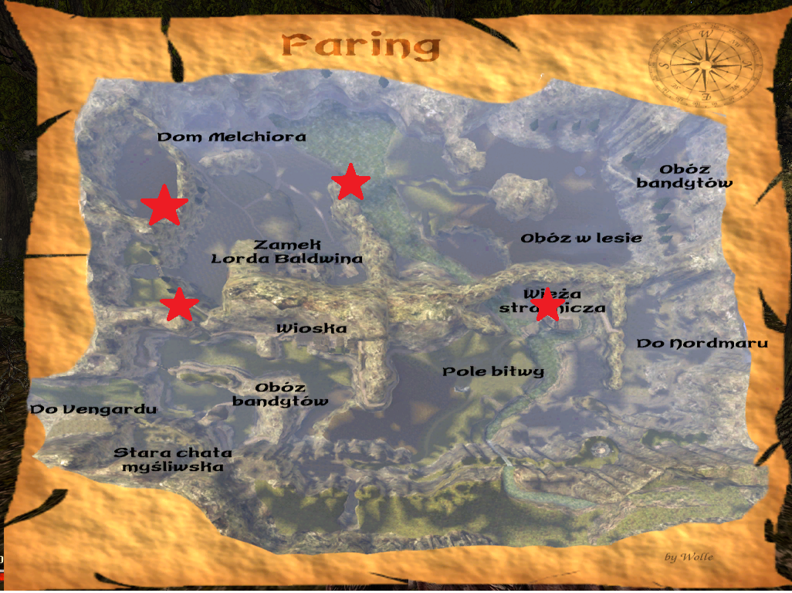

# Rozdział VI

## Najważniejsze informacje

Uwaga! Przed wyruszeniem do Myrtany lepiej wrócić na pozostałe wyspy jeśli chcemy wykonywać tam misje, ponieważ potem przez długi okres nie będziemy mogli podróżować.

- Lokalizacja smoczej krwi - [FILM](https://youtu.be/ReEJFKW-Z_A)

## Albatros

### Zadania główne i powiązane

#### Bitwa morska

Na otwartym morzu trafiasz na statek orków. Pokonaj wszystkich i zdaj raport.

## Tamora

### Zadania główne i powiązane

#### Atak z podziemi

Przypływając w 6 rozdziale na Tamorę, zastajemy Janusa i Bruno, którzy stoją na plaży. Zlecają nam pozbycie się nieumarłych z miasta i zamku. Możemy zabijać wszystkich po kolei lub od razu pobiec do Kościanego Lorda, którego zabicie spowoduje śmierć wszystkich innych nieumarłych.

#### Portal do podziemi

Wchodząc do piwnicy zamku na Tamorze natkniemy się na portal i tłum nieumarłych. Idziemy teraz do Pyrokara i mówimy mu o zaistniałej sytuacji. Ten daje nam książkę z przepisem na eliksir zamykania portali. Potrzebujesz do tego: Butelki wody święconej (powinniśmy jakąś mieć przy sobie)  
Zwoju "Wygnanie zła" (który powinniśmy zdobyć podczas eksploracji Varantu/Myrtany, a jeśli nie, to otrzymamy go od Ingmara w zadaniu "Albrecht") oraz diamentu (znajdziemy je dopiero w zalanej jaskini nieopodal Klanu Morsa w Nordmarze). Wszystkie składniki łączymy w stole alchemicznym i wchodzimy w interakcje z portalem. Po zamknięciu portalu wracamy do Pyrokara po nagrodę.

## Adarmos

### Zadania główne i powiązane

#### Powrót Garrika

Gdy wrócimy na Adarmos w 6 rozdziale, to dowiadujemy się od starszego wioski oraz jego żony, że Garrik jest obecnie uciekinierem, gdy dał do zrozumienia Roshowi o jego tyranii. Znajdziemy go w jaskini, w której wcześniej przebywał Alvares. Po rozmowie z nim, zadanie się zakończy

#### Zemsta na Roshu

Po rozmowie z Garrikiem i dowiedzeniu się, że Rosh zamordował Baromira, postanawiamy wspomóc Garrika w tej sprawie. Najpierw musimy zabić wszystkich najemników, a następnie pokonać Rosha, którego znajdziemy przy chatce Baromira. Mówimy o tym Garrikowoi.

## Athanos

### Zadania główne i powiązane

#### Armia ożywieńców

Zadanie rozpoczyna się po rozmowie w grobowcu z duchem Baal Hanshara w Varancie. Po dostaniu się do zamku (patrz zadanie “Droga do zamku”) i pokonaniu Lorda Finistera zdajemy raport o sukcesie Sejanowi i Baldwinowi.

#### Ożywieńcy w porcie

Przed wyruszeniem w głąb wyspy Lord Baldwin prosi nas o zabicie ożywieńców w porcie. Niszczymy i wracamy.

#### Ożywieńcy w wiosce

Lord Baldwin znów nas prosi o pokonanie nieumarłych, tym razem w wiosce. Robimy to i wracamy.

#### Ożywieńcy w lesie

Lord Baldwin prosi nas byśmy pozbyli się zagrożenia dookoła wyspy. Możemy zabić wszystko lub tylko Lorda Finistera, którego zabicie eliminuje wszystkich nieumarłych na wyspie, co umożliwi ukończenie misji u Baldwina.

#### Poszukiwanie ocalałych

Lord Baldwin Prosi nas o znalezienie ocalałych i przyprowadzenie ich na statek. Znajdziemy ich w następujących miejscach: kopalnia, jaskinia w stronę lasu niedaleko miejsca gdzie są owce, w domku myśliwskim Klausa, w jaskini przemytników za jaskinią przemytników (tam gdzie przebywał król szczurów)

#### Droga do zamku

Zadanie rozpoczyna się gdy postać zauważy brak możliwości wejścia główną bramą. W tym celu używasz runy teleportacyjnej do biblioteki i z pomocą Sejana dostajesz się do zamku. Po pokonaniu Lorda Finistera jest koniec zadania.

#### Runa Lorda Sintrama

Sejan radzi nam zdobyć runę do zamku. W tym celu udajemy się by otworzyć skrzynie z kluczem do grobowca Lorda Sintrama. Kufer znajduje się na skałach niedaleko wieży strażniczej. Po zdobyciu klucza, a następnie runy z grobowca obok, wracamy do Sejana. Czekamy jeden dzień i używamy zwoju.

## Wyspa pirata Mendozy

### Zadania główne i powiązane

#### Wyspa piratów

Zadanie rozpoczyna się po pokazaniu mapy Lordowi Baldwinowi od pirata Klaasa z zadania [Oszukany](sekcje/zadania/rozdzial_iv?id=oszukany). Pirat Sam, którego znajdziemy już na wyspie, jest gotów powiedzieć nam, gdzie znajdziemy Mendozę. Zrobi to jednak dopiero po wykonaniu zadań pobocznych: [Zdrajcy w załodze Mendozy](#zdrajcy-w-załodze-mendozy) oraz [Dziennik Korsarza](#dziennik-korsarza). Po wykonaniu obu zadań, Sam mówi nam o Mendozie i zaczyna walkę, więc musimy go zabić.. Mendoza popłynął do Królestwa Smoka co raportujemy Lordowi Baldwinowi kończąc zadanie. W tym samym momencie kończymy zadanie [Złoto piratów](sekcje/zadania/rozdzial_ii?id=złoto-piratów).

#### Zdrajcy w załodze Mendozy

Sam opowiada nam o zdrajcach w załodze. Zabijamy wszystkich na obu pobocznych wyspach i wracamy do Sama.

#### Dziennik Korsarza

Sam chce zdobyć dziennik kapitana. Składa się on z dwóch części. Znajdziemy je u zdrajców załogi na wyspie ścierwojada i wyspie kretoszczura. Zanosimy Samowi.

#### Skarb Mendozy

Przy piratach znajdziemy mapę z zaznaczonymi skarbami. Po wykopaniu i przeczytaniu notatki chociaż jednego z nich, rozpoczynamy zadanie. Po zebraniu wszystkich notatek ułożą się nam w napis "PRZY NAMIOCIE". Na wyspie, gdzie spotkaliśmy sama jest jedyny namiot. Kopiemy w pobliżu skarb kończąc zadanie.

## Vengard

### Najważniejsze informacje

- W zamku u jednego z handlarzy warto kupić wszystkie mapy, aby mieć lepszą orientację w terenie.
- Nie odbijaj na starcie całego miasta
- Należy wykonać najpierw zadanie [Twierdza](#twierdza) przed wyruszeniem w dalszą drogę, ponieważ można zbugować sobie resztę zadań.

### Zadania główne i powiązane

#### Twierdza

Przed wyruszeniem do króla Gernot prosi cię o pozbycie się wszystkich orków z portu i twierdzy. Zabijamy wszystko i wracamy z wykonanym zadaniem.

#### Grób wojownika z Nordmaru

Po przeczytaniu notatki znalezionej w porcie dowiadujemy się o grobie. Znajduje się on jakbyśmy szli w stronę Faring w jaskini wypełnionej goblinami i ogrami.

#### Gra w kości z Flaviusem

Po zagadaniu z Flaviusem dostajemy wpis, że możemy z nim zagrać. Ogrywamy go kończąc misję.

#### List do Ganeluna

Lord Garaks prosi nas abyśmy dostarczyli list, jego synowi, Ganelunowi na pokładzie Albatrosa.

#### Paczka broni dla Wielanda

Kowal Wieland prosi nas o dostarczenie 20 paczek broni. Jeśli ich nie posiadamy to zdobędziemy je dopiero w mieście.

#### Zwiadowcy orków

Paladyn Markus opowiada nam o niewielkim oddziale zwiadowczym, który kręci się niedaleko wejścia do zamku. Po pokonaniu wszystkich orków wracamy do Markusa.

#### Ocaleni w Vengardzie

Zadanie dostajemy od paladyna Thordira. Więcej informacji dostaniemy od paladyna Markusa. Jeden z nich jest na początku w mieście w jednym z pierwszych domów. Reszta ocalałych jest niedaleko przed miastem w jaskini. Odprowadzamy wszystkich na zamek i gadamy na końcu z paladynem Thoridrem.

#### Orkowie w Vengardzie

Cobryn opowiada nam, że miasto zostało zajęte przez orków i trzeba je odbić. Zadanie wykonujemy dopiero po misji “Spisek”. Po odbiciu wracamy do Cobryna przekazać nowinę. Tym samym zyskujemy pancerz paladyna.

#### Nowicjusz za kratami

Zadanie rozpoczynamy rozmawiając ze sługą w zamku. Opowiada nam o tajnym więzieniu, do którego wejście jest gdzieś na parterze. Przełącznik i samo więzienie znajduje się w jadalni, a misja kończy się po rozmowie z więźniem.

#### Naszyjnik królowej

Zadanie dostajemy od Nolana gdy się dowiemy za co trafił do więzienia. By zabrać się za zadanie idziemy porozmawiać z damą dworu i jej pokojówką. Następnie idziemy do Lorda Reginalda i dowiadujemy się, że sekretarz króla, Albert, jest świadkiem w tej sprawie. Po rozmowie z Albertem wracamy do Nolana, następnie znowu do Alberta i ciągniemy go dalej za język. Teraz znów gadamy z pokojówką, która oznajmia, że nie ma możliwości by klucz skradziono, ponieważ przed wejściem w nocy jest straż. Idziemy więc do kapitana Flaviusa i dowiadujemy się, kto był wtedy na służbie. Był to Ditmar, z którym idziemy porozmawiać w magazynie prowiantu (wejście na zewnątrz zamku blisko alchemika). Przez cały ten czas nie dowiedzieliśmy się czegoś sensownego, więc idziemy otworzyć skrzynię Ditmara na górnym piętrze. Wracamy do niego z notatką i każe nam się spotkać niedaleko alchemika przy sarkofagach po północy. Gdy trafimy na wyznaczone miejsce spotykamy martwe ciało Ditmara, w którym znajdujemy notatkę i dalszą wskazówkę. Tym sposobem odblokowało nam się przejście do katakumb. Na piętrze w zamku możemy otworzyć teraz wcześniej zablokowane drzwi, a przechodząc dalej w dół trafiamy na skrytobójców. Przy jednym z nich znajdujemy klucz, którym otwieramy sarkofag Rhobara I. Znajdujemy tam naszyjnik oraz pierścień z wygrawerowaną literą “R”. Wracamy do Lorda Reginalda by powiedzieć co o wszystkim sądzimy, następnie do królowej, a na końcu przekazać smutne wieści Nolanowi, tym samym kończąc misję.

#### Spisek

Zadanie możemy zacząć po przeczytaniu notatki, która była w jednym z ciał skrytobójców w trakcie wykonywania misji [Naszyjnik królowej](#naszyjnik-królowej). Dowiadujemy się o spisku przeciwko królestwu więc musimy ostrzec o tym króla. Ten mówi, że porozmawiać na osobności możecie tylko po 20:00. Po przeanalizowaniu sytuacji musisz przebrać się za skrytobójcę (zbroja jest w worku, w ekwipunku) i wyruszyć na spotkanie z wodzem orków Ogroshem. Podczas rozmowy, ork, każe ci powiedzieć kto jest twoim przywódcą. Prawidłową odpowiedzią jest, że nie możesz tego zdradzić (sami dalej tego nie wiemy). Ork nam wierzy i mówi, że szaman wykona potężny rytuał, który zniszczy paladynów, a atak zaplanowany jest jednocześnie od frontu jak i od strony tajemnego przejścia. Dalej wykonując zadania [Rytuał z Gothy](#rytuał-z-gothy), [Atak na Vengard](#atak-na-vengard) oraz zabijając orków w tajemnym przejściu (tam gdzie byli skrytobójcy) możemy zdać raport królowi kończąc misję.

#### Przywódca spisku

Zadanie dostępne po misji [Zemsta Lee](#w-poszukiwaniu-hektora) (patrz Nordmar - Klan Rudy). W skrzyni Lorda Garaksa znajdujemy ważną notatkę. Czytamy ją rozpoczynając misję i przekazujemy wieści  królowi, że zdrajców spotkała zasłużona kara.

#### Rytuał z Gothy

By dowiedzieć się więcej o rytuale, Ogrosh wysyła nas do szamana Rovasha. Szaman mówi nam o rytuale i o tym, że już został zakończony. Szybko biegniemy ostrzec króla, zabijamy wszystkich nieumarłych i demona, a następnie wracamy do króla kończąc zadanie.

#### Atak na Vengard!

Po zakończeniu zadania [Rytuał z Gothy](#rytuał-z-gothy), król każe nam ostrzec paladyna Thordira i rozkazać by zebrał ludzi do przeciwstawienia się atakowi ze strony orków. Po pokonaniu orków wracamy do króla i kończymy zadanie.

#### Ucieczka z więzienia

Wymagane jest ukończenie [Orkowie w Vengardzie](#zagubieni-orkowie), [Spisek](#zlecenie-od-lorda-baldwina) oraz [Naszyjnik królowej](#naszyjnik-królowej)

Rozmawiając z Nolanem mówi mu, że jesteśmy przekonani o jego niewinności i pomożemy mu w ucieczce. W tym celu rozmawiamy z dozorcą i dowiadujemy się, że zapomina się przy damach. Idziemy więc do pomieszczenia gdzie jest dama i pokojówka, kradniemy suknie, wracamy do Nolana i przekonujemy go, by to założył. Uciekamy z nim prosto do namiotu przed zamkiem, tam gdzie wcześniej stacjonowali orkowie.

#### Magowie Ognia w mieście

Mag ognia, Umrich, prosi nas byśmy sprawdzili czy ktoś z innych magów przeżył i dostarczył pewną księgę. Ciała magów znajdziemy na rynku, przed kapliczką Innosa blisko rynku oraz ostatni mag, który posiada już księgę, znajduje się w jednym z budynków głębiej w mieście (możliwe dopiero w trakcie zadania [Spisek](#zlecenie-od-lorda-baldwina) lub po wybiciu miasta). Czytamy wszystkie notatki i wracamy do Umricha.

#### Cenna figurka Innosa

Zadanie dostajemy od Umricha po wykonaniu wcześniejszego. Prosi nas byśmy odnaleźli 3 statuetki Innosa i mu dostarczyli. Znajdują się one przy kamiennych kręgach. Na pierwszy krąg i figurkę natrafimy idąc od strony portu z Albatrosa w prawo. Kolejny jest spoglądając na mapę “w stronę Faring” chroniony przez golemy. Ostatni posążek jest w południowej części mapy pod kamiennym kręgiem w malutkiej jaskini.

#### Podejrzane postacie

Zadanie dostajemy po zbliżeniu się do tawerny, która znajduje się przed przejściem kierującym do Montery. Żeby wejść porozmawiać należy zmienić pancerz na inny. Po rozmowie ze wszystkimi dostajemy w końcu zadanie “Polowanie na Joe”. Po wykonaniu wracamy powiedzieć co się stało z Latigo, po czym dochodzi do walki i jesteś zmuszony zabić wszystkich, co kończy zadanie.

#### Gra w kości z Olbersem

W tawernie na drodze do Montery można zagrać w kości z Olbersem i wygrać złoto.

#### Polowanie na Joe

Latigo prosi cię o pomoc w poszukiwaniu dzika zwanego Joe. Idziemy za nim po czym widzimy jak dzik go zabija. Pokonujemy zwierzę i wracamy do tawerny powiedzieć co się stało. Nie wierzą nam i dochodzi do walki co kończy misję.

## Montera

### Zadania główne i powiązane

#### Gniazdo plagi szczurów

W drodzę do Montery, jeszcze na terenach Vengardu, spotykamy nijakiego Egberta. Opowiada nam o królu szczurów, którego trzeba zabić, by pozbyć się plagi. Gniazdo znajduję się pod małą twierdzą, w której spotykamy pierwszy raz Gorna. Trzeba iść ścieżką górską dalej w dół, w stronę Montery, aż trafimy do wejścia.

#### Wyeliminowanie szabrowników

W drodzę do Montery, jeszcze na terenach Vengardu, spotykamy nijakiego Egberta. Opowiada nam, że wioski zostały splądrowane przez orków oraz możliwe, że dalej się tam kręcą. Naszym zadaniem jest zabić w górach 4 oddziały w różnych miejscach w górach. Po zabiciu wszystkich misja kończy się automatycznie.

#### Obóz buntowników w górach Montery

W malutkiej twierdzy w drodze do Montery spotykamy Gorna, który mówi, że niedaleko powinien znajdować się obóz buntowników (jest na mapie). Po znalezieniu go wracamy do Gorna i pomagamy odprowadzić do celu, którego poszukuje.

#### Obóz orków

Curtis, przywódca buntownik prosi nas byśmy zlikwidowali obóz najemników orków i samych orków. Jest zaznaczony na mapie. Pokonujemy przeciwników i wracamy z nowiną.

#### Dolina Borsuków

Przed wejściem do obozu buntowników można znaleźć ciało martwego maga, który opowiada o amulecie, który chciał ukryć w dolinie borsuków przy kapliczce Innosa, jednak martwi się, że mogą go mieć bandyci. Po znalezieniu bandytów, zabieramy amulet z ciała przywódcy kończąc misję.

#### Skarb w Dolinie Borsuków

W ciele bandyty znajdujemy notatkę o skarbie. Po znalezieniu skarbu w górach, w jaskini gdzie są borsuki, kończy się zadanie.

## Obóz Gońców Leśnych

### Zadania główne i powiązane

Zadanie dostajemy od króla Rhobara II. Każe nam wspomóc gońców leśnych. Po wykonaniu dla nich zadania [Atak orków na Gońców Leśnych](#polowanie-na-krasnoludy) możemy wrócić do króla.

#### Atak orków na Gońców Leśnych

Gdy pogadamy z druidem Melanderem, dowiadujemy się, że orkowie planują atak. Idziemy pogadać ze zwiadowcą Hermanem po czym dowiadujemy się, że orkowie w tej chwili atakują. Wracamy szybko do obozu ostrzec innych. W tym celu gadamy z Arthosem, po czym następuje mobilizacja. Razem z gońcami leśnymi pokonujecie orków na dole. Po wygranej walce wróć do Hermana i Melandera.

#### Gniazdo os

Herman opowiada nam, że jadowite osy nękają ciągle ich obóz, a nie ma możliwości się do nich dobrać. W obozie można jednak dostać się przy pomocy liany na górę, a po zabiciu wszystkiego możemy wrócić oddać zadanie.

#### Katastrofa

Na wybrzeżu możemy wejść do jaskini (przed nią są smocze zębacze) i pogadać z piratem o imieniu Mac. Dowiadujemy się na tematy wraku statku. Po wybraniu następnej opcji dialogowej u niego dochodzi do walki i po przeczytaniu dziennika płyniemy w stronę wraku i nurkujemy po skarby na czym misja się zakończy. Inną opcją jest nie wybranie drugiej opcji dialogowej, by nie walczyć z piratem. Wtedy, gdy zdobędziemy kosztowności Esmeraldy, to udajemy się do pirata i zdajemy raport na czym zadanie się zakończy. Gdybyśmy jednak najpierw nurkowali po skarby, a potem mimo to doprowadzili do walki z Mac’iem i go zabili, to misje należy zakończyć, u któregoś z pozostałych piratów.

#### Grupa orków z Gothy

Zadanie dostajemy jak trafimy przed Gothę po misji “Polowanie na Joe”. Należy pamiętać o innym pancerzu. Możemy pogadać w środku z kilkoma orkami, jednak na końcu wszystko zabijamy i idziemy zdać raport królowi.

#### Poszukiwania Hektora

Król poprosił nas byśmy znaleźli paladyna, która miał być zwiadowcą w okolicach Montery. Znajdujemy niestety tylko jego martwe ciało w Gocie. Teleportujemy się do króla, by go o tym poinformować.

#### Demon z Gothy

W Gocie, ork Potros opowiada nam o potężnym demonie, który został przyzwany przy pomocy rytuału. Jeżeli chcemy dowiedzieć się więcej udajemy się do szamana orków. Następnie idziemy na górę, w stronę zamku, by zabić demona. Przy nieumarłym paladynie Rufusie znajdujemy runę teleportacyjną do lochów, w których znajduje się demon. Zadanie kończy się po zabiciu demona, a wraz z nim ginie reszta ożywieńców.

#### Pojedynek

Po oczyszczeniu Gothy z nieumarłych możemy wrócić do Potrosa, by mu o tym powiedzieć. Ten nam nie wierzy, po czym dochodzi do pojedynku. Po pogadaniu z nim, po naszej wygranej, rzuca się na nas cały obóz więc wszystko zabijamy (możliwe, że nie będzie dane wykonać tej misji, ponieważ orkowie mogą się na ciebie zaagrować jak biłeś nieumarłych w zamku).

## Faring

### Zadania główne i powiązane

#### Banda Ortegi

Na drodze, w stronę Faring, możemy spotkać uciekiniera Adriana, który opowiada nam, że banda Ortegi powoduje, że cała okolica jest niebezpieczna. Po zrobieniu zadań [Udręka z bandytami](#udręka-z-bandytami) oraz [Kryjówka Ortegi](#nekromanta) (czyli pokonaniu wszystkich bandytów), wracamy do Adriana opowiedzieć mu o tym.

#### Udręka z bandytami

Zadanie dostajemy od Adriana. Zabijamy bandytów w wiosce w okolicach Faring oraz nieopodal niej w ruinach (by dojść należy kierować się dalej w górę drogą z wioski). Wracamy do Adriana powiedzieć, że może wracać do wioski.

#### Poszukiwanie łupu

Po pokonaniu bandytów z ruin mogliśmy znaleźć notatkę w skrzyni. W okolicach przełęczy z Nordmarem możemy znaleźć łup Ortegi. Stojąc przed wodospadem musimy skręcić w prawo trzymając się ściany przy górze, aż znajdziesz drogę, która poprowadzi cię do góry. Przechodzisz tam przez wodospad, aż dojdziesz do pewnych ruin. W tamtych okolicach znajdziesz jaskinię oraz skarb do wykopania.

#### Kryjówka Ortegi

Na granicy z Nordmarem przy górach możemy spotkać bandytę o imieniu Zach (lokalizacja będzie na mapie). Opowiada nam o skarbie po czym zgadzamy się mu towarzyszyć. Zaprowadza nas w pułapkę do bandytów, a zadanie się kończy gdy zabijemy wszystkich.

#### Miecz poległego paladyna

Samo zadanie mogliśmy dostać już wcześniej po rozmowie z Gernotem na statku przy zadaniu [Stammler](#stammler). Wykonać je możemy dopiero w okolicach Faring. Miecza nie znajdziemy na pobojowisku, a w pobliskiej wieży strażniczej, w której stacjonują orkowie.

## Buntownicy z Faring

### Zadania główne i powiązane

Jeszcze w Vengardzie, król Rhobar II zleciał nam odszukanie buntowników z Faring i udzielenie im pomocy. Po wykonaniu zadań u przywódcy buntowników - Aidana - możemy wrócić do króla powiedzieć o sukcesie.

#### Wysłannik buntowników

Bo dostaniu się do buntowników, Aidan wysyła nas byśmy odnaleźli wysłannika. Jest nim Joker, którego mogliśmy spotkać już, w domku, niedaleko Adriana. Po rozmowie z nim wracamy do przywódcy buntowników.

#### Oddział pościgowy orków

W trakcie zadania [Wysłannik buntowników](#wysłannik-buntowników) zostaniemy poinformowani, że Jokera ściągano. Idąc w stronę buntowników piechotą będziemy mogli spotkać orków, których należy pokonać i powiedzieć o tym Jokerowi.

#### Wieża strażnicza Faring

Zadanie rozpoczyna się, gdy wspominamy o wieży strażniczej Aidanowi. Zakończymy je zabijając stacjonujących tam orków i wracając powiedzieć o tym Aidanowi.

#### Karawana orków

Po zadaniu [Wysłannik buntowników](#wysłannik-buntowników) zostaniemy poproszeni o zniszczenie karawany podróżującej z Nordmaru. Znajdziemy ją na końcu lasu, a po pokonaniu mówimy Aidanowi. Obóz jest też zaznaczony na mapie.

#### Wsparcie dla buntowników

Ostatnią misją zleconą przez Aidana jest przyprowadzenie minimum pięciu ludzi do wsparcia. Będą to: [Nolan](#nolan), [Brodolf](#brodolf), [Degenhart](#degenhart), [Adrian](#adrian), [Niko](#niko).

#### Nolan

W trakcie wykonywania misji [Wsparcie dla buntowników](#wsparcie-dla-buntowników) gadamy z Nolanem dostając tę misję, pytając się go, czy nie zechciałby przyłączyć się do walki. Oddajemy mu naszą runę teleportacyjną do obozu buntowników w Faring, następnie odbieramy ją na miejscu i idziemy do Aidana kończąc zadanie.

#### Brodolf

Brodolfa mogliśmy już spotkać w drodze do Montery, w ruinach razem z Gornem. Musimy go jednak odprowadzić (działa teleport i przespanie się), porozmawiać tam z nim oraz zameldować o tym Aidanowi.

#### Degenhart

Degendharta mogliśmy spotkać w okolicach Vengardu w domku Gońców Leśnych (miejsce zaznaczone na mapie). Zgodzi się dołączyć jeżeli uwolnimy jego wieżę, która znajduje się niedaleko przy plaży z plagi goblinów. Po uzyskaniu od niego zgody, wracamy do Aidana.

#### Adrian

Adriana mogliśmy spotkać już wcześniej przy Jokerze. Zgodzi się dołączyć po wykonaniu zadania [Udręka z bandytami](#udręka-z-bandytami). Po wykonaniu zadania wracamy do Aidana kończąc misję.

#### Niko

Niko mogliśmy spotkać razem z Degenhartem (miejsce zaznaczone na mapie). Zgodzi się dołączyć do buntowników, jeżeli uzyska zgodę od swojego przywódcy [Melandera](#melander). Następnie mówimy mu o tym i wracamy do Aidana

#### Farmer i potwór

Niedaleko zamku buntowników z Faring mogliśmy spotkać farmera Melchiora, którego niepokoją dźwięki dochodzące z pola i słyszane w nocy. Okazuje się, że na polu spotykamy zwykłego szczura, którego należy pokonać. Po ponownej rozmowie z farmerem, ten nam nie wierzy i nie otrzymujemy wynagrodzenia.

#### Zabłąkana owca

Po wykonaniu zadania [Farmer i potwór](#farmer-i-potwór), Melchior następnego dnia mówi nam, że uciekły jego owce przed wilkami. Zadanie kończy się po dostarczeniu trzech żywych owiec oraz zameldowaniu o jednej martwej. Owce są dobrze poukrywane i porozrzucane po okolicy.  

## Nordmar

### Najważniejsze informacje

- Droga do Klanu Rudy - [FILM](https://youtu.be/tiC6dvWlRSE)
- Za zadanie [Stara pamiątka rodzinna](#stara-pamiątka-rodzinna) otrzymamy runę Deszczu Ognia
- Za zadanie [Nordmarska starka](#nordmarska-starka) możemy otrzymać przepis na miksturę +5HP i many
- Za zadanie [Zaginiony amulet](#zaginiony-amulet) możemy otrzymać amulet +40 siły

### Zadania główne i powiązane

#### Nieznośne zimno

Zadanie to zaczyna się automatycznie po wejściu do Nordmaru, a kończy po zdobyciu pancerza w [Wieży strażniczej Faring](#wieża-strażnicza-faring)

#### Poszukiwanie Xardasa

Zadanie to zaczyna się automatycznie po odpłynięciu z Athanos, a kończy po znalezieniu Xardasa (Patrz: [Droga do wieży Xardasa](#droga-do-wieży-xardasa))

#### Poszukiwanie skarbu w Wiecznych Lodach

W zwłokach Duke’a, złodzieja ryb siedzącego pod Klanem Rudy, znajdziemy notatkę mówiącą o położeniu skarby. Idziemy do miejsca zaznaczonego na mapie niebieskim krzyżykiem, wykopujemy skarb i na tym kończy się nasze zadanie.

#### Obóz orków przy Wieży Xardasa

Po spotkaniu Xardasa prosi on nas o pozbycie się obozu orków znajdującego się nieopodal jego wieży. Po rozprawieniu się z kreaturami, wracamy do nekromanty po nagrodę.

#### Kamień przodków

Xardas prosi nas o przyniesienie mu Kamienia Przodków, potrzebnego do wykonania amuletu ochrony przed ogniem. Podczas zadania [Grób Snorre](#grób-snorre) otrzymamy pożądany przedmiot, z którym wracamy do Xardasa, a zadanie kończy się.

#### Księga ze starej wieży

Xardas wysyła nas do pobliskiej opuszczonej wieży strażniczej, w której znajduje się podziemna biblioteka. Udajemy się tam, schodzimy do podziemi, zabieramy księgę i wracamy z nią do Xardasa.

#### Jaja pełzaczy lodowych

Xardas prosi nas o przyniesienie mu specjalnych jaj lodowych pełzaczy. Ich leże znajdziemy w jaskini w południowo-wschodniej części Nordmaru(miejsce to jest zaznaczone na mapie wręczonej nam przez Xardasa). Po zebraniu odpowiedniej ilości jaj, wracamy do Xardasa.

#### Lodowy demon

Xardas prosi nas o przyniesienie mu serca lodowego demona. Znajdziemy go w jaskini zaznaczonej przez Xardasa na mapie. Po zdobyciu serca wracamy do Xardasa.

#### Północna świątynia Beliara

Xardas daje nam teleport w okolice Klanu Ognia, gdzie mamy znaleźć człowieka, który przeprowadzi nas do Północnej Świątyni Beliara. Spotykamy Ingolfa, który prowadzi nas do osady, w której rozmawiamy z Ansgarem. Ten zgadza się nam pomóc, pod warunkiem że pomożemy jego ludowi. Po zdobyciu odpowiedniego zaufania, wracamy do Ansgara, który wysyła nas na ostatnie zadanie, po którym zgadza się zaprowadzić nas do ruin Isagratu. Ważne jest, aby zawsze być blisko niego, bo inaczej tepnie się on do swojego waypoint’a. Po dotarciu do tajnego przejścia, eksplorujemy świątynie, zdobywamy zbroję z rudy, po czym wracamy do Ansgara. Przy okazji pobytu tutaj, warto zrobić zadanie z mieczem i obozem berserkerów. Po wszystkim wracamy do Xardasa, a misja się kończy

#### Zachodnia świątynia Beliara

Xardas daje nam runę teleportacyjną w góry Montery. Stamtąd trafiamy do nowej lokacji zwanej ruinami Auraratu. Dokładnie eksplorujemy ruiny na powierzchni, gdzie powinniśmy trafić na dzienniki nowicjusza znajdujące się w skrzyni. Zgodnie z treścią notatek idziemy na ostatnią wyspę, gdzie obok posągu w skrzyni znajdziemy klucz do drzwi, prowadzących do podziemi. Następnie wracamy na wyspę z ruinami, gdzie schodzimy ścieżką w dół. Skręcamy w bok do jaskini, z której idziemy coraz niżej do podnóża góry. Na samym końcu trasy znajdziemy drzwi, które otwieramy wcześniej znalezionym kluczem.  
Teraz musimy znaleźć 5 kluczy, aby dotrzeć do pomieszczenia z hełmem. Klucze znajdują się w skrzyniach pilnowanych przez magów. Sposób na znalezienie wszystkich kluczy:  
3.Na początku trzymaj się cały czas skręcaj w prawo, aż dojdziesz do drzwi. Przejdź przez drzwi, a trafisz na maga przy orkowym posągu, który posiada trzeci klucz  
2.Teraz wracamy na początek, ale tym razem idziemy ścieżką “ w górę”. Przy kolejnym rozwidleniu skręcamy w prawo, aż dojdziemy do schodów, którymi schodzimy w dół. Stamtąd idziemy cały czas prosto, aż dojdziemy na balkon, na którym jest mag, który posiada drugi klucz.  
4.Idąc z balkonu, skręcamy w prawo, a następnie w lewo i idziemy “w górę”. Następnie wybieramy lewą ścieżkę, a następnie idziemy cały czas za ścieżką, aż dotrzemy do pomieszczenia z dywanem, gdzie jest mag posiadający czwarty klucz.  
5.Wracamy na sam początek. Stamtąd skręcamy w drugie od lewej przejście, następnie w prawo, w górę po schodach. Później w lewo i w prawo, aż trafimy do pomieszczenia z ostatnim magiem przechowującym piąty klucz.  
1.Teraz wracamy na początek i zeskakujemy na dół, gdzie szukamy kapliczki Beliara i kamiennych posągów. Przy nich znajduje się mag, który posiada pierwszy klucz.

Po zdobyciu wszystkich kluczy, obok kraty z teleportem, będzie wejście, którym kierujemy się na wprost, po czym skręcamy w prawo(do demona). Stamtąd idziemy w lewo, następnie w górę, aż trafimy na drzwi, przez które przechodzimy, aż natrafimy na drzwi, do których trzeba przeskoczyć przez zniszczoną ścieżkę. Za drzwiami znajdziemy ostatnich nieumarłych oraz hełm w skrzyni. Po zdobyciu hełmu wracamy do Xardasa

#### Mistrz kopaczy

Otrzymujemy to zadanie po ukończeniu [Północna świątynia Beliara](#północna-świątynia-beliara). Teraz musimy udać się do Olafa w Klanie Rudy. Powie on nam, że sam nie potrafi ulepszyć zbroi, ale może zrobić to ktoś, kto potrafi przekuwać pancerze, potrafi wykuwać rzeczy z rudy oraz jest Mistrzem Kopaczy. Do tego potrzebujemy dodatkowo 5 oszlifowanych akwamarynów (Kopalnia na Tamorze), 5 kawałków czerwonej rudy (Kopalnia w Ugarze lub wyspa z misji [Zagubieni orkowie](#zagubieni-orkowie)), 5 bryłek srebra (Kopalnia na Tamorze), 5 oszlifowanych rubinów (kopalnia na Khorusie lub wyspa z misji [Zagubieni orkowie](#zagubieni-orkowie)) I 5 oszlifowanych diamentów. Powinniśmy mieć wszystkie składniki, poza diamentami, które zdobędziemy [w tej jaskini](https://imgur.com/a/hyvmGPg) Jeśli nie posiadamy jeszcze Mistrza Kopaczy, to możemy to nadrobić [u Scatty’ego](sekcje/zadania/rozdzial_iii?id=scatty). Teraz wraz z wszystkimi składnikami idziemy do stołu rzemieślniczego i ulepszamy zbroję, co kończy nasze zadanie.

## Klan Rudy

### Zadania główne i powiązane

#### Atak ogrów

Wchodząc do Klanu Rudy okazuje się, że został on zaatakowany przez ogry. Pozbywamy się ogrów (nie szkodzi że zabiły kilku nieimiennych NPC), po czym gadamy z mieszkańcami wioski.

#### Droga do Wieży Xardasa

Leif dowiadując się o naszych pobudkach wysyła nas do Bjorna, który zgadza się zaprowadzić nas do Wieży Xardasa. Bjorn zostawia nas przy chatce Daga, skąd zgodnie z drogowskazami idziemy ścieżkami, aż dojdziemy do małego mostku. Przy nim zeskakujemy na ścieżkę niżej i stamtąd idąc prosto trafimy do wieży.

#### Zemsta

W domu przywódcy klanu znajdziemy Lee, który chce dostać się do królewskiego zamku i zabić hrabie Garaksa.  
Przynosimy mu runę teleportacyjną do Vengardu (sami musimy sobie jakąś zostawić, drugą znajdziemy np. przy [Hektorze](#hektor)) Teraz teleportujemy się wraz z nim do zamku, a następnie gadamy z hrabią, który zgadza się wyjść przed zamek. Tam zabijamy go wraz z Lee, a zadanie się kończy

#### Zaginiony amulet

Zadanie zleca Jarl. Idziemy do Skjolda, który nie przyznaje się do kradzieży. Teraz wracamy do Jarla, gadamy  z nim, a następnie z jego żoną Utą. Teraz zostajemy odesłani do karczmarza, u którego musimy zrobić zadanie Podejrzliwy gospodarz. Po zrobieniu tego zadania, należy pogadać o wszystkich mieszkańcach wioski, a następnie jeszcze kilka razy wejść w ten dialog, bo pojawią się opcje dialogowe o Ute, Wiebke i “innych mieszkańcach wioski”. Teraz idziemy do Ute, a następnie idziemy do bocznego korytarza kopalni za wioską. Tam kopiemy za skrzynkami i odzyskujemy amulet. Teraz mamy 3 rozwiązania  
A) Idziemy i oddajemy Jarlowi amulet, a nie dostajemy nic w zamian  
B) Idziemy i oddajemy Jarlowi amulet, pod warunkiem że da nam 4000 złota  
C) Nie oddajemy Jarlowi amuletu, a ten się na nas rzuca  
Warto zostawić sobie ten amulet, bo daje aż 40 siły. Teraz po walce (lub nie) z Jarlem idziemy do Skjolda, który się na nas rzuca. Po pobiciu go i rozmowie, zadanie się kończy

#### Pojedynek ze Skjoldem

Zadanie to aktywuje się gdy źle wybierzemy opcje dialogową przy pierwszej rozmowie ze Skjoldem lub nieuchronnie w ostatnim dialogu z zadania Zaginiony Amulet

#### Podejrzliwy gospodarz

Zadanie to polega na zrobieniu zadań w Klanie Rudy. Po wykonaniu odpowiedniej ilości gospodarz nam zaufa i dostaniemy eliksir siły.

#### Ukryta Ruda

Torsten prosi nas o odprowadzenie go do jego ukrytej jaskini, w której znajdują się pokaźne złoża rudy. Idziemy za Torstenem, pozbywamy się okolicznych potworów, po czym otrzymujemy klucz do skrzyni. Otwieramy ją i idziemy ponownie pogadać z Torstenem, co kończy nasze zadanie.

#### Grób Snorre

Tjure prosi nas o zakończenie żywota nieumarłych w grobie Snorre’a. Teleportujemy się do kopalni rudy, a stamtąd trzymamy się prawej ściany, ale schodzimy w dół. Na końcu drogi przeskakujemy na ścieżkę niżej, skąd powinniśmy z łatwością trafić do grobowca. Pozbywamy się umarlaków w jaskini, zabieramy kamień przodków i wracamy do Tiura.

#### Gra w kości o Nordmarską Starkę

Karczmarz Soren proponuje nam grę w kości, za którą możemy dostać 3 nodmarskie starki. Jedynym warunkiem jest używanie podstawowych kości, bo w innym wypadku nie będzie on chciał z nami zagrać. Ogrywamy go ze złota, a zadanie się kończy.

#### Kopalnia Klanu Rudy

Leif zgadza się dostarczać rudę dla Vengardu, pod warunkiem że odbijemy kopalnie zajętą przez orków.

#### Nordmarska starka

Elgur zleca nam znalezienie 12 alkojagód do produkcji nordmarskiego alkoholu. Da on nam mapę Nordmaru, na której zaznaczone będzie miejsce w którym znajdziemy jagody. Po przyniesieniu wybieramy nagrodę. Osobiście polecam przepis na Nordmarską Starkę (+5 zdrowia i many na stałe), jako że inaczej go nie zdobędziemy.

#### Ruda dla Olafa

Olaf, kowal z klanu Rudy, prosi nas o dostarczenie mu 12 kawałków magicznej rudy. Przynosimy mu rudę, którą powinniśmy już mieć, a w nagrodę otrzymujemy amulet.

#### Skóry szablozęba dla Daga

Dag ma co do nas wątpliwości i każe nam przynieść 12 skór szablozęba, które można znaleźć w całym Nordmarze. Po oddaniu otrzymujemy rudę, a zadanie się kończy.

#### Śnieżna bestia

Dag nadal nie jest do nas przekonany i wysyła nas na zabicie Śnieżnej Bestii znajdującej się wysoko w górach Nordmaru. Wspinamy się w góry w Nordmarze [\[FILMIK\]](https://youtu.be/oH1cSUKtlOs), po czym zabijamy albinosa stojącego pośród innych trolli. Ze skórą wracamy do Daga po nagrodę.

#### Milten chce dojść do Klanu Rudy

Eksplorując Nordmar napotykamy maga ognia Miltena, który chce dotrzeć do Klanu Rudy. Warto z nim pochodzić, jako że jest nieśmiertelny, więc skutecznie tankuje nordmarskie kreatury. Ostatecznie odprowadzamy go do Klanu Rudy, gdzie rozmawiamy z nim, a zadanie się kończy.

## Klan Ognia

### Zadania główne i powiązane

Na teren Klanu Ognia dostaniemy się dzięki zadaniu [Północna świątynia Beliara](#północna-świątynia-beliara)

#### Polowanie na lodowe wilki

Helg  prosi nas o przyniesienie mu 30 skór lodowych wilków. Wilki znajdują się na terenie całego Nordmaru, więc nie powinniśmy mieć problemu ze znalezieniem ich. Po zebraniu odpowiedniej ilości odnosimy mu skóry, a zadanie się kończy

#### Polowanie na rozpruwacze

Baldur zleca nam zabicie wściekłych rozpruwaczy nieopodal Klanu Ognia. Po zabiciu ich wszystkich przynosimy mu 20 skór rozpruwacza, a zadanie się kończy.

#### Natrętne gobliny

Ingolf zleca nam pozbycie się denerwujących goblinów nieopodal Klanu Ognia. Po zabiciu ich wszystkich wracamy do Ingolfa, a zadanie się kończy.

#### Zaginiony w lodach

Ansgar zgadza się zaprowadzić nas do ruin Isagratu, pod warunkiem, że przyprowadzimy zaginionego myśliwego z ich klanu. Znajduje się on na [dnie wąwozu z dużymi skałami](https://i.imgur.com/tUA403L.png) . Znajdujemy Ulfruna, zabijamy dla niego orków berserkerów i odprowadzamy go do Klanu Ognia [\[FILMIK Z DROGĄ\]](https://youtu.be/U-Imu1MJ4XA). Na koniec wracamy do Ansgara, a misja się kończy.

Oddział pościgowy orków

Od Ulfruna dowiadujemy się, że ściga go oddział orków berserkerów. Znajduje się on nieopodal, więc pozbywamy się orków i wracamy do Ulfruna

#### W drogę do ruin świątyni!

Ansgar zgadza się zaprowadzić nas na tereny Isagratu.Pod warunkiem że pomożemy innym myśliwym w Klanie Ognia. Robimy zadania [Natrętne gobliny](#natrętne-gobliny) [Polowanie na rozpruwacze](#polowanie-na-rozpruwacze) [Polowanie na lodowe wilki](#polowanie-na-lodowe-wilki), po czym wracamy do Ansgara dowiedzieć że o kolejnym zadaniu [Zaginiony w lodach](#zaginiony-w-lodach), po którym zgadza się on nas zaprowadzić. Idziemy z nim w międzyczasie wykonując zadania [Jaskinia Trollów](#jaskinia-trollów) i [Ochrona mostu](#ochrona-mostu). Kiedy dojdziemy już do sekretnego wejścia, zadanie się kończy.

#### Jaskinia trollów

Idąc z Ansgarem do Isagratu musimy przedostać się przez jaskinie pełną trolli. Zabijamy trolle wewnątrz jak i przy wyjściu z jaskini, po czym wracamy do Ansgara, a quest się kończy.

#### Stara pamiątka rodzinna

Po dotarciu do ruin Isagratu, Ansgar opowiada nam o tym, że zgubił kiedyś na tych terenach miecz, który wpadł do wąwozu. Jeśli w trakcie eksploracji tych terenów się na niego natkniemy, możemy wrócić do Ansgara i mu go oddać, a w zamian otrzymamy runę deszczu ognia [\[FILMIK\]](https://youtu.be/Dn6rO6vnMCY)

#### Ochrona mostu

Idąc z Ansgarem do Isagratu napotykamy na oddział berserkerów na moście. Pozbywamy się orków i wracamy do Ansgara, po czym idziemy dalej do ruin.

#### Strażnik Isagrat

Ansgar opowiada nam o potwornym stworzeniu, które ma swoją siedzibę w świątyni. Podczas oczyszczania budynku zabijamy ogaropodobnego stwora, po czym możemy wrócić do Ansgara

###

Klan berserkerów

Podczas wędrówki do Isagratu Ansgar opowiada nam o wiosce berserkerów przed wejściem do Isagratu. Po wybiciu odpowiedniej ilości orków dostaniemy komunikat na ekranie i możemy wrócić do Ansgara

## Klan Morsa

### Zadania główne i powiązane

#### Złodzieje Ryb

Przywódca Klanu Morsa opowiada nam o złodziejaszkach, którzy ukradli mieszkańcom ryby. ZNajdziemy ich pod klanem Rudy, gdzie ich zabijamy, a następnie wracamy ze skrzynią do przywódcy

#### Orkowie piraci

Przywódca Klanu Morsa prosi nas o pozbycie się orków piratów z wybrzeża. Po zabiciu wszystkich mobów wracamy do przywódcy i odbieramy nagrodę

## Górnicza Dolina

Najlepiej iść prosto do Lorda Hagena na jakiejś przemianie, aby nie wyczyścić czegoś bez misji.

## Główne misje GD

#### Droga do Górniczej Doliny

Quest aktywuje się automatycznie przy próbie przejścia do GD przez Opuszczoną Kopalnie lub bramę. Kończy się on po wejściu do GD w 6 rozdziale, za pomocą przemiany w chrząszcza.

#### Poszukiwanie Lorda Hagena

Quest rozpoczyna się automatycznie po wejściu do GD. Musimy odnaleźć Lorda Hagena, który stacjonuje w dawnym leżu Lodowego Smoka. Po rozmowie z nim zadanie się kończy.

#### Poszukiwanie smoków

SubQuest [Negocjacje z UrShakiem](#negocjacje-z-ur-shakiem). Lord Hagen zleca nam znalezienie wszystkich trucheł smoków. Idziemy w lokalizacje smoków z podstawki, zabieramy z nich loot i wracamy zdać relacje Hagenowi.

#### Wyzwolenie zamku

SubQuest [Negocjacje z UrShakiem](#negocjacje-z-ur-shakiem). Po [odnalezieniu smoków,](#poszukiwanie-smoków) Lord Hagen zleca nam odbicie zamku spod panowania orków. Idziemy do środka, pozbywamy się zielonoskórych, aż nie dostaniemy wpisu w dzienniku. Po wszystkim wracamy do Lorda Hagena

#### Negocjacje z Ur-Shakiem

Po misji [Wyzwolenie zamku](#wyzwolenie-zamku) Hagen prosi nas o udanie się do Ur-Shaka, przywódcy orków w Górniczej Dolinie. Potrzebujemy do tego [Ulu-Mulu](#ulu-mulu), które zrobi dla nas ork Tarrok przebywający w Khorinis.  
Po dostarczeniu mu składników, otrzymujemy Ulu-Mulu, które chroni nas przed gniewem orków (Jedynie Ur-Shaka, reszta pozostaje agresywna). Teraz musimy pozbyć się orków z kluczowych miejsc w Górniczej Doline. Są to:  
• Zamek w Górniczej Dolinie  
• Teren wokół Zamku  
• Oblężenie obozu Hagena  
• Składowisko za palisadą  
• Port za palisadą  
Teraz musimy wykonać co najmniej 7 z 8 poniższych zadań, aby Ur-Shak ugiął się przed paladynami i zgodził się na sojusz  
• [Wyzwolenie Khorinis](#wyzwolenie-khorinis)• [Statki orków](#statki-orków)  
• [Orkowie za murami](#orkowie-za-murami)• [Wyzwolenie zamku](#wyzwolenie-zamku)• [Poszukiwanie smoków](#poszukiwanie-smoków)• [Orkowie w Górniczej Dolinie](#orkowie-w-górniczej-dolinie)• [Ofiara dla Beliara](#ofiara-dla-beliara) • [Oblężenie paladynów Hagena  
](#oblężenie-paladynów-hagena)Po spełnieniu powyższego warunku idziemy do Ur-Shaka, następnie do Hagena, z powrotem do Ur-Shaka i do Hagena, gdzie zadanie się kończy.

#### Ulu-Mulu

SubQuest [Negocjacje z UrShakiem](#negocjacje-z-ur-shakiem). Należy przynieść Tarrokowi język ognistego jaszczura, kieł trolla, kieł błotnego węża i róg cieniostwora. Po przyniesieniu składników otrzymujemy Ulu-Mulu, a quest się kończy.

#### Ofiara dla Beliara

SubQuest [Negocjacje z UrShakiem](#negocjacje-z-ur-shakiem). Należy się pozbyć orków z przed jaskini Olava, a następnie wypuścić stamtąd Garonda i dwóch rycerzy. Po wszystkim wracamy do Hagena i quest się kończy

#### Statki orków

SubQuest [Negocjacje z UrShakiem](#negocjacje-z-ur-shakiem). Należy pozbyć się orków na statkach i w przystani za palisadą. Po otrzymaniu wpisu do dziennika wracamy do Ur-Shaka.

#### Orkowie w Górniczej Dolinie

Sub-Quest [Negocjacje z UrShakiem](#negocjacje-z-ur-shakiem) zlecany przez Ur-Shaka. Polega on na rozbiciu obozów orków wokół zamku. Po tym jak dostaniemy komunikat na ekranie, można do niego wrócić i zakończyć zadanie.

#### Orkowie za murami

Sub-Quest [Negocjacje z UrShakiem](#negocjacje-z-ur-shakiem) zlecany przez Ur-Shaka. Polega on na rozbiciu obozów orków i stoczni za palisadą. Po tym jak dostaniemy komunikat na ekranie, można do niego wrócić i zakończyć zadanie.

#### Oblężenie paladynów Hagena

Sub-Quest [Negocjacje z UrShakiem](#negocjacje-z-ur-shakiem) zlecany przez Hagena/Ur-Shaka. Polega on na rozbiciu oblężenie obozu Hagena. Po tym jak dostaniemy komunikat na ekranie, można wrócić do Hagena i zakończyć zadanie.

#### Zło w Świątyni Śniącego

Od Xardasa otrzymujemy teleport do Świątyni Śniącego, gdzie musimy pozbyć się Kościanego Lorda, który posiada Uriziel. Po zabiciu go, reszta nieumarłych również ginie, a quest się kończy.

## Zadania poboczne

#### Albrecht

Ingmar zleca nam rozejrzeć się za Albrechtem, który jest na przeszpiegach za palisadą. Znajduje się on za palisadą w małej kotlince przy podziemnym przejściu. Po rozmowie z nim wracamy do Ingmara, a zadanie się kończy

Wieża mgieł

Albrecht zleca nam rozejrzenie się po wieży mgieł. Idziemy tam i eksplorujemy ją, aż nie dostaniemy wpisu w dzienniku, po którym można wrócić do Albrechta

#### Węże błotne Shrata

Shrat zleca nam zabicie 7 błotnych węży, które pojawiają się o północy wokół jego chaty. Śpimy do północy, pozbywamy się węży i zdajemy relacje Shratowi.

Orkowie na bagnie

Shrat prosi nas o pozbycie się orków z obozowiska na bagnie. Po zabiciu 23 orków i otrzymaniu wpisu do dziennika wracamy do Shrata co kończy naszą misje.

#### Fanatyczni wyznawcy

Shrat opowiada nam o ludziach, którzy kiedyś zamieszkiwali obóz na bagnie. Znajdziemy ich przed wejściem do Świątyni Śniącego. Po pozbyciu się zła z Świątyni Śniącego, nasi łysi przyjaciele staną się znowu przyjaźnie nastawieni, po czym możemy wrócić do Shrata oddać misje.

#### Napad bandytów

Ortwin opowiada nam o bandytach, którzy ciągle napadają obóz paladynów. Znajdują się oni za Ortwinem. Po zabiciu ich otrzymujemy wpis w dzienniku i wracamy do Ortwina.

Stara kopalnia

Questa zleca nam Ingmar, po zadaniu [Napad bandytów](#napad-bandytów). Idziemy w miejsce starej kopalni i eksplorujemy tamte tereny, aż nie otrzymamy wpisu w dzienniku, po którym wracamy do Ingmara.

#### Wtargnięcie bandytów

Po zrobieniu zadania [Napad bandytów](#napad-bandytów) Ortwin mówi nam o bandzie bandytów, którzy ulokowali się w okolicach [Wolnej Kopalni](#wolna-kopalnia). Teraz idziemy do Ingmara, który wysyła nas na negocjacje z bandytami. Płacimy szefowi 3000 złota za zakończenie napadów i wracamy do Ingmara, co kończy nasze zadanie

#### Wolna Kopalnia

Ingma wysyła nas w stroju bandyty do obozu bandytów w Wolnej Kopalni, aby dowiedzieć się o możliwościach wydobycia. W obozie rozmawiamy z Ryżowym Księciem, który prosi nas o [odzyskanie jego zaginionej torby rudy](#zgubiona-ruda), którą zgubił w kopalni. Kradniemy Shrike’owi klucz, a następnie rozmawiamy z księciem, który odwraca jego uwagę. Następnie wchodzimy do kopalni i eksplorujemy ją, przy okazji zabierając sakiewkę Ryżowego Księcia. Po wyjściu z kopalni Shrike nas atakuje, więc go zabijamy. Następnie idziemy do Księcia, który również nas atakuje, a po zabiciu go idziemy do Roscoe, który wysyła nas do Wedge’a. Po tym jak zostanie on przywódcą obozu, wracamy do Ingmara, a quest się kończy.

#### Zgubiona ruda

Ryżowy Książe wysyła nas do kopalni po torbę rudy, która leży przy ognisku obok pieca. Z sakiewką wracamy do Ryżowego Księcia, a zadanie się kończy

#### Smocze łuski

Ratford prosi nas o przyniesienie mu 20 łusek smoka, które da nam Godar(który jest przy wodospadzie), jeśli przyniesiemy mu dwie czarne perły. Zleca on nam przy okazji znalezienie jego sakwy, która znajduje się w dawnym Kanionie Trolli. Niezależnie od tego jak zdobędziemy perły, wracamy do Godara, a on daje nam łuski

#### Pancerz Łowcy Smoków

Po zadaniu [Smocze łuski](#smocze-łuski) dowiadujemy się, że Jan potrafi wykuwać pancerz łowcy smoków. Idziemy do niego, oddajemy mu 20 smoczych łusek (które znaleźliśmy w smokach lub odzyskaliśmy po pobiciu Ratforda) i 12 tysięcy sztuk złota, po czym otrzymujemy pancerz i dostajemy niewielki bonus do statystyk.

#### Mięso dla obozu bandytów

Myśliwy Drax prosi nas o przyniesienie mu 40 sztuk surowego mięsa, które z pewnością już mamy, więć mu je oddajemy i kończymy tym samym misje.

#### Świątynia Śniącego

Xardas zleca nam zdobycie Uriziela, który ma przy sobie kościany lord z Świątyni Śniącego. Wchodzimy tam, pozbywamy się nieumarłych i wracamy z Urizielem do Xardasa

#### Karczma w Górniczej Dolinie

Pat otworzył knajpę w Górniczej Dolinie. Zleci Ci on questy [Fajka](#fajka), [Rej](#rej), [Czerwony pieprz](#czerwony-pieprz) oraz [Kradzież](#kradzież). Po zakończeniu wszystkich questów w knajpie zadanie się kończy po zapytaniu Pat’a “Co nowego?’.

#### Fajka

Pat opowiada nam, że ktoś ukradł jego fajkę. Ma ją przy sobie Miles, więc używamy kradzieży kieszonkowej, a następnie wracamy do Pata.

#### Rej

Po zrobieniu zadań [Fajka](#fajka) [Poszukiwanie smoków](#poszukiwanie-smoków) i [Napad bandytów](#napad-bandytów), następnego dnia Pat zagada nas o zaginięciu Reja. Przepytujemy teraz strażników przy ognisku obok namiotu, a następnie udajemy się do skały nad zamarzniętym wodospadem. Wykopujemy ją, a za nią znajdujemy Reja, który decyduje się wrócić do obozu

#### Gra w kości z Patem

Ogrywamy Pata z pieniędzy, co kończy naszą misje.

#### Czerwony pieprz

Po zrobieniu zadania [Rej](#rej) Pat prosi nas o przyniesienie mu worka czerwonego pieprzu. Możemy go kupić między innymi w Varancie. Po zdobyciu woreczka odnosimy go Patowi, a zadanie się kończy.

#### Martwi orkowie

Po zrobieniu zadania [Rej](#rej) możliwym jest wejście na cmentarzysko orków. Udajemy się tam i spotykamy Biffa. Po zabiciu orków przed cmentarzyskiem, okazuje się, że żaden z nich nie miał klucza do cmentarzyska, a quest się kończy

#### Biff

Po zrobieniu zadania [Martwi orkowie](#martwi-orkowie) dowiadujemy się, że to Biff wrzucił Reja do zamarzniętej jaskini. Możemy dać mu nauczkę i go pobić, co zakończy naszą misję.

#### Kradzież

Po zrobieniu zadań [Rej](#rej) [Oblężenie paladynów Hagena](#oblężenie-paladynów-hagena) [Napad bandytów](#napad-bandytów) i [Czerwony pieprz](#czerwony-pieprz) Pat opowiada nam o kradzieżach żywności. Idziemy do Ortwina, który opowiada nam gdzie i jak doszło do kradzieży. Następnie śpimy do 2 w nocy i idziemy za karczmę, gdzie spotykamy Billy’iego, który nam ucieka. Idziemy teraz do Ortwina, a następnie do Pata, co kończy nasze zadanie.

#### W ruinach klasztoru

Gestath opowiada nam o tym, że widział jakieś postacie w okolicy starego klasztoru. Idziemy do ruin klasztoru Zmiennokształtnych, pozbywamy się stamtąd wszystkich kościanych wojowników, aż dostaniemy wpis w dzienniku, po którym wracamy do Gestatha

#### Wieża Xardasa w Górniczej Dolinie

Na piętrze wieży Xardasa w Górniczej Dolinie znajdziemy notatkę, która mówi nam o skrzyni, w której Xardas ukrył pewne notatki. Znajduje się ona pod wieżą, przy jeziorze, obok kapliczki Beliara. Otwieramy tą skrzynie i czytamy książkę o zagrożeniu z Varantu, co kończy naszą misję.
